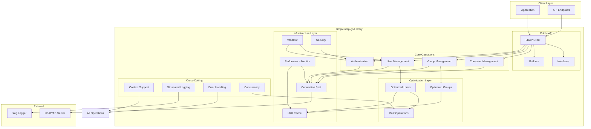
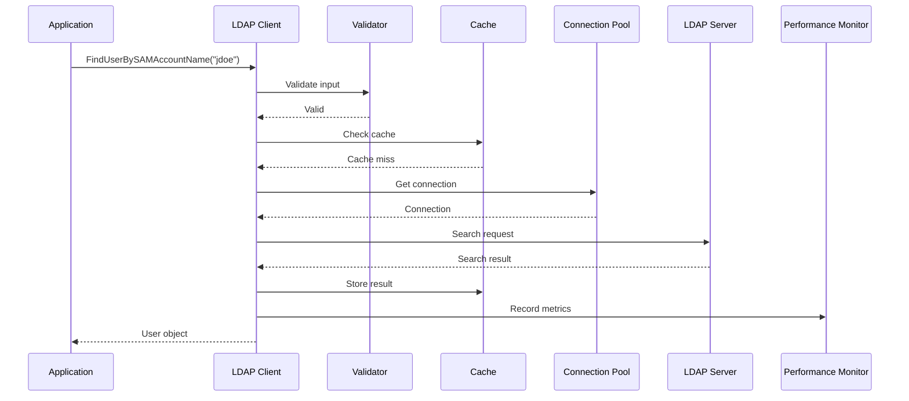
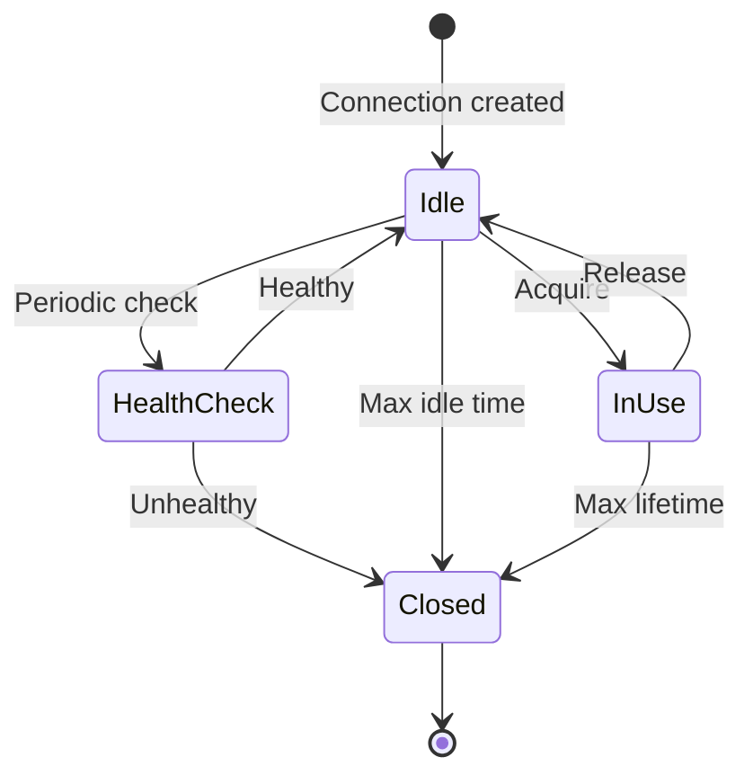
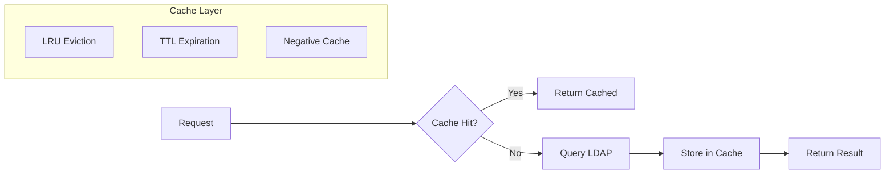
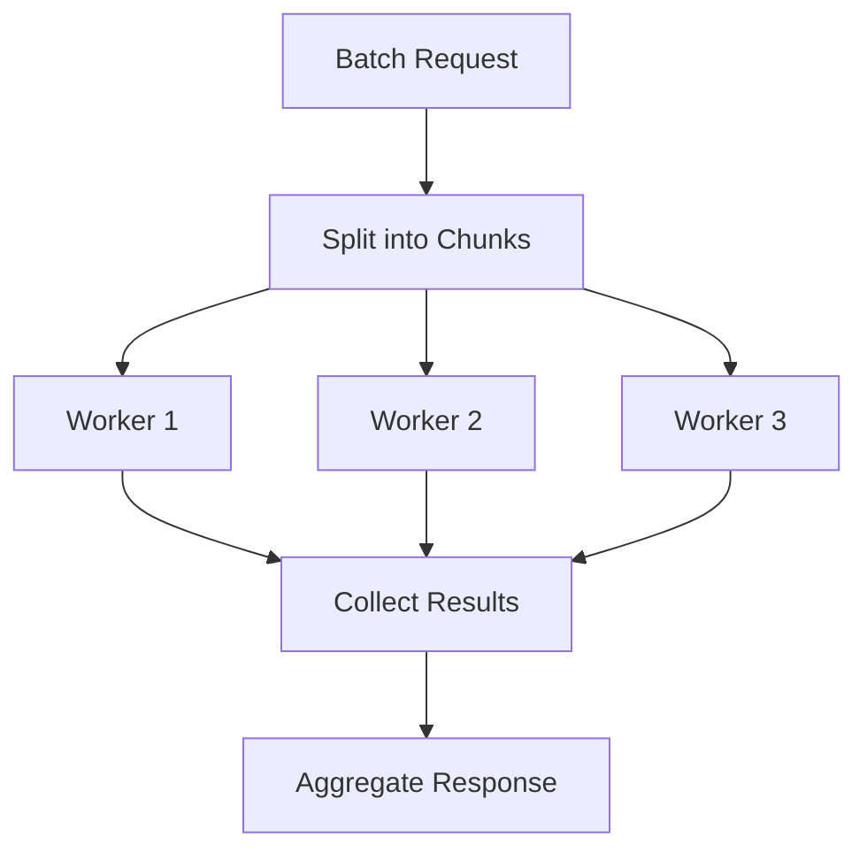
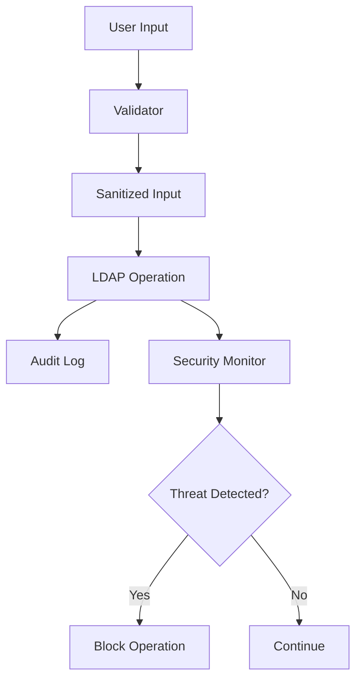
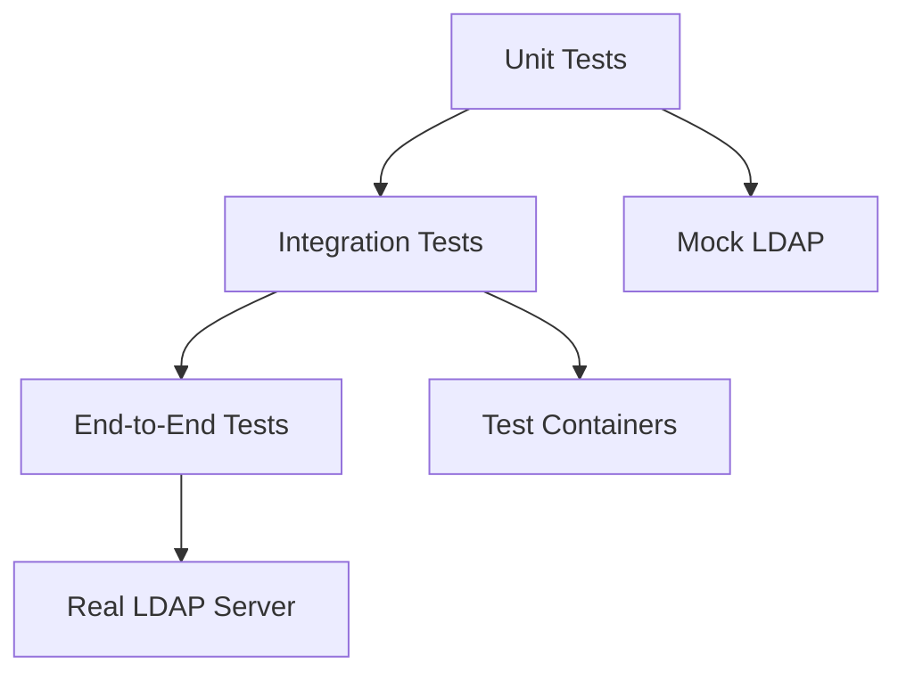

# simple-ldap-go Architecture Documentation

## System Overview

simple-ldap-go is a comprehensive LDAP library built with modern Go patterns and enterprise-grade features. The architecture emphasizes modularity, performance, and maintainability through clear separation of concerns and well-defined interfaces.

## Architecture Diagram



## Architectural Layers

### 1. Public API Layer

The public API layer provides the primary interface for library consumers.

#### Components:
- **LDAP Client** (`client.go`): Main entry point for all operations
- **Builders** (`builders.go`): Fluent API for object construction
- **Interfaces** (`interfaces.go`): Contract definitions for modularity

#### Design Principles:
- Clean, intuitive API surface
- Backward compatibility maintenance
- Context-aware operations
- Builder pattern for complex objects

### 2. Core Operations Layer

Core business logic for LDAP operations, organized by entity type.

#### Modules:
- **Authentication** (`auth.go`): Password verification and management
- **User Management** (`users.go`): User CRUD operations
- **Group Management** (`groups.go`): Group operations and membership
- **Computer Management** (`computers.go`): Active Directory computer accounts

#### Features:
- Entity-specific logic encapsulation
- Unified operations with conditional optimizations
- Active Directory specific handling
- Comprehensive error handling
- Feature flags for selective optimization enablement

### 3. Infrastructure Layer

Foundational components that support core operations.

#### Components:

##### Connection Pool (`pool.go`)
- Manages LDAP connection lifecycle
- Health checks and automatic recovery
- Connection reuse for performance
- Configurable pool sizing

##### LRU Cache (`cache.go`)
- Reduces LDAP query load
- TTL-based expiration
- Negative caching for missing entries
- Cache statistics and monitoring

##### Performance Monitor (`performance.go`)
- Operation timing and metrics
- Cache hit rate tracking
- Slow query detection
- Resource usage monitoring

##### Validator (`validation.go`)
- Input sanitization
- LDAP injection prevention
- DN and filter syntax validation
- Security-focused validation rules

##### Security (`security.go`)
- Credential management
- Audit logging
- Security event detection
- Compliance features

### 4. Optimization Layer

Performance-critical enhancements for high-volume operations, integrated into unified operations.

#### Components:
- **Enhanced Operations** (`users_extended.go`, `groups_extended.go`): Unified methods with optional optimizations
- **Bulk Operations**: Batch processing with concurrency control
- **Pipeline Processing**: Stream-based data handling
- **Caching Integration**: Automatic cache utilization

#### Optimization Features:
- **WithOptions Methods**: Enable caching and performance monitoring per-operation
- **Feature Flags**: Enable optimizations at client or config level
- **Reduced Round Trips**: Intelligent query batching to LDAP server
- **Parallel Execution**: Safe concurrent operations where appropriate
- **Memory Efficiency**: Optimized data structures and processing

### 5. Cross-Cutting Concerns

Aspects that span multiple layers and components.

#### Context Support
- All operations have Context variants
- Timeout and cancellation propagation
- Request-scoped value passing
- Tracing and correlation ID support

#### Structured Logging
- slog integration throughout
- Contextual logging with request IDs
- Performance metrics in logs
- Security event logging

#### Error Handling
- Wrapped errors with context
- Error type hierarchy
- Retryable error detection
- Multi-error aggregation

#### Concurrency (`concurrency.go`)
- Worker pools for parallel processing
- Pipeline pattern implementation
- Fan-out/fan-in patterns
- Semaphore for rate limiting

## Component Interactions

### Request Flow



### Connection Management Flow



## Design Patterns

### 1. Builder Pattern

Used for constructing complex objects with validation.

```go
type UserBuilder struct {
    user   *FullUser
    errors []error
}

func (b *UserBuilder) WithCN(cn string) *UserBuilder {
    b.user.CN = cn
    return b
}

func (b *UserBuilder) Build() (*FullUser, error) {
    // Validation and construction
}
```

### 2. Options Pattern

Flexible configuration without breaking changes.

```go
type Option func(*LDAP) error

func WithCache(size int) Option {
    return func(l *LDAP) error {
        // Configure cache
    }
}
```

### 3. Interface Segregation

Small, focused interfaces for testability.

```go
type UserReader interface {
    FindUserByDN(dn string) (*User, error)
}

type UserWriter interface {
    CreateUser(user FullUser) (string, error)
}

type UserManager interface {
    UserReader
    UserWriter
}
```

### 4. Context Pattern

Pervasive context support for cancellation and timeout.

```go
func (l *LDAP) FindUserByDNContext(ctx context.Context, dn string) (*User, error) {
    select {
    case <-ctx.Done():
        return nil, ctx.Err()
    default:
        // Proceed with operation
    }
}
```

### 5. Error Wrapping

Context preservation in error chains.

```go
if err != nil {
    return fmt.Errorf("failed to find user %s: %w", dn, err)
}
```

## Performance Architecture

### Caching Strategy



### Connection Pooling

- **Pre-warmed connections**: Minimum idle connections maintained
- **Health monitoring**: Periodic health checks on idle connections
- **Automatic recovery**: Failed connections replaced automatically
- **Fair scheduling**: Round-robin connection allocation

### Bulk Processing



## Security Architecture

### Defense in Depth

1. **Input Validation Layer**
   - LDAP injection prevention
   - DN syntax validation
   - Filter sanitization

2. **Authentication Layer**
   - Secure credential handling
   - Password policy enforcement
   - Failed attempt tracking

3. **Authorization Layer**
   - Operation-level permissions
   - Audit logging
   - Compliance reporting

4. **Transport Security**
   - LDAPS enforcement
   - Certificate validation
   - Connection encryption

### Security Features



## Scalability Considerations

### Horizontal Scaling

- **Stateless design**: No server-side state dependencies
- **Connection pool per instance**: Independent resource management
- **Distributed caching support**: Cache can be externalized
- **Load balancer friendly**: Round-robin compatible

### Vertical Scaling

- **Configurable resource limits**: Pool size, cache size, concurrency
- **Memory-efficient structures**: Minimal allocation patterns
- **Goroutine pooling**: Controlled concurrency
- **Lazy evaluation**: On-demand processing

## Extension Points

### Custom Options

```go
func WithCustomTransport(transport Transport) Option {
    return func(l *LDAP) error {
        l.transport = transport
        return nil
    }
}
```

### Interface Implementation

```go
type CustomCache struct{}

func (c *CustomCache) Get(key string) (interface{}, bool) {
    // Custom implementation
}

func (c *CustomCache) Set(key string, value interface{}, ttl time.Duration) error {
    // Custom implementation
}
```

### Middleware Pattern

```go
type Middleware func(Operation) Operation

func WithLogging() Middleware {
    return func(next Operation) Operation {
        return func(ctx context.Context, req Request) (Response, error) {
            // Log before
            resp, err := next(ctx, req)
            // Log after
            return resp, err
        }
    }
}
```

## Testing Architecture

### Test Hierarchy



### Test Infrastructure

- **Unit Tests**: Mock interfaces for isolation
- **Integration Tests**: Testcontainers for OpenLDAP
- **Benchmarks**: Performance regression detection
- **Fuzz Testing**: Security vulnerability detection

## Future Architecture Considerations

### Planned Enhancements

1. **Distributed Caching**: Redis/Memcached integration
2. **Metrics Export**: Prometheus/OpenTelemetry support
3. **Circuit Breaker**: Fault tolerance improvements
4. **Query Optimization**: Intelligent query planning
5. **Schema Discovery**: Dynamic attribute mapping

### Extensibility Roadmap

1. **Plugin System**: Dynamic feature loading
2. **Custom Filters**: User-defined search filters
3. **Transform Pipelines**: Data transformation chains
4. **Event System**: Pub/sub for operations
5. **Multi-tenancy**: Tenant isolation support

## Architecture Decision Records (ADRs)

### ADR-001: Context-First Design
**Status**: Accepted
**Context**: Need for timeout and cancellation support
**Decision**: All operations have Context variants
**Consequences**: Better control flow, slight API duplication

### ADR-002: Interface Segregation
**Status**: Accepted
**Context**: Need for testability and modularity
**Decision**: Small, focused interfaces over large ones
**Consequences**: More interfaces, better testability

### ADR-003: Builder Pattern for Complex Objects
**Status**: Accepted
**Context**: Complex object construction with validation
**Decision**: Implement builder pattern with fluent API
**Consequences**: More code, better usability

### ADR-004: Error Wrapping Strategy
**Status**: Accepted
**Context**: Need for error context preservation
**Decision**: Use fmt.Errorf with %w for all errors
**Consequences**: Rich error context, Go 1.13+ requirement

### ADR-005: Structured Logging with slog
**Status**: Accepted
**Context**: Need for structured, contextual logging
**Decision**: Adopt slog as standard logger
**Consequences**: Better observability, Go 1.21+ requirement

---

*Architecture Documentation v1.0.0 - Last Updated: 2025-09-17*