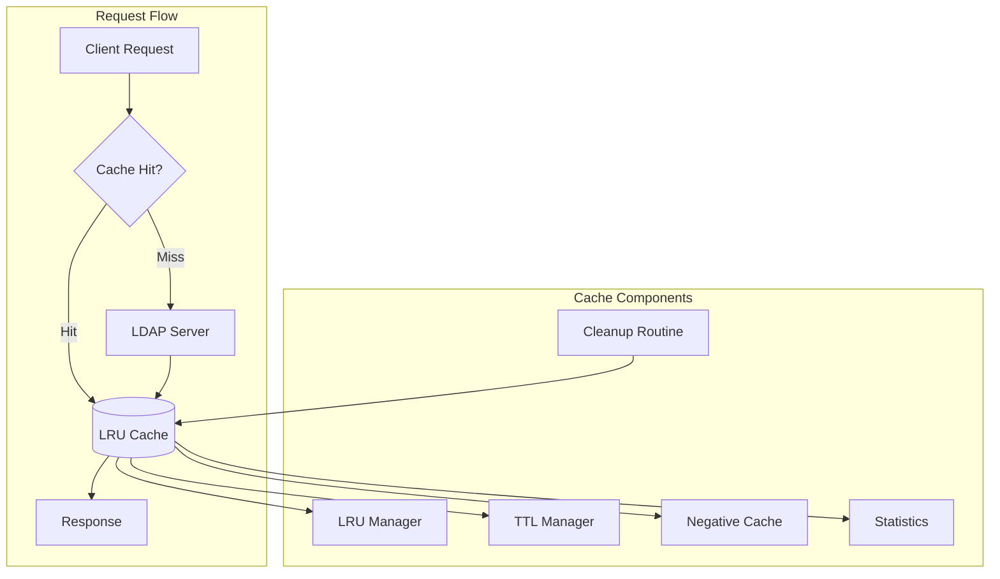

# Caching Strategy Guide

## Table of Contents

1. [Overview](#overview)
2. [Cache Architecture](#cache-architecture)
3. [Implementation Details](#implementation-details)
4. [Caching Strategies](#caching-strategies)
5. [Configuration](#configuration)
6. [Performance Metrics](#performance-metrics)
7. [Best Practices](#best-practices)
8. [Troubleshooting](#troubleshooting)
9. [Advanced Topics](#advanced-topics)

## Overview

The simple-ldap-go library implements a sophisticated multi-layer caching system designed to reduce LDAP server load, improve response times, and enhance overall application performance. The caching layer is transparent to consumers while providing significant performance benefits.

### Key Features

- **LRU Eviction**: Least Recently Used algorithm for optimal memory usage
- **TTL-Based Expiration**: Configurable time-to-live for cache entries
- **Negative Caching**: Cache missing entries to prevent repeated lookups
- **Thread-Safe Operations**: Concurrent access with RWMutex protection
- **Performance Metrics**: Built-in statistics and monitoring
- **Context-Aware**: Respects cancellation and timeouts

## Cache Architecture



### Cache Layers

1. **L1 Cache (In-Memory LRU)**
   - Ultra-fast access (microseconds)
   - Limited by memory constraints
   - Per-process isolation

2. **Negative Cache**
   - Prevents repeated failed lookups
   - Shorter TTL than positive entries
   - Reduces unnecessary LDAP queries

3. **Future: L2 Cache (Redis/Memcached)**
   - Shared across processes
   - Larger capacity
   - Network overhead considerations

## Implementation Details

### Core Cache Structure

```go
// cache.go:15 - Main cache implementation
type Cache struct {
    items         map[string]*cacheItem
    evictionOrder *list.List
    itemsByKey    map[string]*list.Element
    maxSize       int
    ttl           time.Duration
    negativeTTL   time.Duration
    mu            sync.RWMutex
    stats         *CacheStats
    cleanupTicker *time.Ticker
    stopCleanup   chan struct{}
}

// cache.go:28 - Individual cache entry
type cacheItem struct {
    key        string
    value      interface{}
    expiration time.Time
    negative   bool // Indicates missing entry
    size       int64
    hits       int64
    lastAccess time.Time
}
```

### LRU Implementation

```go
// cache.go:95 - LRU get with promotion
func (c *Cache) Get(key string) (interface{}, bool) {
    c.mu.Lock()
    defer c.mu.Unlock()

    element, exists := c.itemsByKey[key]
    if !exists {
        c.stats.Misses++
        return nil, false
    }

    item := element.Value.(*cacheItem)

    // Check expiration
    if time.Now().After(item.expiration) {
        c.removeElement(element)
        c.stats.Evictions++
        return nil, false
    }

    // Promote to front (most recently used)
    c.evictionOrder.MoveToFront(element)
    item.hits++
    item.lastAccess = time.Now()

    c.stats.Hits++
    c.stats.updateHitRate()

    return item.value, true
}

// cache.go:128 - LRU set with eviction
func (c *Cache) Set(key string, value interface{}, ttl time.Duration) error {
    c.mu.Lock()
    defer c.mu.Unlock()

    // Check if updating existing
    if element, exists := c.itemsByKey[key]; exists {
        c.evictionOrder.MoveToFront(element)
        item := element.Value.(*cacheItem)
        item.value = value
        item.expiration = time.Now().Add(ttl)
        return nil
    }

    // Evict if at capacity
    if c.evictionOrder.Len() >= c.maxSize {
        c.evictOldest()
    }

    // Add new item
    item := &cacheItem{
        key:        key,
        value:      value,
        expiration: time.Now().Add(ttl),
        lastAccess: time.Now(),
    }

    element := c.evictionOrder.PushFront(item)
    c.itemsByKey[key] = element

    return nil
}
```

### Negative Caching

```go
// cache.go:168 - Negative cache entry
func (c *Cache) SetNegative(key string) error {
    c.mu.Lock()
    defer c.mu.Unlock()

    item := &cacheItem{
        key:        key,
        value:      nil,
        negative:   true,
        expiration: time.Now().Add(c.negativeTTL),
        lastAccess: time.Now(),
    }

    element := c.evictionOrder.PushFront(item)
    c.itemsByKey[key] = element

    c.stats.NegativeEntries++
    return nil
}

// users_optimized.go:45 - Using negative cache
func (l *LDAP) FindUserBySAMAccountNameOptimized(sam string) (*User, error) {
    cacheKey := fmt.Sprintf("user:sam:%s", sam)

    // Check cache first
    if cached, hit := l.cache.Get(cacheKey); hit {
        if cached == nil {
            // Negative cache hit
            return nil, ErrUserNotFound
        }
        return cached.(*User), nil
    }

    // Query LDAP
    user, err := l.findUserInternal(sam)
    if err != nil {
        if errors.Is(err, ErrUserNotFound) {
            // Cache negative result
            l.cache.SetNegative(cacheKey)
        }
        return nil, err
    }

    // Cache positive result
    l.cache.Set(cacheKey, user, l.cache.ttl)
    return user, nil
}
```

## Caching Strategies

### 1. User Lookups

```go
// users_optimized.go:78 - Optimized user retrieval with caching
func (l *LDAP) GetUserDetailsOptimized(username string) (*FullUser, error) {
    // Multi-level cache key strategy
    primaryKey := fmt.Sprintf("user:full:%s", username)

    // Try cache first
    if cached, hit := l.cache.Get(primaryKey); hit {
        l.log.Debug("cache hit", "key", primaryKey)
        return cached.(*FullUser), nil
    }

    // Parallel attribute fetching if cache miss
    ctx, cancel := context.WithTimeout(context.Background(), 30*time.Second)
    defer cancel()

    var user *FullUser
    var groups []string
    var err error

    // Parallel execution for efficiency
    g, gCtx := errgroup.WithContext(ctx)

    g.Go(func() error {
        user, err = l.fetchUserAttributes(gCtx, username)
        return err
    })

    g.Go(func() error {
        groups, err = l.fetchUserGroups(gCtx, username)
        return err
    })

    if err := g.Wait(); err != nil {
        return nil, err
    }

    user.Groups = groups

    // Cache with appropriate TTL
    l.cache.Set(primaryKey, user, 5*time.Minute)

    // Also cache by DN for cross-reference
    l.cache.Set(fmt.Sprintf("user:dn:%s", user.DN), user, 5*time.Minute)

    return user, nil
}
```

### 2. Group Membership

```go
// groups_optimized.go:112 - Cached group membership checks
func (l *LDAP) IsUserInGroupOptimized(username, groupDN string) (bool, error) {
    cacheKey := fmt.Sprintf("membership:%s:%s", username, groupDN)

    // Check cache with shorter TTL for membership
    if cached, hit := l.cache.Get(cacheKey); hit {
        return cached.(bool), nil
    }

    // Perform LDAP query
    isMember, err := l.checkMembershipInternal(username, groupDN)
    if err != nil {
        return false, err
    }

    // Cache with shorter TTL for dynamic data
    l.cache.Set(cacheKey, isMember, 1*time.Minute)

    return isMember, nil
}

// groups_optimized.go:145 - Batch group membership with cache warming
func (l *LDAP) GetUserGroupsOptimized(username string) ([]Group, error) {
    cacheKey := fmt.Sprintf("groups:user:%s", username)

    if cached, hit := l.cache.Get(cacheKey); hit {
        return cached.([]Group), nil
    }

    groups, err := l.fetchAllUserGroups(username)
    if err != nil {
        return nil, err
    }

    // Cache main result
    l.cache.Set(cacheKey, groups, 5*time.Minute)

    // Warm cache with individual groups
    for _, group := range groups {
        groupKey := fmt.Sprintf("group:dn:%s", group.DN)
        l.cache.Set(groupKey, group, 10*time.Minute)
    }

    return groups, nil
}
```

### 3. Search Results

```go
// cache_strategies.go:23 - Search result caching with pagination
type SearchCache struct {
    cache *Cache
    log   *slog.Logger
}

func (sc *SearchCache) CacheSearchResults(filter string, results []interface{}, page int) {
    // Create composite key with filter hash
    hasher := sha256.New()
    hasher.Write([]byte(filter))
    filterHash := hex.EncodeToString(hasher.Sum(nil))[:16]

    cacheKey := fmt.Sprintf("search:%s:page:%d", filterHash, page)

    // Cache with appropriate TTL based on result size
    ttl := sc.calculateTTL(len(results))

    sc.cache.Set(cacheKey, results, ttl)

    // Store filter mapping for invalidation
    sc.cache.Set(fmt.Sprintf("search:filter:%s", filterHash), filter, ttl)
}

func (sc *SearchCache) calculateTTL(resultSize int) time.Duration {
    // Dynamic TTL based on result size
    switch {
    case resultSize < 10:
        return 5 * time.Minute
    case resultSize < 100:
        return 2 * time.Minute
    case resultSize < 1000:
        return 1 * time.Minute
    default:
        return 30 * time.Second
    }
}
```

## Configuration

### Basic Configuration

```go
// client.go:156 - Cache configuration during client creation
func NewWithCache(config *Config) (*LDAP, error) {
    client := &LDAP{
        config: config,
        log:    slog.Default().With("component", "ldap-client"),
    }

    // Initialize cache with configuration
    cacheConfig := &CacheConfig{
        MaxSize:      getEnvInt("LDAP_CACHE_SIZE", 10000),
        TTL:          getEnvDuration("LDAP_CACHE_TTL", 5*time.Minute),
        NegativeTTL:  getEnvDuration("LDAP_CACHE_NEGATIVE_TTL", 30*time.Second),
        CleanupInterval: 1 * time.Minute,
        EnableStats:  getEnvBool("LDAP_CACHE_STATS", true),
    }

    cache, err := NewCache(cacheConfig)
    if err != nil {
        return nil, fmt.Errorf("failed to initialize cache: %w", err)
    }

    client.cache = cache

    return client, nil
}
```

### Advanced Configuration

```go
// cache_config.go:12 - Comprehensive cache configuration
type CacheConfig struct {
    // Size limits
    MaxSize       int           `json:"max_size"`
    MaxMemoryMB   int           `json:"max_memory_mb"`

    // TTL settings
    TTL           time.Duration `json:"ttl"`
    NegativeTTL   time.Duration `json:"negative_ttl"`

    // Behavior
    CleanupInterval time.Duration `json:"cleanup_interval"`
    EnableStats     bool          `json:"enable_stats"`
    EnableMetrics   bool          `json:"enable_metrics"`

    // Performance tuning
    ShardCount      int           `json:"shard_count"`      // For sharded cache
    CompressionLevel int          `json:"compression_level"` // 0-9, 0=disabled

    // Persistence (future)
    PersistPath     string        `json:"persist_path"`
    PersistInterval time.Duration `json:"persist_interval"`
}

// Example configuration
config := &CacheConfig{
    MaxSize:         50000,
    MaxMemoryMB:     512,
    TTL:             10 * time.Minute,
    NegativeTTL:     1 * time.Minute,
    CleanupInterval: 5 * time.Minute,
    EnableStats:     true,
    EnableMetrics:   true,
    ShardCount:      16, // For concurrent access
}
```

### Environment Variables

```bash
# Cache size limits
export LDAP_CACHE_SIZE=10000
export LDAP_CACHE_MEMORY_MB=256

# TTL configuration (in seconds)
export LDAP_CACHE_TTL=300
export LDAP_CACHE_NEGATIVE_TTL=30

# Performance tuning
export LDAP_CACHE_CLEANUP_INTERVAL=60
export LDAP_CACHE_SHARD_COUNT=8

# Monitoring
export LDAP_CACHE_STATS=true
export LDAP_CACHE_METRICS=true
export LDAP_CACHE_METRICS_PORT=9090
```

## Performance Metrics

### Cache Statistics

```go
// cache.go:281 - Cache statistics structure
type CacheStats struct {
    Hits            int64     `json:"hits"`
    Misses          int64     `json:"misses"`
    Evictions       int64     `json:"evictions"`
    NegativeEntries int64     `json:"negative_entries"`
    CurrentSize     int64     `json:"current_size"`
    MaxSize         int64     `json:"max_size"`
    HitRate         float64   `json:"hit_rate"`
    AvgAccessTime   float64   `json:"avg_access_time_ms"`
    LastReset       time.Time `json:"last_reset"`
}

// cache.go:302 - Get current statistics
func (c *Cache) Stats() *CacheStats {
    c.mu.RLock()
    defer c.mu.RUnlock()

    stats := *c.stats
    stats.CurrentSize = int64(c.evictionOrder.Len())
    stats.HitRate = c.calculateHitRate()

    return &stats
}

// cache.go:315 - Calculate hit rate
func (c *Cache) calculateHitRate() float64 {
    total := c.stats.Hits + c.stats.Misses
    if total == 0 {
        return 0.0
    }
    return float64(c.stats.Hits) / float64(total) * 100
}
```

### Monitoring Integration

```go
// monitoring.go:45 - Prometheus metrics export
func (c *Cache) ExportMetrics() {
    // Register Prometheus metrics
    prometheus.MustRegister(
        prometheus.NewGaugeFunc(
            prometheus.GaugeOpts{
                Name: "ldap_cache_size",
                Help: "Current number of items in cache",
            },
            func() float64 {
                return float64(c.Size())
            },
        ),
        prometheus.NewCounterFunc(
            prometheus.CounterOpts{
                Name: "ldap_cache_hits_total",
                Help: "Total number of cache hits",
            },
            func() float64 {
                return float64(c.stats.Hits)
            },
        ),
        prometheus.NewGaugeFunc(
            prometheus.GaugeOpts{
                Name: "ldap_cache_hit_rate",
                Help: "Cache hit rate percentage",
            },
            func() float64 {
                return c.calculateHitRate()
            },
        ),
    )
}

// monitoring.go:78 - Structured logging for cache events
func (c *Cache) logCacheEvent(event string, key string, hit bool) {
    c.log.Debug("cache event",
        slog.String("event", event),
        slog.String("key", key),
        slog.Bool("hit", hit),
        slog.Float64("hit_rate", c.calculateHitRate()),
        slog.Int64("size", int64(c.Size())),
    )
}
```

### Performance Analysis

```go
// performance_analysis.go:23 - Cache effectiveness analyzer
type CacheAnalyzer struct {
    cache *Cache
    log   *slog.Logger
}

func (ca *CacheAnalyzer) Analyze() *PerformanceReport {
    stats := ca.cache.Stats()

    report := &PerformanceReport{
        Period:    time.Since(stats.LastReset),
        HitRate:   stats.HitRate,
        Efficiency: ca.calculateEfficiency(stats),
        Recommendations: ca.generateRecommendations(stats),
    }

    return report
}

func (ca *CacheAnalyzer) calculateEfficiency(stats *CacheStats) float64 {
    // Efficiency score based on hit rate and eviction rate
    evictionRate := float64(stats.Evictions) / float64(stats.MaxSize)

    // High hit rate + low eviction rate = high efficiency
    efficiency := stats.HitRate * (1 - evictionRate)

    return efficiency
}

func (ca *CacheAnalyzer) generateRecommendations(stats *CacheStats) []string {
    var recommendations []string

    if stats.HitRate < 70 {
        recommendations = append(recommendations,
            "Consider increasing cache TTL for better hit rate")
    }

    if float64(stats.Evictions)/float64(stats.Hits) > 0.2 {
        recommendations = append(recommendations,
            "High eviction rate detected - consider increasing cache size")
    }

    if stats.NegativeEntries > stats.CurrentSize/4 {
        recommendations = append(recommendations,
            "High negative cache usage - investigate missing entries")
    }

    return recommendations
}
```

## Best Practices

### 1. Cache Key Design

```go
// Best practice: Hierarchical, predictable cache keys
const (
    UserKeyPrefix      = "user:"
    GroupKeyPrefix     = "group:"
    MembershipKeyPrefix = "membership:"
    SearchKeyPrefix    = "search:"
)

func BuildCacheKey(parts ...string) string {
    // Use consistent separator
    return strings.Join(parts, ":")
}

// Examples
userKey := BuildCacheKey(UserKeyPrefix, "dn", userDN)
groupKey := BuildCacheKey(GroupKeyPrefix, "cn", groupCN)
membershipKey := BuildCacheKey(MembershipKeyPrefix, userDN, groupDN)
```

### 2. TTL Management

```go
// Best practice: Variable TTL based on data volatility
func GetOptimalTTL(dataType string) time.Duration {
    switch dataType {
    case "user_details":
        // User details change infrequently
        return 10 * time.Minute
    case "group_membership":
        // Membership changes more frequently
        return 2 * time.Minute
    case "search_results":
        // Search results are dynamic
        return 30 * time.Second
    case "schema":
        // Schema rarely changes
        return 24 * time.Hour
    default:
        return 5 * time.Minute
    }
}
```

### 3. Cache Warming

```go
// Best practice: Proactive cache warming for critical data
func (l *LDAP) WarmCache(ctx context.Context) error {
    g, gCtx := errgroup.WithContext(ctx)

    // Warm critical user cache
    g.Go(func() error {
        users, err := l.GetCriticalUsers(gCtx)
        if err != nil {
            return err
        }

        for _, user := range users {
            key := BuildCacheKey(UserKeyPrefix, "sam", user.SAMAccountName)
            l.cache.Set(key, user, 30*time.Minute)
        }
        return nil
    })

    // Warm group cache
    g.Go(func() error {
        groups, err := l.GetFrequentlyAccessedGroups(gCtx)
        if err != nil {
            return err
        }

        for _, group := range groups {
            key := BuildCacheKey(GroupKeyPrefix, "dn", group.DN)
            l.cache.Set(key, group, 30*time.Minute)
        }
        return nil
    })

    return g.Wait()
}
```

### 4. Cache Invalidation

```go
// Best practice: Targeted invalidation strategies
type CacheInvalidator struct {
    cache *Cache
    log   *slog.Logger
}

func (ci *CacheInvalidator) InvalidateUser(userDN string) {
    // Invalidate all related cache entries
    patterns := []string{
        fmt.Sprintf("user:dn:%s", userDN),
        fmt.Sprintf("user:sam:*"),
        fmt.Sprintf("membership:%s:*", userDN),
        fmt.Sprintf("groups:user:%s", userDN),
    }

    for _, pattern := range patterns {
        ci.cache.DeletePattern(pattern)
    }

    ci.log.Info("invalidated user cache", "user", userDN)
}

func (ci *CacheInvalidator) InvalidateOnModify(dn string, attributes []string) {
    // Smart invalidation based on modified attributes
    if contains(attributes, "memberOf") {
        ci.InvalidateGroupMembership(dn)
    }

    if contains(attributes, "mail", "displayName", "telephoneNumber") {
        ci.InvalidateUserDetails(dn)
    }
}
```

## Troubleshooting

### Common Issues

#### 1. Low Hit Rate

```go
// Diagnostic: Analyze cache misses
func DiagnoseLowHitRate(c *Cache) {
    stats := c.Stats()

    if stats.HitRate < 50 {
        fmt.Println("Low hit rate detected:", stats.HitRate)

        // Check TTL configuration
        if c.ttl < 30*time.Second {
            fmt.Println("TTL too short - consider increasing")
        }

        // Check cache size
        if float64(stats.Evictions)/float64(stats.Hits) > 0.3 {
            fmt.Println("High eviction rate - increase cache size")
        }

        // Check access patterns
        c.AnalyzeAccessPatterns()
    }
}
```

#### 2. Memory Issues

```go
// Monitor memory usage
func MonitorCacheMemory(c *Cache) {
    ticker := time.NewTicker(1 * time.Minute)
    defer ticker.Stop()

    for range ticker.C {
        var m runtime.MemStats
        runtime.ReadMemStats(&m)

        cacheMemoryMB := c.EstimateMemoryUsage() / 1024 / 1024

        if cacheMemoryMB > 500 {
            slog.Warn("high cache memory usage",
                "cache_mb", cacheMemoryMB,
                "total_alloc_mb", m.Alloc/1024/1024,
            )

            // Trigger cleanup if needed
            c.ReduceMemoryUsage()
        }
    }
}
```

#### 3. Stale Data

```go
// Implement cache versioning for consistency
type VersionedCache struct {
    *Cache
    version int64
}

func (vc *VersionedCache) Set(key string, value interface{}, ttl time.Duration) error {
    // Include version in cache entry
    entry := &VersionedEntry{
        Value:   value,
        Version: atomic.LoadInt64(&vc.version),
    }

    return vc.Cache.Set(key, entry, ttl)
}

func (vc *VersionedCache) InvalidateAll() {
    // Increment version to invalidate all entries
    atomic.AddInt64(&vc.version, 1)
}
```

### Debug Utilities

```go
// cache_debug.go - Cache debugging utilities
func (c *Cache) DumpCache() map[string]interface{} {
    c.mu.RLock()
    defer c.mu.RUnlock()

    dump := make(map[string]interface{})

    for key, element := range c.itemsByKey {
        item := element.Value.(*cacheItem)
        dump[key] = map[string]interface{}{
            "value":      item.value,
            "expiration": item.expiration,
            "hits":       item.hits,
            "negative":   item.negative,
        }
    }

    return dump
}

func (c *Cache) GetTopKeys(n int) []string {
    c.mu.RLock()
    defer c.mu.RUnlock()

    type keyHits struct {
        key  string
        hits int64
    }

    var items []keyHits

    for key, element := range c.itemsByKey {
        item := element.Value.(*cacheItem)
        items = append(items, keyHits{key, item.hits})
    }

    // Sort by hits
    sort.Slice(items, func(i, j int) bool {
        return items[i].hits > items[j].hits
    })

    // Return top N
    var topKeys []string
    for i := 0; i < n && i < len(items); i++ {
        topKeys = append(topKeys, items[i].key)
    }

    return topKeys
}
```

## Advanced Topics

### 1. Sharded Cache

```go
// sharded_cache.go - Distributed cache for concurrency
type ShardedCache struct {
    shards    []*Cache
    shardMask uint32
    hashFunc  func(string) uint32
}

func NewShardedCache(shardCount int, config *CacheConfig) *ShardedCache {
    shards := make([]*Cache, shardCount)

    for i := range shards {
        shards[i] = NewCache(config)
    }

    return &ShardedCache{
        shards:    shards,
        shardMask: uint32(shardCount - 1),
        hashFunc:  fnv32,
    }
}

func (sc *ShardedCache) Get(key string) (interface{}, bool) {
    shard := sc.getShard(key)
    return shard.Get(key)
}

func (sc *ShardedCache) getShard(key string) *Cache {
    hash := sc.hashFunc(key)
    return sc.shards[hash&sc.shardMask]
}
```

### 2. Write-Through Cache

```go
// write_through.go - Write-through cache pattern
type WriteThroughCache struct {
    cache *Cache
    ldap  *LDAP
    log   *slog.Logger
}

func (wtc *WriteThroughCache) UpdateUser(user *User) error {
    // Update LDAP first
    if err := wtc.ldap.UpdateUser(user); err != nil {
        return fmt.Errorf("failed to update LDAP: %w", err)
    }

    // Update cache
    key := BuildCacheKey(UserKeyPrefix, "dn", user.DN)
    wtc.cache.Set(key, user, 10*time.Minute)

    // Invalidate related entries
    wtc.InvalidateRelated(user.DN)

    wtc.log.Info("write-through update completed", "user", user.DN)

    return nil
}
```

### 3. Cache Preloading

```go
// preload.go - Startup cache preloading
func (l *LDAP) PreloadCache(ctx context.Context) error {
    start := time.Now()

    l.log.Info("starting cache preload")

    // Load configuration
    config := &PreloadConfig{
        MaxUsers:  getEnvInt("CACHE_PRELOAD_USERS", 1000),
        MaxGroups: getEnvInt("CACHE_PRELOAD_GROUPS", 500),
        Parallel:  getEnvInt("CACHE_PRELOAD_PARALLEL", 10),
    }

    // Create worker pool
    sem := make(chan struct{}, config.Parallel)
    g, gCtx := errgroup.WithContext(ctx)

    // Preload users
    g.Go(func() error {
        users, err := l.GetTopUsers(gCtx, config.MaxUsers)
        if err != nil {
            return err
        }

        for _, user := range users {
            sem <- struct{}{}
            g.Go(func(u User) error {
                defer func() { <-sem }()

                key := BuildCacheKey(UserKeyPrefix, "dn", u.DN)
                l.cache.Set(key, u, 1*time.Hour)

                return nil
            }(user)
        }

        return nil
    })

    // Preload groups
    g.Go(func() error {
        groups, err := l.GetTopGroups(gCtx, config.MaxGroups)
        if err != nil {
            return err
        }

        for _, group := range groups {
            key := BuildCacheKey(GroupKeyPrefix, "dn", group.DN)
            l.cache.Set(key, group, 1*time.Hour)
        }

        return nil
    })

    if err := g.Wait(); err != nil {
        return fmt.Errorf("cache preload failed: %w", err)
    }

    l.log.Info("cache preload completed",
        "duration", time.Since(start),
        "cache_size", l.cache.Size(),
    )

    return nil
}
```

### 4. Distributed Cache (Future)

```go
// distributed_cache.go - Redis-backed distributed cache
type DistributedCache struct {
    local  *Cache      // L1 cache
    redis  *redis.Client // L2 cache
    log    *slog.Logger
}

func (dc *DistributedCache) Get(ctx context.Context, key string) (interface{}, bool) {
    // Check L1 (local) first
    if value, hit := dc.local.Get(key); hit {
        dc.log.Debug("L1 hit", "key", key)
        return value, true
    }

    // Check L2 (Redis)
    data, err := dc.redis.Get(ctx, key).Bytes()
    if err == redis.Nil {
        dc.log.Debug("L2 miss", "key", key)
        return nil, false
    }

    if err != nil {
        dc.log.Error("L2 error", "key", key, "error", err)
        return nil, false
    }

    // Deserialize and populate L1
    value, err := dc.deserialize(data)
    if err != nil {
        return nil, false
    }

    dc.local.Set(key, value, 5*time.Minute)
    dc.log.Debug("L2 hit, L1 populated", "key", key)

    return value, true
}

func (dc *DistributedCache) Set(ctx context.Context, key string, value interface{}, ttl time.Duration) error {
    // Set in both L1 and L2
    dc.local.Set(key, value, ttl)

    data, err := dc.serialize(value)
    if err != nil {
        return err
    }

    return dc.redis.Set(ctx, key, data, ttl).Err()
}
```

---

*Cache Strategy Guide v1.0.0 - simple-ldap-go Project*