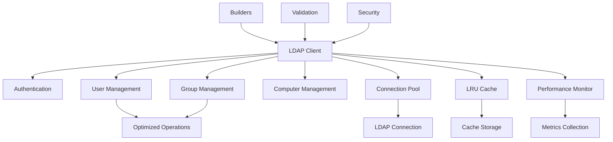

# simple-ldap-go Documentation Index

<div align="center">

[](https://pkg.go.dev/github.com/netresearch/simple-ldap-go)
[](https://goreportcard.com/report/github.com/netresearch/simple-ldap-go)

**A comprehensive Go library for LDAP and Active Directory operations**

[Quick Start](#quick-start) • [API Reference](#api-reference) • [Architecture](#architecture) • [Examples](#examples) • [Best Practices](#best-practices)

</div>

---

## 📚 Documentation Structure

### [🚀 Quick Start](README.md)
- [Installation](README.md#installation)
- [Basic Usage](README.md#quick-start)
- [Configuration](README.md#configuration)
- [Examples Overview](examples/)

### [📖 API Reference](#api-reference)
- [Core Client](#core-client)
- [Authentication](#authentication-api)
- [User Management](#user-management-api)
- [Group Management](#group-management-api)
- [Computer Management](#computer-management-api)
- [Builders & Fluent API](#builders-api)
- [Infrastructure Components](#infrastructure-api)

### [🏗️ Architecture Documentation](#architecture)
- [System Design](docs/ARCHITECTURE.md)
- [Component Overview](#component-overview)
- [Design Patterns](#design-patterns)
- [Interface Contracts](#interfaces)

### [📊 Feature Documentation](#features)
- [Context Support](CONTEXT_SUPPORT.md)
- [Error Handling](ERROR_HANDLING.md)
- [Structured Logging](STRUCTURED_LOGGING.md)
- [Performance Optimization](PERFORMANCE_OPTIMIZATION.md)
- [Security Best Practices](SECURITY.md)
- [Modernization Plan](MODERNIZATION_PLAN.md)

### [📘 Implementation Guides](#guides)
- [Authentication Workflows](docs/AUTHENTICATION_GUIDE.md) - MFA, session management, security patterns
- [Connection Pooling](docs/CONNECTION_POOLING.md) - Pool configuration, monitoring, optimization
- [Caching Strategies](docs/CACHING_GUIDE.md) - LRU implementation, TTL management, performance
- [Error Handling Patterns](docs/ERROR_HANDLING.md) - Error types, recovery patterns, best practices
- [Performance Tuning](docs/PERFORMANCE_TUNING.md) - Benchmarking, profiling, optimization techniques
- [Security Implementation](docs/SECURITY_GUIDE.md) - Authentication, authorization, compliance
- [Troubleshooting Guide](docs/TROUBLESHOOTING.md) - Common issues, diagnostics, debugging

---

## 🎯 API Reference

### Core Client

#### Client Creation
| Method | Description | File |
|--------|-------------|------|
| `New(config, user, password)` | Create standard LDAP client | [client.go:108](client.go#L108) |
| `NewBasicClient(config, user, pass)` | Create basic client | [client.go:301](client.go#L301) |
| `NewPooledClient(config, user, pass, max)` | Create pooled client | [client.go:307](client.go#L307) |
| `NewCachedClient(config, user, pass, size, ttl)` | Create cached client | [client.go:327](client.go#L327) |
| `NewHighPerformanceClient(config, user, pass)` | Create optimized client | [client.go:347](client.go#L347) |
| `NewSecureClient(config, user, pass)` | Create security-focused client | [client.go:378](client.go#L378) |
| `NewReadOnlyClient(config, user, pass)` | Create read-only client | [client.go:400](client.go#L400) |

#### Connection Management
| Method | Description | Context Support |
|--------|-------------|-----------------|
| `GetConnection()` | Get LDAP connection | ❌ |
| `GetConnectionContext(ctx)` | Get connection with context | ✅ |
| `WithCredentials(dn, pass)` | Change credentials | ❌ |

### Authentication API

| Method | Description | Context | File |
|--------|-------------|---------|------|
| `CheckPasswordForSAMAccountName(sam, pass)` | Verify user password by SAM | ❌ | [auth.go:34](auth.go#L34) |
| `CheckPasswordForSAMAccountNameContext(ctx, sam, pass)` | Verify with context | ✅ | [auth.go:52](auth.go#L52) |
| `CheckPasswordForDN(dn, pass)` | Verify user password by DN | ❌ | [auth.go:128](auth.go#L128) |
| `CheckPasswordForDNContext(ctx, dn, pass)` | Verify with context | ✅ | [auth.go:146](auth.go#L146) |
| `ChangePasswordForSAMAccountName(sam, old, new)` | Change password | ❌ | [auth.go:248](auth.go#L248) |
| `ChangePasswordForSAMAccountNameContext(ctx, sam, old, new)` | Change with context | ✅ | [auth.go:273](auth.go#L273) |

### User Management API

#### User Search Operations
| Method | Description | Context | Optimized |
|--------|-------------|---------|-----------|
| `FindUserByDN(dn)` | Find by DN | ❌ | ❌ |
| `FindUserByDNContext(ctx, dn)` | Find by DN with context | ✅ | ❌ |
| `FindUserByDNOptimized(ctx, dn, opts)` | Optimized find by DN | ✅ | ✅ |
| `FindUserBySAMAccountName(sam)` | Find by SAM name | ❌ | ❌ |
| `FindUserBySAMAccountNameContext(ctx, sam)` | Find by SAM with context | ✅ | ❌ |
| `FindUserBySAMAccountNameOptimized(ctx, sam, opts)` | Optimized find by SAM | ✅ | ✅ |
| `FindUserByMail(mail)` | Find by email | ❌ | ❌ |
| `FindUserByMailContext(ctx, mail)` | Find by email with context | ✅ | ❌ |
| `FindUserByMailOptimized(ctx, mail, opts)` | Optimized find by email | ✅ | ✅ |
| `FindUsers()` | Find all users | ❌ | ❌ |
| `FindUsersContext(ctx)` | Find all with context | ✅ | ❌ |
| `FindUsersOptimized(ctx, opts)` | Optimized find all | ✅ | ✅ |
| `BulkFindUsersBySAMAccountName(ctx, sams, opts)` | Bulk find users | ✅ | ✅ |

#### User CRUD Operations
| Method | Description | Context |
|--------|-------------|---------|
| `CreateUser(user, password)` | Create new user | ❌ |
| `CreateUserContext(ctx, user, pass)` | Create with context | ✅ |
| `DeleteUser(dn)` | Delete user | ❌ |
| `DeleteUserContext(ctx, dn)` | Delete with context | ✅ |

#### User Group Operations
| Method | Description | Context |
|--------|-------------|---------|
| `AddUserToGroup(userDN, groupDN)` | Add user to group | ❌ |
| `AddUserToGroupContext(ctx, userDN, groupDN)` | Add with context | ✅ |
| `RemoveUserFromGroup(userDN, groupDN)` | Remove from group | ❌ |
| `RemoveUserFromGroupContext(ctx, userDN, groupDN)` | Remove with context | ✅ |

### Group Management API

#### Group Search Operations
| Method | Description | Context | Optimized |
|--------|-------------|---------|-----------|
| `FindGroupByDN(dn)` | Find by DN | ❌ | ❌ |
| `FindGroupByDNContext(ctx, dn)` | Find by DN with context | ✅ | ❌ |
| `FindGroupByDNOptimized(ctx, dn, opts)` | Optimized find by DN | ✅ | ✅ |
| `FindGroups()` | Find all groups | ❌ | ❌ |
| `FindGroupsContext(ctx)` | Find all with context | ✅ | ❌ |
| `FindGroupsOptimized(ctx, opts)` | Optimized find all | ✅ | ✅ |

#### Group Member Operations
| Method | Description | Context | Optimized |
|--------|-------------|---------|-----------|
| `GetUserGroupsOptimized(ctx, userDN, opts)` | Get user's groups | ✅ | ✅ |
| `GetGroupMembersOptimized(ctx, groupDN, opts)` | Get group members | ✅ | ✅ |
| `AddUserToGroupOptimized(ctx, userDN, groupDN)` | Add member | ✅ | ✅ |
| `RemoveUserFromGroupOptimized(ctx, userDN, groupDN)` | Remove member | ✅ | ✅ |

### Computer Management API

| Method | Description | Context |
|--------|-------------|---------|
| `FindComputerByDN(dn)` | Find by DN | ❌ |
| `FindComputerByDNContext(ctx, dn)` | Find by DN with context | ✅ |
| `FindComputerBySAMAccountName(sam)` | Find by SAM | ❌ |
| `FindComputerBySAMAccountNameContext(ctx, sam)` | Find by SAM with context | ✅ |
| `FindComputers()` | Find all computers | ❌ |
| `FindComputersContext(ctx)` | Find all with context | ✅ |

### Builders API

#### User Builder
```go
user := NewUserBuilder().
    WithCN("John Doe").
    WithSAMAccountName("jdoe").
    WithMail("john@example.com").
    WithFirstName("John").
    WithLastName("Doe").
    WithEnabled(true).
    Build()
```

#### Group Builder
```go
group := NewGroupBuilder().
    WithCN("Administrators").
    WithDescription("System Administrators").
    WithSAMAccountName("admins").
    Build()
```

#### Computer Builder
```go
computer := NewComputerBuilder().
    WithCN("WORKSTATION01").
    WithSAMAccountName("WORKSTATION01$").
    WithDNSHostName("workstation01.example.com").
    WithOperatingSystem("Windows 11").
    Build()
```

#### Config Builder
```go
config := NewConfigBuilder().
    WithServer("ldaps://ldap.example.com:636").
    WithBaseDN("dc=example,dc=com").
    WithActiveDirectory(true).
    WithConnectionPool(poolConfig).
    WithCache(cacheConfig).
    Build()
```

#### Query Builder
```go
filter := NewQueryBuilder().
    WithBaseDN("ou=Users,dc=example,dc=com").
    WithAttributes("cn", "mail", "sAMAccountName").
    FilterByObjectClass("user").
    FilterByAttribute("department", "IT").
    BuildFilter()
```

### Infrastructure API

#### Connection Pool
| Component | Constructor | Description |
|-----------|------------|-------------|
| ConnectionPool | `NewConnectionPool(config, ldapConfig, user, pass, logger)` | Manages connection lifecycle |

#### Cache
| Component | Constructor | Methods | Description |
|-----------|------------|---------|-------------|
| LRUCache | `NewLRUCache(config, logger)` | `Get`, `Set`, `Delete`, `Clear`, `Stats` | LRU cache with TTL |

#### Performance Monitor
| Component | Constructor | Methods | Description |
|-----------|------------|---------|-------------|
| PerformanceMonitor | `NewPerformanceMonitor(config, logger)` | `RecordOperation`, `GetStats` | Tracks performance metrics |

#### Validation
| Component | Constructor | Methods | Description |
|-----------|------------|---------|-------------|
| Validator | `NewValidator(config)` | `ValidateDNSyntax`, `ValidateFilter`, `ValidateAttribute` | Input validation |

#### Error Handling
| Error Type | Constructor | Usage |
|------------|------------|-------|
| LDAPError | `NewLDAPError(op, server, err)` | LDAP operation errors |
| ValidationError | `NewValidationError(field, msg)` | Validation failures |
| MultiError | `NewMultiError(op)` | Multiple error aggregation |
| ConfigError | `NewConfigError(field, msg)` | Configuration errors |
| OperationError | `NewOperationError(op, dn, server, err)` | Operation failures |

---

## 🏛️ Architecture

### Component Overview



### Design Patterns

#### 1. Builder Pattern
- Fluent API for complex object construction
- Type-safe configuration
- Validation during build

#### 2. Options Pattern
```go
type Option func(*LDAP) error

func WithCache(size int) Option
func WithPool(max int) Option
func WithLogger(logger *slog.Logger) Option
```

#### 3. Interface Segregation
```go
type UserReader interface {
    FindUserByDN(dn string) (*User, error)
    FindUserBySAMAccountName(name string) (*User, error)
}

type UserWriter interface {
    CreateUser(user FullUser, password string) (string, error)
    DeleteUser(dn string) error
}

type UserManager interface {
    UserReader
    UserWriter
    GetUserGroups(userDN string) ([]Group, error)
}
```

#### 4. Context Pattern
- All operations have Context variants
- Timeout and cancellation support
- Request-scoped values

#### 5. Error Wrapping
```go
if err != nil {
    return fmt.Errorf("failed to find user %s: %w", dn, err)
}
```

### Interfaces

| Interface | Purpose | Methods |
|-----------|---------|---------|
| UserReader | Read user operations | 6 methods |
| UserWriter | Write user operations | 6 methods |
| UserManager | Complete user management | 14 methods |
| GroupReader | Read group operations | 4 methods |
| GroupWriter | Write group operations | 8 methods |
| GroupManager | Complete group management | 14 methods |
| ComputerReader | Read computer operations | 6 methods |
| ComputerWriter | Write computer operations | 4 methods |
| ComputerManager | Complete computer management | 11 methods |
| Cache | Caching operations | 8 methods |
| Cacheable | Objects that can be cached | 2 methods |
| LDAPObject | Generic LDAP object | 3 methods |
| Validator | Input validation | 5 methods |

---

## 📝 Examples

### Directory Structure
```
examples/
├── authentication/         # Login, password verification
├── basic-usage/           # Finding users, groups, computers
├── context-usage/         # Context and timeout handling
├── enhanced_errors/       # Error handling patterns
├── modern_patterns/       # Builders, generics, pipelines
├── performance/           # Caching, pooling, optimization
├── structured_logging/    # Logging with slog
└── user-management/       # CRUD operations
```

### Basic Examples

#### Simple Authentication
```go
client, err := ldap.New(config, adminDN, adminPass)
user, err := client.CheckPasswordForSAMAccountName("jdoe", "password")
```

#### Context with Timeout
```go
ctx, cancel := context.WithTimeout(context.Background(), 5*time.Second)
defer cancel()
user, err := client.FindUserBySAMAccountNameContext(ctx, "jdoe")
```

#### Connection Pooling
```go
poolConfig := &PoolConfig{
    MaxConnections: 10,
    MaxIdleTime:    5 * time.Minute,
}
client, err := ldap.NewPooledClient(config, user, pass, 10)
```

#### Caching
```go
cacheConfig := &CacheConfig{
    MaxSize:     1000,
    DefaultTTL:  5 * time.Minute,
    NegativeTTL: 1 * time.Minute,
}
client, err := ldap.NewCachedClient(config, user, pass, 1000, 5*time.Minute)
```

#### Bulk Operations
```go
users, errors := client.BulkFindUsersBySAMAccountName(ctx,
    []string{"user1", "user2", "user3"},
    &BulkSearchOptions{
        BatchSize:       10,
        MaxConcurrency:  3,
    })
```

---

## 🎓 Best Practices

### 1. Always Use Context
```go
// ❌ Bad
user, err := client.FindUserByDN(dn)

// ✅ Good
ctx, cancel := context.WithTimeout(context.Background(), 30*time.Second)
defer cancel()
user, err := client.FindUserByDNContext(ctx, dn)
```

### 2. Use Builders for Complex Objects
```go
// ❌ Bad
user := FullUser{
    CN: "John Doe",
    SAMAccountName: &samName,
    // ... many fields
}

// ✅ Good
user := NewUserBuilder().
    WithCN("John Doe").
    WithSAMAccountName(samName).
    Build()
```

### 3. Handle Errors Properly
```go
// ✅ Good
if err != nil {
    var ldapErr *LDAPError
    if errors.As(err, &ldapErr) {
        log.Error("LDAP operation failed",
            "operation", ldapErr.Operation,
            "server", ldapErr.Server,
            "code", ldapErr.Code)
    }
    return fmt.Errorf("failed to find user: %w", err)
}
```

### 4. Use Appropriate Client Type
```go
// Read-heavy workload
client := NewCachedClient(config, user, pass, 1000, 5*time.Minute)

// High concurrency
client := NewPooledClient(config, user, pass, 20)

// Maximum performance
client := NewHighPerformanceClient(config, user, pass)

// Security-focused
client := NewSecureClient(config, user, pass)
```

### 5. Leverage Optimized Methods
```go
// ❌ Slower
users := []User{}
for _, sam := range samNames {
    user, _ := client.FindUserBySAMAccountName(sam)
    users = append(users, *user)
}

// ✅ Faster
userMap, _ := client.BulkFindUsersBySAMAccountName(ctx, samNames, opts)
```

---

## 🧪 Testing

### Test Coverage
- **Unit Tests**: 159 test functions across 22 files
- **Integration Tests**: Container-based with testcontainers-go
- **Benchmarks**: Performance testing for critical paths

### Test Infrastructure
| Component | Purpose | Location |
|-----------|---------|----------|
| TestContainer | OpenLDAP container setup | test_setup.go |
| TestHelper | Test utilities | modern_test.go |
| MockLDAP | Mock client for unit tests | modern_test.go |
| TestLogBuffer | Log capture for testing | structured_logging_test.go |

### Running Tests
```bash
# Unit tests only (fast)
go test -short ./...

# All tests including integration
go test ./...

# With coverage
go test -cover ./...

# Benchmarks
go test -bench=. ./...
```

---

## 📈 Performance

### Optimization Features

#### 1. Connection Pooling
- Maintains persistent connections
- Health checks and automatic recovery
- Configurable pool size

#### 2. LRU Caching
- Reduces LDAP queries
- Negative caching for missing entries
- TTL-based expiration
- Cache statistics and monitoring

#### 3. Bulk Operations
- Batch processing
- Concurrent execution
- Rate limiting

#### 4. Performance Monitoring
- Operation timing
- Cache hit rates
- Error tracking
- Resource usage

### Performance Tuning

| Parameter | Default | Recommended | Impact |
|-----------|---------|-------------|--------|
| Pool Size | 5 | 10-20 | Connection availability |
| Cache Size | 1000 | 5000-10000 | Memory vs speed |
| Cache TTL | 5 min | 10-30 min | Freshness vs performance |
| Batch Size | 100 | 50-200 | Memory usage |
| Concurrency | 5 | 10-20 | CPU utilization |

---

## 🔒 Security

### Security Features

#### 1. Input Validation
- LDAP injection prevention
- DN syntax validation
- Filter validation
- Attribute sanitization

#### 2. Credential Management
- Secure credential storage
- Automatic zeroization
- Expiration handling

#### 3. Audit Logging
- Operation tracking
- Security event logging
- Compliance reporting

#### 4. Error Handling
- No sensitive data in errors
- Proper error wrapping
- Security event detection

### Security Best Practices

1. **Always use LDAPS** for production
2. **Validate all inputs** before LDAP operations
3. **Use service accounts** with minimal permissions
4. **Enable audit logging** for compliance
5. **Rotate credentials** regularly
6. **Monitor failed operations** for attacks

---

## 🔄 Migration Guide

### From Basic to Advanced Usage

#### Step 1: Add Context Support
```go
// Before
user, err := client.FindUserByDN(dn)

// After
ctx := context.Background()
user, err := client.FindUserByDNContext(ctx, dn)
```

#### Step 2: Enable Caching
```go
// Before
client, err := ldap.New(config, user, pass)

// After
client, err := ldap.NewCachedClient(config, user, pass, 1000, 5*time.Minute)
```

#### Step 3: Add Connection Pooling
```go
// After
client, err := ldap.NewHighPerformanceClient(config, user, pass)
```

#### Step 4: Use Builders
```go
// Before
user := FullUser{/* many fields */}

// After
user := NewUserBuilder()./* fluent API */.Build()
```

#### Step 5: Implement Error Handling
```go
// After
var ldapErr *LDAPError
if errors.As(err, &ldapErr) {
    // Handle LDAP-specific error
}
```

---

## 📚 Additional Documentation

| Document | Description | Status |
|----------|-------------|--------|
| [README.md](README.md) | Quick start guide | ✅ Complete |
| [PROJECT_CONTEXT.md](PROJECT_CONTEXT.md) | Project overview | ✅ Complete |
| [MODERNIZATION_PLAN.md](MODERNIZATION_PLAN.md) | Architecture evolution | ✅ Complete |
| [PERFORMANCE_OPTIMIZATION.md](PERFORMANCE_OPTIMIZATION.md) | Performance guide | ✅ Complete |
| [SECURITY.md](SECURITY.md) | Security practices | ✅ Complete |
| [ERROR_HANDLING.md](ERROR_HANDLING.md) | Error patterns | ✅ Complete |
| [STRUCTURED_LOGGING.md](STRUCTURED_LOGGING.md) | Logging guide | ✅ Complete |
| [CONTEXT_SUPPORT.md](CONTEXT_SUPPORT.md) | Context usage | ✅ Complete |
| [CODE_MAINTENANCE_REPORT.md](CODE_MAINTENANCE_REPORT.md) | Recent changes | ✅ Complete |

---

## 🔍 Quick Reference

### Import
```go
import ldap "github.com/netresearch/simple-ldap-go"
```

### Configuration
```go
config := ldap.Config{
    Server:            "ldaps://ldap.example.com:636",
    BaseDN:            "dc=example,dc=com",
    IsActiveDirectory: true,
}
```

### Client Creation
```go
client, err := ldap.NewHighPerformanceClient(config, adminDN, adminPassword)
```

### Common Operations
```go
// Authentication
user, err := client.CheckPasswordForSAMAccountNameContext(ctx, "username", "password")

// Find user
user, err := client.FindUserBySAMAccountNameContext(ctx, "username")

// Create user
user := NewUserBuilder().WithCN("John Doe").Build()
dn, err := client.CreateUserContext(ctx, *user, "password")

// Add to group
err := client.AddUserToGroupContext(ctx, userDN, groupDN)
```

---

## 📞 Support & Contributing

- **Issues**: [GitHub Issues](https://github.com/netresearch/simple-ldap-go/issues)
- **Documentation**: [pkg.go.dev](https://pkg.go.dev/github.com/netresearch/simple-ldap-go)
- **Examples**: [examples/](examples/)
- **Tests**: Run `go test ./...`

---

*Generated: 2025-09-17 | Version: 1.0.0 | Branch: feature/code-maintenance-overhaul*