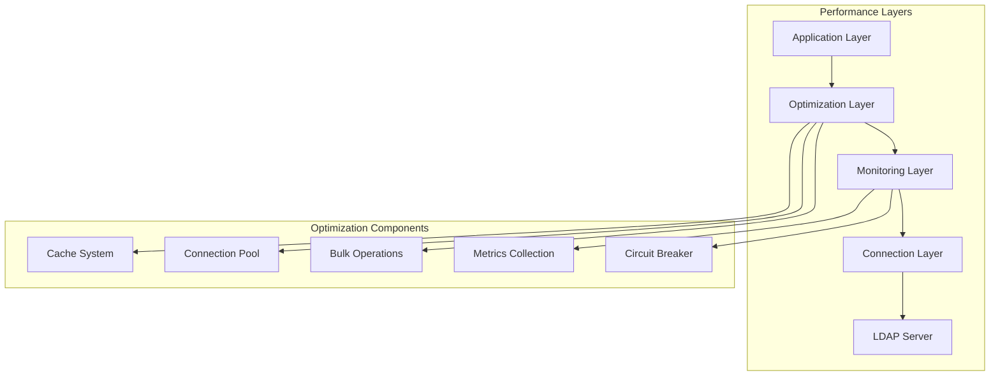

# Performance Configuration Guide

## Table of Contents

1. [Overview](#overview)
2. [Performance Configuration Options](#performance-configuration-options)
3. [Metrics Collection and Analysis](#metrics-collection-and-analysis)
4. [Bulk Operations Optimization](#bulk-operations-optimization)
5. [Connection Pooling Performance](#connection-pooling-performance)
6. [Cache Performance Optimization](#cache-performance-optimization)
7. [Slow Query Detection](#slow-query-detection)
8. [Memory and Resource Management](#memory-and-resource-management)
9. [Prometheus Integration](#prometheus-integration)
10. [Performance Benchmarking](#performance-benchmarking)
11. [Real-World Configuration Examples](#real-world-configuration-examples)
12. [Performance Troubleshooting](#performance-troubleshooting)

## Overview

The simple-ldap-go library provides a comprehensive performance configuration system that enables fine-tuned optimization for various workloads. This guide covers all aspects of performance configuration, from basic monitoring to advanced optimization strategies.

### Performance Architecture



### Key Performance Features

- **Intelligent Caching**: Multi-layer cache with key tracking and TTL management
- **Connection Pooling**: High-performance connection pool with health monitoring
- **Bulk Operations**: Optimized batch processing for high-throughput scenarios
- **Performance Monitoring**: Real-time metrics collection and analysis
- **Resource Management**: Memory optimization and automatic cleanup
- **Prometheus Integration**: Enterprise-grade metrics export

## Performance Configuration Options

### PerformanceConfig Structure

The `PerformanceConfig` struct provides comprehensive control over performance monitoring and optimization:

```go
type PerformanceConfig struct {
    // Core settings
    Enabled             bool          `json:"enabled"`               // Enable performance monitoring
    SlowQueryThreshold  time.Duration `json:"slow_query_threshold"`  // Threshold for slow query detection
    MetricsRetention    time.Duration `json:"metrics_retention"`     // How long to keep metrics data
    SampleRate          float64       `json:"sample_rate"`           // Sample rate for detailed metrics (0.0-1.0)
    DetailedMetrics     bool          `json:"detailed_metrics"`      // Enable detailed per-operation metrics

    // Buffer and timing settings
    BufferSize          int           `json:"buffer_size"`           // Size of metrics buffer
    FlushInterval       time.Duration `json:"flush_interval"`        // How often to flush metrics
    MemoryStatsInterval time.Duration `json:"memory_stats_interval"` // How often to collect memory stats

    // Prometheus integration
    ExportPrometheus    bool          `json:"export_prometheus"`     // Enable Prometheus metrics export
    PrometheusNamespace string        `json:"prometheus_namespace"`  // Namespace for Prometheus metrics
    HistogramBuckets    []float64     `json:"histogram_buckets"`     // Custom histogram buckets for response times

    // Optimization controls
    MaxSearchResults       int           `json:"max_search_results"`       // Maximum number of search results
    SearchTimeout          time.Duration `json:"search_timeout"`           // Timeout for search operations
    EnablePrefetch         bool          `json:"enable_prefetch"`          // Enable prefetching optimizations
    EnableBulkOperations   bool          `json:"enable_bulk_operations"`   // Enable bulk operation optimizations
}
```

### Default Configuration

```go
func OptimalPerformanceConfig() *PerformanceConfig {
    return &PerformanceConfig{
        Enabled:             true,
        SlowQueryThreshold:  50 * time.Millisecond,  // Aggressive slow query detection
        MetricsRetention:    24 * time.Hour,
        SampleRate:          0.1,                    // Sample 10% for detailed metrics
        DetailedMetrics:     true,
        BufferSize:          5000,                   // Larger buffer for high throughput
        FlushInterval:       30 * time.Second,       // More frequent flushing
        ExportPrometheus:    true,                   // Enable Prometheus by default
        PrometheusNamespace: "ldap",
        MemoryStatsInterval: 15 * time.Second,       // More frequent memory monitoring
        HistogramBuckets:    []float64{0.001, 0.005, 0.01, 0.025, 0.05, 0.1, 0.25, 0.5, 1, 2.5, 5, 10},
        MaxSearchResults:    10000,                  // Reasonable limit
        SearchTimeout:       10 * time.Second,       // Faster timeout
        EnablePrefetch:      true,                   // Enable prefetching
        EnableBulkOperations: true,                  // Enable bulk operations
    }
}
```

### Global Optimization Flags

The library provides three global optimization flags that control major performance features:

```go
type Config struct {
    // Global optimization controls
    EnableOptimizations bool // Enable all optimizations (master switch)
    EnableCache         bool // Enable caching separately
    EnableMetrics       bool // Enable performance metrics separately
    EnableBulkOps       bool // Enable bulk operations separately

    // Configuration structures
    Performance *PerformanceConfig
    Cache       *CacheConfig
    Pool        *PoolConfig
}
```

#### Flag Priority

1. **Specific flags override global**: `EnableCache` overrides `EnableOptimizations` for caching
2. **EnableOptimizations = true**: Enables all optimization features by default
3. **Individual control**: Each feature can be controlled independently

## Metrics Collection and Analysis

### EnableMetrics Flag Configuration

The `EnableMetrics` flag controls whether performance metrics are collected and analyzed:

```go
// Enable metrics collection
config := Config{
    EnableMetrics: true,
    Performance: &PerformanceConfig{
        Enabled:             true,
        DetailedMetrics:     true,
        SampleRate:          0.2,  // Sample 20% of operations
        BufferSize:          2000,
        FlushInterval:       1 * time.Minute,
        SlowQueryThreshold:  100 * time.Millisecond,
    },
}

client, err := New(config, username, password)
```

### Performance Metrics Structure

```go
type PerformanceMetrics struct {
    // Basic counters
    OperationsTotal int64 `json:"operations_total"`
    ErrorCount      int64 `json:"error_count"`
    TimeoutCount    int64 `json:"timeout_count"`
    SlowQueries     int64 `json:"slow_queries"`
    CacheHits       int64 `json:"cache_hits"`
    CacheMisses     int64 `json:"cache_misses"`

    // Timing statistics
    AvgResponseTime time.Duration `json:"avg_response_time"`
    MinResponseTime time.Duration `json:"min_response_time"`
    MaxResponseTime time.Duration `json:"max_response_time"`
    P50ResponseTime time.Duration `json:"p50_response_time"`
    P95ResponseTime time.Duration `json:"p95_response_time"`
    P99ResponseTime time.Duration `json:"p99_response_time"`

    // Resource usage
    MemoryUsageMB  float64 `json:"memory_usage_mb"`
    GoroutineCount int     `json:"goroutine_count"`

    // Operation breakdown
    OperationsByType  map[string]int64 `json:"operations_by_type"`
    ErrorsByType      map[string]int64 `json:"errors_by_type"`
    SlowQueriesByType map[string]int64 `json:"slow_queries_by_type"`

    // Cache statistics
    CacheHitRatio float64 `json:"cache_hit_ratio"`
}
```

### Collecting and Analyzing Metrics

```go
// Get current performance statistics
stats := client.GetPerformanceStats()

// Print comprehensive performance report
fmt.Printf("Performance Report:\n")
fmt.Printf("==================\n")
fmt.Printf("Total Operations: %d\n", stats.OperationsTotal)
fmt.Printf("Average Response Time: %v\n", stats.AvgResponseTime)
fmt.Printf("P95 Response Time: %v\n", stats.P95ResponseTime)
fmt.Printf("Cache Hit Ratio: %.2f%%\n", stats.CacheHitRatio)
fmt.Printf("Error Rate: %.2f%%\n", float64(stats.ErrorCount)/float64(stats.OperationsTotal)*100)
fmt.Printf("Memory Usage: %.2f MB\n", stats.MemoryUsageMB)

// Analyze operation types
fmt.Printf("\nOperation Breakdown:\n")
for opType, count := range stats.OperationsByType {
    percentage := float64(count) / float64(stats.OperationsTotal) * 100
    fmt.Printf("  %s: %d (%.1f%%)\n", opType, count, percentage)
}

// Identify slow queries
if stats.SlowQueries > 0 {
    slowQueryRate := float64(stats.SlowQueries) / float64(stats.OperationsTotal) * 100
    fmt.Printf("\nSlow Query Analysis:\n")
    fmt.Printf("  Total Slow Queries: %d (%.2f%%)\n", stats.SlowQueries, slowQueryRate)

    for opType, count := range stats.SlowQueriesByType {
        fmt.Printf("  %s: %d slow queries\n", opType, count)
    }
}
```

### Real-Time Monitoring

```go
// Set up real-time monitoring
go func() {
    ticker := time.NewTicker(30 * time.Second)
    defer ticker.Stop()

    for {
        select {
        case <-ticker.C:
            stats := client.GetPerformanceStats()

            // Check for performance issues
            if stats.P95ResponseTime > 500*time.Millisecond {
                log.Printf("WARNING: High P95 response time: %v", stats.P95ResponseTime)
            }

            if stats.CacheHitRatio < 80 {
                log.Printf("WARNING: Low cache hit ratio: %.2f%%", stats.CacheHitRatio)
            }

            if stats.MemoryUsageMB > 500 {
                log.Printf("WARNING: High memory usage: %.2f MB", stats.MemoryUsageMB)
            }
        }
    }
}()
```

## Bulk Operations Optimization

### EnableBulkOps Flag Configuration

The `EnableBulkOps` flag enables optimized batch processing for high-throughput operations:

```go
// Enable bulk operations optimization
config := Config{
    EnableBulkOps: true,
    Performance: &PerformanceConfig{
        EnableBulkOperations: true,
        MaxSearchResults:     50000,  // Higher limit for bulk operations
        SearchTimeout:        60 * time.Second,  // Longer timeout for large batches
    },
}
```

### Bulk Search Operations

```go
// BulkSearchOptions for optimized batch searches
type BulkSearchOptions struct {
    BatchSize       int           `json:"batch_size"`        // Number of concurrent searches
    Timeout         time.Duration `json:"timeout"`           // Timeout for entire bulk operation
    ContinueOnError bool          `json:"continue_on_error"` // Continue processing on individual failures
    UseCache        bool          `json:"use_cache"`         // Enable caching for bulk searches
    CachePrefix     string        `json:"cache_prefix"`      // Prefix for cache keys
    MaxConcurrency  int           `json:"max_concurrency"`   // Limit concurrent operations
    RetryAttempts   int           `json:"retry_attempts"`    // Retry failed operations
    RetryDelay      time.Duration `json:"retry_delay"`       // Delay between retries
}

// Optimized bulk search implementation
func PerformBulkSearch(client *LDAP, queries []string) ([]SearchResult, error) {
    options := &BulkSearchOptions{
        BatchSize:       50,                   // Process 50 queries concurrently
        Timeout:         5 * time.Minute,     // 5-minute timeout for entire operation
        ContinueOnError: true,                // Don't stop on individual failures
        UseCache:        true,                // Enable caching
        CachePrefix:     "bulk_search",       // Cache key prefix
        MaxConcurrency:  20,                  // Limit concurrent goroutines
        RetryAttempts:   3,                   // Retry failed queries
        RetryDelay:      100 * time.Millisecond,
    }

    var results []SearchResult
    var wg sync.WaitGroup
    resultsChan := make(chan SearchResult, len(queries))
    semaphore := make(chan struct{}, options.MaxConcurrency)

    ctx, cancel := context.WithTimeout(context.Background(), options.Timeout)
    defer cancel()

    for _, query := range queries {
        wg.Add(1)
        go func(q string) {
            defer wg.Done()

            // Acquire semaphore
            semaphore <- struct{}{}
            defer func() { <-semaphore }()

            // Perform search with retries
            var result SearchResult
            var err error

            for attempt := 0; attempt <= options.RetryAttempts; attempt++ {
                if attempt > 0 {
                    time.Sleep(options.RetryDelay)
                }

                result, err = client.Search(ctx, q)
                if err == nil {
                    break
                }

                if attempt == options.RetryAttempts && !options.ContinueOnError {
                    return
                }
            }

            if err == nil {
                resultsChan <- result
            }
        }(query)
    }

    // Wait for all operations to complete
    go func() {
        wg.Wait()
        close(resultsChan)
    }()

    // Collect results
    for result := range resultsChan {
        results = append(results, result)
    }

    return results, nil
}
```

### Bulk Operation Performance Patterns

```go
// Pattern 1: Batch Processing with Load Balancing
func BatchProcess(client *LDAP, items []string, batchSize int) error {
    for i := 0; i < len(items); i += batchSize {
        end := i + batchSize
        if end > len(items) {
            end = len(items)
        }

        batch := items[i:end]
        if err := processBatch(client, batch); err != nil {
            log.Printf("Batch processing error: %v", err)
            continue
        }

        // Brief pause to prevent overwhelming the server
        time.Sleep(10 * time.Millisecond)
    }
    return nil
}

// Pattern 2: Pipeline Processing
func PipelineProcess(client *LDAP, input <-chan string, output chan<- Result) {
    workers := runtime.NumCPU()
    var wg sync.WaitGroup

    for i := 0; i < workers; i++ {
        wg.Add(1)
        go func() {
            defer wg.Done()
            for item := range input {
                result, err := client.ProcessItem(context.Background(), item)
                if err != nil {
                    log.Printf("Processing error: %v", err)
                    continue
                }
                output <- result
            }
        }()
    }

    wg.Wait()
    close(output)
}
```

## Connection Pooling Performance

### Connection Pool Configuration

```go
type PoolConfig struct {
    // Core settings
    MaxConnections      int           // Maximum concurrent connections
    MinConnections      int           // Minimum idle connections
    MaxIdleTime         time.Duration // Maximum idle time before cleanup
    HealthCheckInterval time.Duration // Health check frequency
    ConnectionTimeout   time.Duration // Timeout for new connections
    GetTimeout          time.Duration // Timeout for acquiring connections
}

// High-performance pool configuration
func HighPerformancePoolConfig() *PoolConfig {
    return &PoolConfig{
        MaxConnections:      50,                // Higher connection limit
        MinConnections:      10,                // More idle connections
        MaxIdleTime:         2 * time.Minute,   // Shorter idle time
        HealthCheckInterval: 15 * time.Second,  // More frequent health checks
        ConnectionTimeout:   10 * time.Second,  // Faster connection timeout
        GetTimeout:          5 * time.Second,   // Faster acquisition timeout
    }
}
```

### Pool Performance Monitoring

```go
// Monitor connection pool performance
func MonitorPoolPerformance(client *LDAP) {
    ticker := time.NewTicker(30 * time.Second)
    defer ticker.Stop()

    for {
        select {
        case <-ticker.C:
            stats := client.GetPoolStats()

            // Calculate utilization metrics
            utilization := float64(stats.ActiveConnections) / float64(stats.TotalConnections) * 100
            hitRatio := float64(stats.PoolHits) / float64(stats.PoolHits + stats.PoolMisses) * 100

            fmt.Printf("Pool Performance Report:\n")
            fmt.Printf("  Active Connections: %d\n", stats.ActiveConnections)
            fmt.Printf("  Idle Connections: %d\n", stats.IdleConnections)
            fmt.Printf("  Pool Utilization: %.2f%%\n", utilization)
            fmt.Printf("  Pool Hit Ratio: %.2f%%\n", hitRatio)
            fmt.Printf("  Health Checks Passed: %d\n", stats.HealthChecksPassed)
            fmt.Printf("  Health Checks Failed: %d\n", stats.HealthChecksFailed)

            // Performance alerts
            if utilization > 90 {
                log.Printf("ALERT: High pool utilization: %.2f%%", utilization)
            }

            if hitRatio < 70 {
                log.Printf("ALERT: Low pool hit ratio: %.2f%%", hitRatio)
            }

            if stats.HealthChecksFailed > 0 {
                failureRate := float64(stats.HealthChecksFailed) / float64(stats.HealthChecksPassed + stats.HealthChecksFailed) * 100
                if failureRate > 5 {
                    log.Printf("ALERT: High health check failure rate: %.2f%%", failureRate)
                }
            }
        }
    }
}
```

### Pool Optimization Strategies

```go
// Dynamic pool sizing based on load
func OptimizePoolSize(client *LDAP) {
    ticker := time.NewTicker(1 * time.Minute)
    defer ticker.Stop()

    for {
        select {
        case <-ticker.C:
            stats := client.GetPoolStats()

            // Calculate metrics
            utilization := float64(stats.ActiveConnections) / float64(stats.TotalConnections) * 100

            // Adjust pool size based on utilization
            if utilization > 80 {
                // High utilization - consider increasing pool size
                log.Printf("High utilization detected: %.2f%% - consider increasing MaxConnections", utilization)
            } else if utilization < 20 {
                // Low utilization - consider decreasing pool size
                log.Printf("Low utilization detected: %.2f%% - consider decreasing MaxConnections", utilization)
            }

            // Monitor connection creation rate
            if stats.PoolMisses > stats.PoolHits {
                log.Printf("High connection creation rate - consider increasing MinConnections")
            }
        }
    }
}
```

## Cache Performance Optimization

### Cache Key Tracking System

The library features an advanced cache key tracking system that provides O(1) cache invalidation:

```go
// Register cache entries with primary key tracking
client.SetWithPrimaryKey("user:john.doe", userData, 5*time.Minute, "cn=john.doe,ou=users,dc=example,dc=com")

// Efficiently invalidate all related cache entries
invalidatedCount := client.InvalidateByPrimaryKey("cn=john.doe,ou=users,dc=example,dc=com")
fmt.Printf("Invalidated %d cache entries\n", invalidatedCount)

// Get all cache keys related to a primary key
relatedKeys := client.GetRelatedKeys("cn=john.doe,ou=users,dc=example,dc=com")
fmt.Printf("Related cache keys: %v\n", relatedKeys)
```

### Cache Configuration for High Performance

```go
func HighPerformanceCacheConfig() *CacheConfig {
    return &CacheConfig{
        Enabled:              true,
        TTL:                  10 * time.Minute,   // Longer TTL for better hit ratio
        MaxSize:              10000,              // Larger cache size
        RefreshInterval:      30 * time.Second,   // More frequent cleanup
        RefreshOnAccess:      true,               // Enable background refresh
        NegativeCacheTTL:     2 * time.Minute,    // Cache negative results
        MaxMemoryMB:          256,                // Higher memory limit
        CompressionEnabled:   true,               // Enable compression for large entries
        CompressionThreshold: 512,                // Compress entries > 512 bytes
    }
}
```

### Cache Performance Monitoring

```go
// Comprehensive cache performance analysis
func AnalyzeCachePerformance(client *LDAP) {
    stats := client.GetCacheStats()

    fmt.Printf("Cache Performance Analysis:\n")
    fmt.Printf("===========================\n")

    // Hit ratio analysis
    fmt.Printf("Hit Ratio: %.2f%%\n", stats.HitRatio)
    if stats.HitRatio < 80 {
        fmt.Printf("⚠️  Low hit ratio - consider increasing TTL or cache size\n")
    }

    // Memory usage analysis
    memoryUtilization := float64(stats.MemoryUsageMB) / float64(maxMemoryMB) * 100
    fmt.Printf("Memory Usage: %.2f MB (%.1f%% of limit)\n", stats.MemoryUsageMB, memoryUtilization)
    if memoryUtilization > 90 {
        fmt.Printf("⚠️  High memory usage - consider compression or size limits\n")
    }

    // Entry distribution analysis
    entryUtilization := float64(stats.TotalEntries) / float64(stats.MaxEntries) * 100
    fmt.Printf("Cache Entries: %d/%d (%.1f%% full)\n", stats.TotalEntries, stats.MaxEntries, entryUtilization)

    // Performance metrics
    fmt.Printf("Average Get Time: %v\n", stats.AvgGetTime)
    fmt.Printf("Average Set Time: %v\n", stats.AvgSetTime)

    // Operations breakdown
    totalOps := stats.Hits + stats.Misses
    if totalOps > 0 {
        fmt.Printf("Total Operations: %d\n", totalOps)
        fmt.Printf("  Hits: %d (%.2f%%)\n", stats.Hits, float64(stats.Hits)/float64(totalOps)*100)
        fmt.Printf("  Misses: %d (%.2f%%)\n", stats.Misses, float64(stats.Misses)/float64(totalOps)*100)
    }

    // Eviction analysis
    if stats.Evictions > 0 {
        evictionRate := float64(stats.Evictions) / float64(stats.Sets) * 100
        fmt.Printf("Eviction Rate: %.2f%% (%d evictions)\n", evictionRate, stats.Evictions)
        if evictionRate > 10 {
            fmt.Printf("⚠️  High eviction rate - consider increasing cache size\n")
        }
    }

    // Negative cache analysis
    if stats.NegativeEntries > 0 {
        negativeRatio := float64(stats.NegativeEntries) / float64(stats.TotalEntries) * 100
        fmt.Printf("Negative Cache Entries: %d (%.1f%%)\n", stats.NegativeEntries, negativeRatio)
    }
}
```

### Cache Optimization Patterns

```go
// Pattern 1: Predictive Cache Warming
func WarmCache(client *LDAP, commonQueries []string) error {
    log.Printf("Starting cache warming with %d queries", len(commonQueries))

    var wg sync.WaitGroup
    semaphore := make(chan struct{}, 10) // Limit concurrent warming operations

    for _, query := range commonQueries {
        wg.Add(1)
        go func(q string) {
            defer wg.Done()

            semaphore <- struct{}{}
            defer func() { <-semaphore }()

            ctx, cancel := context.WithTimeout(context.Background(), 30*time.Second)
            defer cancel()

            _, err := client.Search(ctx, q)
            if err != nil {
                log.Printf("Cache warming failed for query %s: %v", q, err)
            }
        }(query)
    }

    wg.Wait()
    log.Printf("Cache warming completed")
    return nil
}

// Pattern 2: Intelligent Cache Refresh
func SetupCacheRefresh(client *LDAP) {
    ticker := time.NewTicker(5 * time.Minute)
    defer ticker.Stop()

    for {
        select {
        case <-ticker.C:
            // Get cache statistics
            stats := client.GetCacheStats()

            // If hit ratio is dropping, trigger refresh of popular entries
            if stats.HitRatio < 70 {
                log.Printf("Hit ratio below threshold (%.2f%%), triggering cache refresh", stats.HitRatio)

                // Implement refresh logic based on access patterns
                // This would refresh the most frequently accessed entries
                refreshPopularEntries(client)
            }
        }
    }
}
```

## Slow Query Detection

### Configuration

```go
// Configure aggressive slow query detection
perfConfig := &PerformanceConfig{
    SlowQueryThreshold: 50 * time.Millisecond,  // Aggressive threshold
    DetailedMetrics:    true,                   // Capture detailed slow query info
}
```

### Slow Query Analysis

```go
// Comprehensive slow query analysis
func AnalyzeSlowQueries(client *LDAP) {
    stats := client.GetPerformanceStats()

    if stats.SlowQueries == 0 {
        fmt.Printf("✅ No slow queries detected\n")
        return
    }

    fmt.Printf("Slow Query Analysis:\n")
    fmt.Printf("===================\n")

    // Overall slow query metrics
    slowQueryRate := float64(stats.SlowQueries) / float64(stats.OperationsTotal) * 100
    fmt.Printf("Total Slow Queries: %d (%.2f%% of all operations)\n", stats.SlowQueries, slowQueryRate)

    // Slow queries by operation type
    fmt.Printf("\nSlow Queries by Operation Type:\n")
    for opType, count := range stats.SlowQueriesByType {
        if count > 0 {
            typeTotal := stats.OperationsByType[opType]
            typeSlowRate := float64(count) / float64(typeTotal) * 100
            fmt.Printf("  %s: %d slow queries (%.2f%% of %s operations)\n",
                opType, count, typeSlowRate, opType)
        }
    }

    // Performance recommendations
    fmt.Printf("\nRecommendations:\n")
    if slowQueryRate > 5 {
        fmt.Printf("🔴 High slow query rate detected:\n")
        fmt.Printf("   - Review LDAP server performance\n")
        fmt.Printf("   - Consider optimizing search filters\n")
        fmt.Printf("   - Increase cache TTL for frequently accessed data\n")
    }

    if slowQueryRate > 1 && slowQueryRate <= 5 {
        fmt.Printf("🟡 Moderate slow query rate:\n")
        fmt.Printf("   - Monitor trends over time\n")
        fmt.Printf("   - Consider connection pool optimization\n")
    }

    // Get detailed operation history for slow query analysis
    history := client.GetOperationHistory()
    slowOps := make([]OperationMetric, 0)

    for _, op := range history {
        if op.Duration > perfConfig.SlowQueryThreshold {
            slowOps = append(slowOps, op)
        }
    }

    if len(slowOps) > 0 {
        fmt.Printf("\nRecent Slow Operations (showing up to 10):\n")
        sort.Slice(slowOps, func(i, j int) bool {
            return slowOps[i].Duration > slowOps[j].Duration
        })

        for i, op := range slowOps {
            if i >= 10 {
                break
            }
            fmt.Printf("  %s: %v (%s)\n", op.Operation, op.Duration, op.StartTime.Format("15:04:05"))
            if op.ErrorMessage != "" {
                fmt.Printf("    Error: %s\n", op.ErrorMessage)
            }
        }
    }
}
```

### Slow Query Alerting

```go
// Real-time slow query alerting
func SetupSlowQueryAlerting(client *LDAP, threshold time.Duration) {
    // Monitor for slow queries in real-time
    monitor := client.GetPerformanceMonitor()

    // Set up a custom recorder that checks for slow queries
    originalRecorder := monitor.RecordOperation

    monitor.RecordOperation = func(ctx context.Context, operation string, duration time.Duration, cacheHit bool, err error, resultCount int) {
        // Call the original recorder
        originalRecorder(ctx, operation, duration, cacheHit, err, resultCount)

        // Check for slow query
        if duration > threshold {
            log.Printf("SLOW QUERY ALERT: %s took %v (threshold: %v)", operation, duration, threshold)

            // Additional context if available
            if ctx != nil {
                if clientIP := ctx.Value("client_ip"); clientIP != nil {
                    log.Printf("  Client IP: %s", clientIP)
                }
                if userAgent := ctx.Value("user_agent"); userAgent != nil {
                    log.Printf("  User Agent: %s", userAgent)
                }
            }

            if err != nil {
                log.Printf("  Error: %s", err.Error())
            }

            log.Printf("  Result Count: %d", resultCount)
            log.Printf("  Cache Hit: %t", cacheHit)
        }
    }
}
```

## Memory and Resource Management

### Memory Configuration

```go
// Memory-optimized configuration
func MemoryOptimizedConfig() *Config {
    return &Config{
        Cache: &CacheConfig{
            MaxMemoryMB:          128,               // Limit cache memory usage
            CompressionEnabled:   true,              // Enable compression
            CompressionThreshold: 256,               // Compress entries > 256 bytes
            MaxSize:              5000,              // Limit number of entries
        },
        Performance: &PerformanceConfig{
            BufferSize:          1000,               // Smaller metrics buffer
            MemoryStatsInterval: 10 * time.Second,   // Frequent memory monitoring
            MetricsRetention:    6 * time.Hour,      // Shorter retention
        },
        Pool: &PoolConfig{
            MaxConnections: 20,                      // Limit connections
            MaxIdleTime:    2 * time.Minute,         // Shorter idle time
        },
    }
}
```

### Memory Monitoring

```go
// Comprehensive memory monitoring
func MonitorMemoryUsage(client *LDAP) {
    ticker := time.NewTicker(30 * time.Second)
    defer ticker.Stop()

    var memStats runtime.MemStats

    for {
        select {
        case <-ticker.C:
            runtime.ReadMemStats(&memStats)

            // Get application-specific memory stats
            perfStats := client.GetPerformanceStats()
            cacheStats := client.GetCacheStats()

            fmt.Printf("Memory Usage Report:\n")
            fmt.Printf("==================\n")

            // Runtime memory stats
            fmt.Printf("Go Runtime:\n")
            fmt.Printf("  Allocated: %.2f MB\n", float64(memStats.Alloc)/1024/1024)
            fmt.Printf("  Total Allocated: %.2f MB\n", float64(memStats.TotalAlloc)/1024/1024)
            fmt.Printf("  System Memory: %.2f MB\n", float64(memStats.Sys)/1024/1024)
            fmt.Printf("  GC Cycles: %d\n", memStats.NumGC)
            fmt.Printf("  Goroutines: %d\n", perfStats.GoroutineCount)

            // Cache memory usage
            fmt.Printf("\nCache:\n")
            fmt.Printf("  Cache Memory: %.2f MB\n", cacheStats.MemoryUsageMB)
            fmt.Printf("  Cache Entries: %d\n", cacheStats.TotalEntries)
            fmt.Printf("  Memory per Entry: %.2f KB\n",
                cacheStats.MemoryUsageMB*1024/float64(cacheStats.TotalEntries))

            // Memory efficiency analysis
            totalAppMemory := perfStats.MemoryUsageMB + cacheStats.MemoryUsageMB
            fmt.Printf("\nMemory Efficiency:\n")
            fmt.Printf("  Total App Memory: %.2f MB\n", totalAppMemory)
            fmt.Printf("  Cache Efficiency: %.2f MB per 1000 entries\n",
                cacheStats.MemoryUsageMB/(float64(cacheStats.TotalEntries)/1000))

            // Memory alerts
            if memStats.Alloc > 500*1024*1024 { // 500 MB
                log.Printf("ALERT: High memory usage: %.2f MB", float64(memStats.Alloc)/1024/1024)
            }

            if cacheStats.MemoryUsageMB > 200 {
                log.Printf("ALERT: High cache memory usage: %.2f MB", cacheStats.MemoryUsageMB)
            }

            // Trigger GC if memory usage is high
            if memStats.Alloc > 1024*1024*1024 { // 1 GB
                log.Printf("Triggering garbage collection due to high memory usage")
                runtime.GC()
            }
        }
    }
}
```

### Resource Cleanup

```go
// Automatic resource cleanup
func SetupResourceCleanup(client *LDAP) {
    ticker := time.NewTicker(5 * time.Minute)
    defer ticker.Stop()

    for {
        select {
        case <-ticker.C:
            log.Printf("Starting periodic resource cleanup")

            // Force garbage collection
            runtime.GC()

            // Get memory stats before cleanup
            var beforeStats runtime.MemStats
            runtime.ReadMemStats(&beforeStats)

            // Flush performance metrics buffers
            perfMonitor := client.GetPerformanceMonitor()
            if perfMonitor != nil {
                perfMonitor.Flush()
            }

            // Get memory stats after cleanup
            var afterStats runtime.MemStats
            runtime.ReadMemStats(&afterStats)

            freedMemory := float64(beforeStats.Alloc-afterStats.Alloc) / 1024 / 1024
            log.Printf("Resource cleanup completed, freed %.2f MB", freedMemory)
        }
    }
}
```

## Prometheus Integration

### Enabling Prometheus Metrics

```go
// Enable Prometheus metrics export
config := Config{
    EnableMetrics: true,
    Performance: &PerformanceConfig{
        ExportPrometheus:    true,
        PrometheusNamespace: "ldap_client",
        HistogramBuckets:    []float64{0.001, 0.005, 0.01, 0.025, 0.05, 0.1, 0.25, 0.5, 1, 2.5, 5, 10},
    },
}
```

### Prometheus Metrics Definitions

```go
// Prometheus metrics that would be exported
var (
    // Counter metrics
    ldapOperationsTotal = prometheus.NewCounterVec(
        prometheus.CounterOpts{
            Namespace: "ldap_client",
            Name:      "operations_total",
            Help:      "Total number of LDAP operations performed",
        },
        []string{"operation", "status"},
    )

    ldapErrorsTotal = prometheus.NewCounterVec(
        prometheus.CounterOpts{
            Namespace: "ldap_client",
            Name:      "errors_total",
            Help:      "Total number of LDAP operation errors",
        },
        []string{"operation", "error_type"},
    )

    ldapSlowQueriesTotal = prometheus.NewCounterVec(
        prometheus.CounterOpts{
            Namespace: "ldap_client",
            Name:      "slow_queries_total",
            Help:      "Total number of slow LDAP queries",
        },
        []string{"operation"},
    )

    // Histogram metrics
    ldapOperationDuration = prometheus.NewHistogramVec(
        prometheus.HistogramOpts{
            Namespace: "ldap_client",
            Name:      "operation_duration_seconds",
            Help:      "Duration of LDAP operations in seconds",
            Buckets:   []float64{0.001, 0.005, 0.01, 0.025, 0.05, 0.1, 0.25, 0.5, 1, 2.5, 5, 10},
        },
        []string{"operation"},
    )

    // Gauge metrics
    ldapCacheHitRatio = prometheus.NewGauge(
        prometheus.GaugeOpts{
            Namespace: "ldap_client",
            Name:      "cache_hit_ratio",
            Help:      "Current cache hit ratio (0-100)",
        },
    )

    ldapActiveConnections = prometheus.NewGauge(
        prometheus.GaugeOpts{
            Namespace: "ldap_client",
            Name:      "active_connections",
            Help:      "Number of active LDAP connections",
        },
    )

    ldapMemoryUsage = prometheus.NewGauge(
        prometheus.GaugeOpts{
            Namespace: "ldap_client",
            Name:      "memory_usage_bytes",
            Help:      "Memory usage in bytes",
        },
    )
)
```

### Prometheus Metrics Collection

```go
// Export metrics to Prometheus
func SetupPrometheusExport(client *LDAP, port int) error {
    // Register metrics
    prometheus.MustRegister(
        ldapOperationsTotal,
        ldapErrorsTotal,
        ldapSlowQueriesTotal,
        ldapOperationDuration,
        ldapCacheHitRatio,
        ldapActiveConnections,
        ldapMemoryUsage,
    )

    // Start metrics collection goroutine
    go func() {
        ticker := time.NewTicker(15 * time.Second)
        defer ticker.Stop()

        for {
            select {
            case <-ticker.C:
                updatePrometheusMetrics(client)
            }
        }
    }()

    // Start HTTP server for metrics endpoint
    http.Handle("/metrics", promhttp.Handler())
    log.Printf("Starting Prometheus metrics server on port %d", port)
    return http.ListenAndServe(fmt.Sprintf(":%d", port), nil)
}

func updatePrometheusMetrics(client *LDAP) {
    stats := client.GetPerformanceStats()
    cacheStats := client.GetCacheStats()
    poolStats := client.GetPoolStats()

    // Update gauge metrics
    ldapCacheHitRatio.Set(stats.CacheHitRatio)
    ldapActiveConnections.Set(float64(poolStats.ActiveConnections))
    ldapMemoryUsage.Set(stats.MemoryUsageMB * 1024 * 1024) // Convert to bytes

    // Counter metrics are updated in real-time during operations
    // Histogram metrics are updated during operation recording
}
```

## Performance Benchmarking

### Built-in Benchmarking Tools

```go
// Comprehensive performance benchmark
func BenchmarkLDAPPerformance(client *LDAP, testQueries []string) (*BenchmarkResult, error) {
    result := &BenchmarkResult{
        StartTime:    time.Now(),
        TotalQueries: len(testQueries),
    }

    // Reset performance metrics for clean measurement
    client.ResetPerformanceStats()

    // Warmup phase
    log.Printf("Starting warmup phase with %d queries", len(testQueries)/10)
    warmupQueries := testQueries[:len(testQueries)/10]
    for _, query := range warmupQueries {
        ctx, cancel := context.WithTimeout(context.Background(), 30*time.Second)
        client.Search(ctx, query)
        cancel()
    }

    // Reset again after warmup
    client.ResetPerformanceStats()

    // Main benchmark phase
    log.Printf("Starting main benchmark phase with %d queries", len(testQueries))
    startTime := time.Now()

    var wg sync.WaitGroup
    concurrency := 10
    semaphore := make(chan struct{}, concurrency)

    for _, query := range testQueries {
        wg.Add(1)
        go func(q string) {
            defer wg.Done()

            semaphore <- struct{}{}
            defer func() { <-semaphore }()

            ctx, cancel := context.WithTimeout(context.Background(), 30*time.Second)
            defer cancel()

            _, err := client.Search(ctx, q)
            if err != nil {
                log.Printf("Benchmark query failed: %v", err)
            }
        }(query)
    }

    wg.Wait()
    duration := time.Since(startTime)

    // Collect final statistics
    stats := client.GetPerformanceStats()
    cacheStats := client.GetCacheStats()

    result.EndTime = time.Now()
    result.Duration = duration
    result.QueriesPerSecond = float64(len(testQueries)) / duration.Seconds()
    result.AvgResponseTime = stats.AvgResponseTime
    result.P95ResponseTime = stats.P95ResponseTime
    result.P99ResponseTime = stats.P99ResponseTime
    result.CacheHitRatio = stats.CacheHitRatio
    result.ErrorRate = float64(stats.ErrorCount) / float64(stats.OperationsTotal) * 100
    result.SlowQueryRate = float64(stats.SlowQueries) / float64(stats.OperationsTotal) * 100

    return result, nil
}

type BenchmarkResult struct {
    StartTime        time.Time     `json:"start_time"`
    EndTime          time.Time     `json:"end_time"`
    Duration         time.Duration `json:"duration"`
    TotalQueries     int           `json:"total_queries"`
    QueriesPerSecond float64       `json:"queries_per_second"`
    AvgResponseTime  time.Duration `json:"avg_response_time"`
    P95ResponseTime  time.Duration `json:"p95_response_time"`
    P99ResponseTime  time.Duration `json:"p99_response_time"`
    CacheHitRatio    float64       `json:"cache_hit_ratio"`
    ErrorRate        float64       `json:"error_rate"`
    SlowQueryRate    float64       `json:"slow_query_rate"`
}

func (br *BenchmarkResult) Report() {
    fmt.Printf("Performance Benchmark Results:\n")
    fmt.Printf("==============================\n")
    fmt.Printf("Duration: %v\n", br.Duration)
    fmt.Printf("Total Queries: %d\n", br.TotalQueries)
    fmt.Printf("Queries/Second: %.2f\n", br.QueriesPerSecond)
    fmt.Printf("Average Response Time: %v\n", br.AvgResponseTime)
    fmt.Printf("P95 Response Time: %v\n", br.P95ResponseTime)
    fmt.Printf("P99 Response Time: %v\n", br.P99ResponseTime)
    fmt.Printf("Cache Hit Ratio: %.2f%%\n", br.CacheHitRatio)
    fmt.Printf("Error Rate: %.2f%%\n", br.ErrorRate)
    fmt.Printf("Slow Query Rate: %.2f%%\n", br.SlowQueryRate)

    // Performance grade
    grade := "F"
    if br.QueriesPerSecond > 1000 && br.P95ResponseTime < 100*time.Millisecond {
        grade = "A"
    } else if br.QueriesPerSecond > 500 && br.P95ResponseTime < 200*time.Millisecond {
        grade = "B"
    } else if br.QueriesPerSecond > 200 && br.P95ResponseTime < 500*time.Millisecond {
        grade = "C"
    } else if br.QueriesPerSecond > 100 {
        grade = "D"
    }

    fmt.Printf("Performance Grade: %s\n", grade)
}
```

### Load Testing Patterns

```go
// Graduated load testing
func LoadTest(client *LDAP, maxConcurrency int, duration time.Duration) error {
    log.Printf("Starting load test: max concurrency %d, duration %v", maxConcurrency, duration)

    ctx, cancel := context.WithTimeout(context.Background(), duration)
    defer cancel()

    // Test queries
    testQueries := generateTestQueries(1000)

    // Gradually increase load
    step := maxConcurrency / 10
    if step == 0 {
        step = 1
    }

    for concurrency := step; concurrency <= maxConcurrency; concurrency += step {
        log.Printf("Testing with concurrency: %d", concurrency)

        // Run test for 30 seconds at this concurrency level
        phaseCtx, phaseCancel := context.WithTimeout(ctx, 30*time.Second)
        err := runLoadPhase(client, testQueries, concurrency, phaseCtx)
        phaseCancel()

        if err != nil {
            log.Printf("Load test failed at concurrency %d: %v", concurrency, err)
            return err
        }

        // Report phase results
        stats := client.GetPerformanceStats()
        log.Printf("Phase results - Concurrency: %d, QPS: %.2f, P95: %v, Errors: %d",
            concurrency,
            float64(stats.OperationsTotal)/30.0,
            stats.P95ResponseTime,
            stats.ErrorCount)

        // Reset stats for next phase
        client.ResetPerformanceStats()

        // Brief pause between phases
        time.Sleep(5 * time.Second)
    }

    return nil
}

func runLoadPhase(client *LDAP, queries []string, concurrency int, ctx context.Context) error {
    var wg sync.WaitGroup
    semaphore := make(chan struct{}, concurrency)
    queryIndex := int64(0)

    // Start worker goroutines
    for i := 0; i < concurrency; i++ {
        wg.Add(1)
        go func() {
            defer wg.Done()

            for {
                select {
                case <-ctx.Done():
                    return
                default:
                    semaphore <- struct{}{}

                    // Get next query
                    index := atomic.AddInt64(&queryIndex, 1) % int64(len(queries))
                    query := queries[index]

                    // Execute query
                    queryCtx, cancel := context.WithTimeout(context.Background(), 10*time.Second)
                    _, err := client.Search(queryCtx, query)
                    cancel()

                    <-semaphore

                    if err != nil {
                        log.Printf("Query failed during load test: %v", err)
                    }
                }
            }
        }()
    }

    wg.Wait()
    return nil
}
```

## Real-World Configuration Examples

### High-Throughput Web Application

```go
// Configuration for high-throughput web applications
func WebAppConfig() *Config {
    return &Config{
        // Global optimizations
        EnableOptimizations: true,
        EnableCache:         true,
        EnableMetrics:       true,
        EnableBulkOps:       true,

        // Connection pool optimized for web traffic
        Pool: &PoolConfig{
            MaxConnections:      50,
            MinConnections:      15,
            MaxIdleTime:         3 * time.Minute,
            HealthCheckInterval: 30 * time.Second,
            ConnectionTimeout:   10 * time.Second,
            GetTimeout:          5 * time.Second,
        },

        // Aggressive caching for better response times
        Cache: &CacheConfig{
            Enabled:              true,
            TTL:                  15 * time.Minute,
            MaxSize:              20000,
            RefreshInterval:      1 * time.Minute,
            RefreshOnAccess:      true,
            NegativeCacheTTL:     5 * time.Minute,
            MaxMemoryMB:          512,
            CompressionEnabled:   true,
            CompressionThreshold: 1024,
        },

        // Performance monitoring for production
        Performance: &PerformanceConfig{
            Enabled:             true,
            SlowQueryThreshold:  100 * time.Millisecond,
            MetricsRetention:    24 * time.Hour,
            SampleRate:          0.05, // 5% sampling for high volume
            DetailedMetrics:     true,
            BufferSize:          10000,
            FlushInterval:       30 * time.Second,
            ExportPrometheus:    true,
            PrometheusNamespace: "webapp_ldap",
            MemoryStatsInterval: 30 * time.Second,
            MaxSearchResults:    5000,
            SearchTimeout:       30 * time.Second,
            EnableBulkOperations: true,
        },
    }
}
```

### Batch Processing System

```go
// Configuration for batch processing systems
func BatchProcessingConfig() *Config {
    return &Config{
        EnableOptimizations: true,
        EnableBulkOps:       true,
        EnableCache:         true,
        EnableMetrics:       true,

        // Larger connection pool for batch operations
        Pool: &PoolConfig{
            MaxConnections:      100,
            MinConnections:      20,
            MaxIdleTime:         10 * time.Minute,
            HealthCheckInterval: 1 * time.Minute,
            ConnectionTimeout:   30 * time.Second,
            GetTimeout:          30 * time.Second,
        },

        // Cache optimized for bulk operations
        Cache: &CacheConfig{
            Enabled:              true,
            TTL:                  1 * time.Hour,    // Longer TTL for batch data
            MaxSize:              50000,            // Larger cache
            RefreshInterval:      5 * time.Minute,
            RefreshOnAccess:      false,            // Disable for batch processing
            NegativeCacheTTL:     15 * time.Minute,
            MaxMemoryMB:          1024,             // Higher memory limit
            CompressionEnabled:   true,
            CompressionThreshold: 512,
        },

        // Performance monitoring for batch operations
        Performance: &PerformanceConfig{
            Enabled:             true,
            SlowQueryThreshold:  500 * time.Millisecond, // Higher threshold for batch
            MetricsRetention:    7 * 24 * time.Hour,     // Longer retention
            SampleRate:          0.1,                    // 10% sampling
            DetailedMetrics:     true,
            BufferSize:          20000,                  // Larger buffer
            FlushInterval:       2 * time.Minute,
            ExportPrometheus:    true,
            PrometheusNamespace: "batch_ldap",
            MemoryStatsInterval: 1 * time.Minute,
            MaxSearchResults:    100000,                 // Much higher limit
            SearchTimeout:       5 * time.Minute,        // Longer timeout
            EnableBulkOperations: true,
        },
    }
}
```

### Microservices Environment

```go
// Configuration for microservices
func MicroserviceConfig() *Config {
    return &Config{
        EnableOptimizations: true,
        EnableCache:         true,
        EnableMetrics:       true,
        EnableBulkOps:       false, // Usually not needed in microservices

        // Conservative connection pool for microservices
        Pool: &PoolConfig{
            MaxConnections:      20,
            MinConnections:      5,
            MaxIdleTime:         2 * time.Minute,
            HealthCheckInterval: 30 * time.Second,
            ConnectionTimeout:   10 * time.Second,
            GetTimeout:          5 * time.Second,
        },

        // Moderate caching for microservices
        Cache: &CacheConfig{
            Enabled:              true,
            TTL:                  5 * time.Minute,
            MaxSize:              5000,
            RefreshInterval:      1 * time.Minute,
            RefreshOnAccess:      true,
            NegativeCacheTTL:     1 * time.Minute,
            MaxMemoryMB:          128,
            CompressionEnabled:   true,
            CompressionThreshold: 512,
        },

        // Detailed monitoring for microservices
        Performance: &PerformanceConfig{
            Enabled:             true,
            SlowQueryThreshold:  50 * time.Millisecond,
            MetricsRetention:    12 * time.Hour,
            SampleRate:          0.2,    // Higher sampling for better observability
            DetailedMetrics:     true,
            BufferSize:          2000,
            FlushInterval:       1 * time.Minute,
            ExportPrometheus:    true,
            PrometheusNamespace: "microservice_ldap",
            MemoryStatsInterval: 30 * time.Second,
            MaxSearchResults:    1000,
            SearchTimeout:       15 * time.Second,
        },
    }
}
```

### Development Environment

```go
// Configuration for development environments
func DevelopmentConfig() *Config {
    return &Config{
        EnableOptimizations: true,
        EnableCache:         true,
        EnableMetrics:       true,
        EnableBulkOps:       true,

        // Minimal connection pool for development
        Pool: &PoolConfig{
            MaxConnections:      5,
            MinConnections:      1,
            MaxIdleTime:         1 * time.Minute,
            HealthCheckInterval: 1 * time.Minute,
            ConnectionTimeout:   5 * time.Second,
            GetTimeout:          3 * time.Second,
        },

        // Small cache for development
        Cache: &CacheConfig{
            Enabled:              true,
            TTL:                  2 * time.Minute,
            MaxSize:              1000,
            RefreshInterval:      30 * time.Second,
            RefreshOnAccess:      true,
            NegativeCacheTTL:     30 * time.Second,
            MaxMemoryMB:          32,
            CompressionEnabled:   false, // Disable for easier debugging
            CompressionThreshold: 1024,
        },

        // Verbose monitoring for development
        Performance: &PerformanceConfig{
            Enabled:             true,
            SlowQueryThreshold:  10 * time.Millisecond, // Very aggressive for dev
            MetricsRetention:    2 * time.Hour,
            SampleRate:          1.0,    // 100% sampling for development
            DetailedMetrics:     true,
            BufferSize:          500,
            FlushInterval:       30 * time.Second,
            ExportPrometheus:    false,   // Usually not needed in dev
            PrometheusNamespace: "dev_ldap",
            MemoryStatsInterval: 10 * time.Second,
            MaxSearchResults:    500,
            SearchTimeout:       5 * time.Second,
        },
    }
}
```

## Performance Troubleshooting

### Common Performance Issues

#### High Response Times

```go
func DiagnoseHighResponseTimes(client *LDAP) {
    stats := client.GetPerformanceStats()

    fmt.Printf("Response Time Analysis:\n")
    fmt.Printf("======================\n")
    fmt.Printf("Average: %v\n", stats.AvgResponseTime)
    fmt.Printf("P95: %v\n", stats.P95ResponseTime)
    fmt.Printf("P99: %v\n", stats.P99ResponseTime)

    if stats.P95ResponseTime > 200*time.Millisecond {
        fmt.Printf("🔴 High P95 response time detected\n")

        // Check cache performance
        if stats.CacheHitRatio < 70 {
            fmt.Printf("  - Low cache hit ratio (%.2f%%) may be contributing\n", stats.CacheHitRatio)
            fmt.Printf("  - Consider increasing cache size or TTL\n")
        }

        // Check connection pool
        poolStats := client.GetPoolStats()
        utilization := float64(poolStats.ActiveConnections) / float64(poolStats.TotalConnections) * 100
        if utilization > 90 {
            fmt.Printf("  - High connection pool utilization (%.1f%%)\n", utilization)
            fmt.Printf("  - Consider increasing MaxConnections\n")
        }

        // Check for slow queries
        if stats.SlowQueries > 0 {
            slowRate := float64(stats.SlowQueries) / float64(stats.OperationsTotal) * 100
            fmt.Printf("  - %.2f%% of queries are slow\n", slowRate)
            fmt.Printf("  - Review LDAP server performance and query optimization\n")
        }
    }
}
```

#### Memory Issues

```go
func DiagnoseMemoryIssues(client *LDAP) {
    var memStats runtime.MemStats
    runtime.ReadMemStats(&memStats)

    cacheStats := client.GetCacheStats()
    perfStats := client.GetPerformanceStats()

    fmt.Printf("Memory Diagnosis:\n")
    fmt.Printf("================\n")
    fmt.Printf("Runtime Memory: %.2f MB\n", float64(memStats.Alloc)/1024/1024)
    fmt.Printf("Cache Memory: %.2f MB\n", cacheStats.MemoryUsageMB)
    fmt.Printf("Total Memory: %.2f MB\n", perfStats.MemoryUsageMB)

    if memStats.Alloc > 500*1024*1024 { // 500 MB
        fmt.Printf("🔴 High memory usage detected\n")

        // Check cache efficiency
        if cacheStats.MemoryUsageMB > 200 {
            avgEntrySize := cacheStats.MemoryUsageMB * 1024 / float64(cacheStats.TotalEntries)
            fmt.Printf("  - Cache using %.2f MB with average entry size %.2f KB\n",
                cacheStats.MemoryUsageMB, avgEntrySize)

            if avgEntrySize > 10 {
                fmt.Printf("  - Consider enabling compression (average entry > 10KB)\n")
            }

            if cacheStats.TotalEntries > 10000 {
                fmt.Printf("  - Consider reducing cache size (%d entries)\n", cacheStats.TotalEntries)
            }
        }

        // Check performance buffer usage
        operationHistory := client.GetOperationHistory()
        if len(operationHistory) > 5000 {
            fmt.Printf("  - Large performance buffer (%d operations)\n", len(operationHistory))
            fmt.Printf("  - Consider reducing BufferSize or SampleRate\n")
        }

        // GC analysis
        if memStats.NumGC < 10 {
            fmt.Printf("  - Low GC activity (%d cycles) - memory may not be freed\n", memStats.NumGC)
            fmt.Printf("  - Consider calling runtime.GC() manually\n")
        }
    }
}
```

#### Low Cache Hit Ratio

```go
func DiagnoseLowCacheHitRatio(client *LDAP) {
    cacheStats := client.GetCacheStats()

    fmt.Printf("Cache Hit Ratio Analysis:\n")
    fmt.Printf("========================\n")
    fmt.Printf("Current Hit Ratio: %.2f%%\n", cacheStats.HitRatio)

    if cacheStats.HitRatio < 70 {
        fmt.Printf("🔴 Low cache hit ratio detected\n")

        // Analyze evictions
        if cacheStats.Evictions > 0 {
            evictionRate := float64(cacheStats.Evictions) / float64(cacheStats.Sets) * 100
            fmt.Printf("  - High eviction rate: %.2f%%\n", evictionRate)
            if evictionRate > 20 {
                fmt.Printf("  - Consider increasing cache MaxSize\n")
            }
        }

        // Analyze entry distribution
        utilization := float64(cacheStats.TotalEntries) / float64(cacheStats.MaxEntries) * 100
        fmt.Printf("  - Cache utilization: %.1f%%\n", utilization)

        if utilization < 50 {
            fmt.Printf("  - Low cache utilization suggests short TTL or frequent invalidation\n")
            fmt.Printf("  - Consider increasing TTL or reviewing invalidation logic\n")
        }

        // Check expiration vs eviction
        if cacheStats.Expirations > cacheStats.Evictions {
            fmt.Printf("  - More expirations (%d) than evictions (%d)\n",
                cacheStats.Expirations, cacheStats.Evictions)
            fmt.Printf("  - Consider increasing TTL\n")
        }

        // Negative cache analysis
        if cacheStats.NegativeEntries > 0 {
            negativeRatio := float64(cacheStats.NegativeEntries) / float64(cacheStats.TotalEntries) * 100
            fmt.Printf("  - Negative cache entries: %.1f%%\n", negativeRatio)
            if negativeRatio > 30 {
                fmt.Printf("  - High negative cache ratio suggests many failed lookups\n")
            }
        }
    }
}
```

### Performance Optimization Recommendations

```go
func GenerateOptimizationRecommendations(client *LDAP) {
    perfStats := client.GetPerformanceStats()
    cacheStats := client.GetCacheStats()
    poolStats := client.GetPoolStats()

    fmt.Printf("Performance Optimization Recommendations:\n")
    fmt.Printf("========================================\n")

    recommendations := make([]string, 0)

    // Cache optimizations
    if cacheStats.HitRatio < 80 {
        recommendations = append(recommendations,
            fmt.Sprintf("🔧 Increase cache TTL (current hit ratio: %.1f%%)", cacheStats.HitRatio))
    }

    if cacheStats.MemoryUsageMB > 200 && !cacheStats.CompressionEnabled {
        recommendations = append(recommendations,
            "🔧 Enable cache compression to reduce memory usage")
    }

    // Connection pool optimizations
    poolUtilization := float64(poolStats.ActiveConnections) / float64(poolStats.TotalConnections) * 100
    if poolUtilization > 85 {
        recommendations = append(recommendations,
            fmt.Sprintf("🔧 Increase connection pool MaxConnections (utilization: %.1f%%)", poolUtilization))
    }

    poolHitRatio := float64(poolStats.PoolHits) / float64(poolStats.PoolHits + poolStats.PoolMisses) * 100
    if poolHitRatio < 80 {
        recommendations = append(recommendations,
            fmt.Sprintf("🔧 Increase MinConnections (pool hit ratio: %.1f%%)", poolHitRatio))
    }

    // Performance monitoring optimizations
    if perfStats.SlowQueries > 0 {
        slowRate := float64(perfStats.SlowQueries) / float64(perfStats.OperationsTotal) * 100
        if slowRate > 5 {
            recommendations = append(recommendations,
                fmt.Sprintf("🔧 Optimize LDAP queries (%.1f%% are slow)", slowRate))
        }
    }

    // Memory optimizations
    if perfStats.MemoryUsageMB > 500 {
        recommendations = append(recommendations,
            "🔧 Reduce metrics BufferSize or increase FlushInterval to lower memory usage")
    }

    // Concurrency optimizations
    if poolUtilization > 90 && perfStats.ErrorCount > 0 {
        recommendations = append(recommendations,
            "🔧 Implement circuit breaker pattern to handle overload gracefully")
    }

    // Output recommendations
    if len(recommendations) == 0 {
        fmt.Printf("✅ No immediate optimizations needed - performance looks good!\n")
    } else {
        for i, rec := range recommendations {
            fmt.Printf("%d. %s\n", i+1, rec)
        }
    }

    // Performance score
    score := calculatePerformanceScore(perfStats, cacheStats, poolStats)
    fmt.Printf("\nOverall Performance Score: %d/100\n", score)

    if score >= 90 {
        fmt.Printf("🟢 Excellent performance\n")
    } else if score >= 75 {
        fmt.Printf("🟡 Good performance with room for improvement\n")
    } else if score >= 60 {
        fmt.Printf("🟠 Moderate performance - optimization recommended\n")
    } else {
        fmt.Printf("🔴 Poor performance - immediate optimization required\n")
    }
}

func calculatePerformanceScore(perfStats *PerformanceMetrics, cacheStats *CacheStats, poolStats *PoolStats) int {
    score := 100

    // Deduct points for poor cache performance
    if cacheStats.HitRatio < 80 {
        score -= int((80 - cacheStats.HitRatio) / 2)
    }

    // Deduct points for slow queries
    if perfStats.SlowQueries > 0 {
        slowRate := float64(perfStats.SlowQueries) / float64(perfStats.OperationsTotal) * 100
        score -= int(slowRate * 2)
    }

    // Deduct points for errors
    if perfStats.ErrorCount > 0 {
        errorRate := float64(perfStats.ErrorCount) / float64(perfStats.OperationsTotal) * 100
        score -= int(errorRate * 5)
    }

    // Deduct points for high response times
    if perfStats.P95ResponseTime > 200*time.Millisecond {
        score -= 15
    }
    if perfStats.P95ResponseTime > 500*time.Millisecond {
        score -= 25
    }

    // Deduct points for high memory usage
    if perfStats.MemoryUsageMB > 500 {
        score -= 10
    }

    // Ensure score doesn't go below 0
    if score < 0 {
        score = 0
    }

    return score
}
```

This comprehensive performance configuration guide provides detailed information about all aspects of performance optimization in the simple-ldap-go library, including the latest cache key tracking improvements and real-world configuration examples for various deployment scenarios.