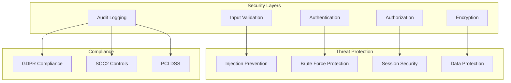

# Security Implementation Guide

## Table of Contents

1. [Overview](#overview)
2. [Security Architecture](#security-architecture)
3. [Authentication Security](#authentication-security)
4. [Authorization Patterns](#authorization-patterns)
5. [Input Validation](#input-validation)
6. [Secure Communication](#secure-communication)
7. [Credential Management](#credential-management)
8. [Audit and Logging](#audit-and-logging)
9. [Security Best Practices](#security-best-practices)
10. [Compliance and Standards](#compliance-and-standards)

## Overview

This guide provides comprehensive security implementation patterns for the simple-ldap-go library. Security is built into every layer of the architecture, from input validation to encrypted communication, ensuring robust protection against common LDAP security threats.

### Security Principles

- **Defense in Depth**: Multiple layers of security controls
- **Least Privilege**: Minimal permissions for operations
- **Zero Trust**: Verify everything, trust nothing
- **Secure by Default**: Safe configurations out of the box
- **Audit Everything**: Comprehensive logging of security events

## Security Architecture



### Security Components

```go
// security.go:34 - Core security manager
type SecurityManager struct {
    validator    *InputValidator
    authenticator *Authenticator
    authorizer   *Authorizer
    encryptor    *Encryptor
    auditor      *AuditLogger
    rateLimiter  *RateLimiter
}

func NewSecurityManager(config *SecurityConfig) *SecurityManager {
    return &SecurityManager{
        validator:     NewInputValidator(config.ValidationRules),
        authenticator: NewAuthenticator(config.AuthConfig),
        authorizer:   NewAuthorizer(config.AuthzConfig),
        encryptor:    NewEncryptor(config.CryptoConfig),
        auditor:      NewAuditLogger(config.AuditConfig),
        rateLimiter:  NewRateLimiter(config.RateLimitConfig),
    }
}
```

## Authentication Security

### Password Policy Enforcement

```go
// password_policy.go:45 - Comprehensive password validation
type PasswordPolicy struct {
    MinLength            int
    RequireUppercase     bool
    RequireLowercase     bool
    RequireNumbers       bool
    RequireSpecialChars  bool
    PreventCommonWords   bool
    PreventUserInfo      bool
    HistoryCount         int
    MaxAge               time.Duration
    MinAge               time.Duration
}

func (p *PasswordPolicy) Validate(password string, user *User) error {
    // Length check
    if len(password) < p.MinLength {
        return fmt.Errorf("password must be at least %d characters", p.MinLength)
    }

    // Complexity checks
    if p.RequireUppercase && !hasUppercase(password) {
        return errors.New("password must contain uppercase letters")
    }

    if p.RequireLowercase && !hasLowercase(password) {
        return errors.New("password must contain lowercase letters")
    }

    if p.RequireNumbers && !hasNumbers(password) {
        return errors.New("password must contain numbers")
    }

    if p.RequireSpecialChars && !hasSpecialChars(password) {
        return errors.New("password must contain special characters")
    }

    // Dictionary check
    if p.PreventCommonWords && isCommonPassword(password) {
        return errors.New("password is too common")
    }

    // User info check
    if p.PreventUserInfo && containsUserInfo(password, user) {
        return errors.New("password cannot contain user information")
    }

    // Password history check
    if p.HistoryCount > 0 {
        if err := p.checkPasswordHistory(user.DN, password); err != nil {
            return err
        }
    }

    return nil
}

// password_policy.go:112 - Secure password hashing
func HashPassword(password string) (string, error) {
    // Use Argon2id for password hashing
    salt := make([]byte, 32)
    if _, err := rand.Read(salt); err != nil {
        return "", err
    }

    hash := argon2.IDKey([]byte(password), salt, 3, 64*1024, 4, 32)

    // Encode for storage
    encoded := base64.StdEncoding.EncodeToString(append(salt, hash...))

    return encoded, nil
}
```

### Multi-Factor Authentication

```go
// mfa.go:56 - TOTP-based MFA implementation
type TOTPAuthenticator struct {
    issuer string
    period uint
}

func (t *TOTPAuthenticator) GenerateSecret(user string) (string, error) {
    key, err := totp.Generate(totp.GenerateOpts{
        Issuer:      t.issuer,
        AccountName: user,
        Period:      t.period,
        SecretSize:  32,
        Algorithm:   otp.AlgorithmSHA256,
    })

    if err != nil {
        return "", fmt.Errorf("failed to generate TOTP secret: %w", err)
    }

    return key.Secret(), nil
}

func (t *TOTPAuthenticator) ValidateToken(secret, token string) (bool, error) {
    valid := totp.Validate(token, secret)

    if !valid {
        // Check for time drift (±30 seconds)
        for i := -1; i <= 1; i++ {
            timeOffset := time.Now().Add(time.Duration(i*30) * time.Second)
            if totp.ValidateCustom(token, secret, timeOffset, totp.ValidateOpts{
                Period: t.period,
                Skew:   1,
                Digits: 6,
                Algorithm: otp.AlgorithmSHA256,
            }) {
                return true, nil
            }
        }
    }

    return valid, nil
}

// mfa.go:123 - Complete MFA flow
func (l *LDAP) AuthenticateWithMFA(username, password, mfaToken string) error {
    // First factor: password
    if err := l.Authenticate(username, password); err != nil {
        l.auditor.LogFailedAuth(username, "password", err)
        return ErrInvalidCredentials
    }

    // Get user's MFA secret
    user, err := l.FindUserBySAMAccountName(username)
    if err != nil {
        return err
    }

    mfaSecret := user.GetAttributeValue("mfaSecret")
    if mfaSecret == "" {
        return errors.New("MFA not configured for user")
    }

    // Second factor: TOTP
    valid, err := l.totpAuth.ValidateToken(mfaSecret, mfaToken)
    if err != nil || !valid {
        l.auditor.LogFailedAuth(username, "mfa", err)
        return errors.New("invalid MFA token")
    }

    l.auditor.LogSuccessfulAuth(username, "mfa")
    return nil
}
```

### Brute Force Protection

```go
// brute_force.go:34 - Rate limiting and account lockout
type BruteForceProtection struct {
    mu           sync.RWMutex
    attempts     map[string]*AttemptRecord
    maxAttempts  int
    lockoutTime  time.Duration
    windowTime   time.Duration
}

type AttemptRecord struct {
    Count       int
    FirstAttempt time.Time
    LastAttempt  time.Time
    LockedUntil  time.Time
}

func (b *BruteForceProtection) CheckAndRecord(identifier string) error {
    b.mu.Lock()
    defer b.mu.Unlock()

    now := time.Now()

    record, exists := b.attempts[identifier]
    if !exists {
        record = &AttemptRecord{
            FirstAttempt: now,
            LastAttempt:  now,
            Count:        1,
        }
        b.attempts[identifier] = record
        return nil
    }

    // Check if locked
    if now.Before(record.LockedUntil) {
        return fmt.Errorf("account locked until %s", record.LockedUntil)
    }

    // Reset if outside window
    if now.Sub(record.FirstAttempt) > b.windowTime {
        record.Count = 1
        record.FirstAttempt = now
        record.LastAttempt = now
        return nil
    }

    // Increment attempts
    record.Count++
    record.LastAttempt = now

    // Lock if exceeded max attempts
    if record.Count >= b.maxAttempts {
        record.LockedUntil = now.Add(b.lockoutTime)

        // Exponential backoff for repeat offenders
        backoffMultiplier := record.Count / b.maxAttempts
        record.LockedUntil = now.Add(b.lockoutTime * time.Duration(backoffMultiplier))

        return fmt.Errorf("too many attempts, locked for %v", b.lockoutTime)
    }

    return nil
}
```

## Authorization Patterns

### Role-Based Access Control (RBAC)

```go
// rbac.go:45 - Role-based authorization
type RBACAuthorizer struct {
    roles       map[string]*Role
    permissions map[string]*Permission
}

type Role struct {
    Name        string
    Permissions []string
    Inherits    []string // Role inheritance
}

type Permission struct {
    Resource string
    Action   string
    Conditions map[string]interface{}
}

func (r *RBACAuthorizer) Authorize(user *User, resource, action string) (bool, error) {
    // Get user's roles
    userRoles := r.getUserRoles(user)

    // Check each role
    for _, roleName := range userRoles {
        role, exists := r.roles[roleName]
        if !exists {
            continue
        }

        // Check role permissions
        if r.hasPermission(role, resource, action) {
            r.auditAccess(user, resource, action, true)
            return true, nil
        }

        // Check inherited roles
        for _, inheritedRole := range r.getInheritedRoles(role) {
            if r.hasPermission(inheritedRole, resource, action) {
                r.auditAccess(user, resource, action, true)
                return true, nil
            }
        }
    }

    r.auditAccess(user, resource, action, false)
    return false, ErrAccessDenied
}

// rbac.go:112 - Attribute-based access control
type ABACAuthorizer struct {
    policies []Policy
}

type Policy struct {
    Subject  PolicyMatcher
    Resource PolicyMatcher
    Action   string
    Effect   string // "allow" or "deny"
}

func (a *ABACAuthorizer) Evaluate(ctx context.Context, request *AccessRequest) (bool, error) {
    // Evaluate all applicable policies
    var allows, denies []Policy

    for _, policy := range a.policies {
        if !policy.Matches(request) {
            continue
        }

        if policy.Effect == "allow" {
            allows = append(allows, policy)
        } else {
            denies = append(denies, policy)
        }
    }

    // Deny takes precedence
    if len(denies) > 0 {
        return false, nil
    }

    return len(allows) > 0, nil
}
```

## Input Validation

### LDAP Injection Prevention

```go
// validation.go:56 - Comprehensive input validation
type InputValidator struct {
    rules map[string]ValidationRule
}

func (v *InputValidator) ValidateDN(dn string) error {
    // Check for null bytes
    if strings.Contains(dn, "\x00") {
        return errors.New("DN contains null bytes")
    }

    // Validate DN structure
    if !isValidDN(dn) {
        return fmt.Errorf("invalid DN format: %s", dn)
    }

    // Check for injection patterns
    if containsInjectionPattern(dn) {
        return errors.New("potential LDAP injection detected")
    }

    return nil
}

func (v *InputValidator) SanitizeFilter(filter string) (string, error) {
    // Escape special characters
    replacer := strings.NewReplacer(
        "\\", "\\5c",
        "*", "\\2a",
        "(", "\\28",
        ")", "\\29",
        "\x00", "\\00",
    )

    sanitized := replacer.Replace(filter)

    // Validate filter syntax
    if !isValidLDAPFilter(sanitized) {
        return "", errors.New("invalid LDAP filter syntax")
    }

    // Check complexity to prevent DoS
    if filterComplexity(sanitized) > maxFilterComplexity {
        return "", errors.New("filter too complex")
    }

    return sanitized, nil
}

// validation.go:134 - Attribute validation
func (v *InputValidator) ValidateAttributes(attrs map[string][]string) error {
    for key, values := range attrs {
        // Validate attribute name
        if !isValidAttributeName(key) {
            return fmt.Errorf("invalid attribute name: %s", key)
        }

        // Validate attribute values
        for _, value := range values {
            if err := v.validateAttributeValue(key, value); err != nil {
                return fmt.Errorf("invalid value for %s: %w", key, err)
            }
        }
    }

    return nil
}

func containsInjectionPattern(input string) bool {
    // Common LDAP injection patterns
    patterns := []string{
        ")(", // Filter manipulation
        "\\*", // Wildcard injection
        "\\00", // Null byte injection
        ")(uid=", // Authentication bypass
        ")(|(", // OR injection
        ")(&(", // AND injection
    }

    for _, pattern := range patterns {
        if strings.Contains(input, pattern) {
            return true
        }
    }

    return false
}
```

## Secure Communication

### TLS/LDAPS Configuration

```go
// tls_config.go:45 - Secure TLS configuration
func GetSecureTLSConfig() *tls.Config {
    return &tls.Config{
        // Minimum TLS version
        MinVersion: tls.VersionTLS12,

        // Secure cipher suites only
        CipherSuites: []uint16{
            tls.TLS_ECDHE_RSA_WITH_AES_256_GCM_SHA384,
            tls.TLS_ECDHE_RSA_WITH_AES_128_GCM_SHA256,
            tls.TLS_ECDHE_ECDSA_WITH_AES_256_GCM_SHA384,
            tls.TLS_ECDHE_ECDSA_WITH_AES_128_GCM_SHA256,
        },

        // Prefer server cipher suites
        PreferServerCipherSuites: true,

        // Certificate verification
        InsecureSkipVerify: false,

        // Client certificates
        ClientAuth: tls.RequireAndVerifyClientCert,

        // Session tickets disabled for forward secrecy
        SessionTicketsDisabled: true,

        // Renegotiation disabled
        Renegotiation: tls.RenegotiateNever,
    }
}

// tls_config.go:89 - Certificate pinning
type CertificatePinner struct {
    pinnedCerts map[string][]byte
}

func (cp *CertificatePinner) VerifyConnection(state tls.ConnectionState) error {
    for _, cert := range state.PeerCertificates {
        fingerprint := sha256.Sum256(cert.Raw)

        expectedFingerprint, exists := cp.pinnedCerts[cert.Subject.CommonName]
        if !exists {
            return fmt.Errorf("certificate not pinned: %s", cert.Subject.CommonName)
        }

        if !bytes.Equal(fingerprint[:], expectedFingerprint) {
            return errors.New("certificate fingerprint mismatch")
        }
    }

    return nil
}

// tls_config.go:123 - Secure LDAP connection
func (l *LDAP) SecureConnect() error {
    tlsConfig := GetSecureTLSConfig()

    // Load client certificate if configured
    if l.config.ClientCertPath != "" {
        cert, err := tls.LoadX509KeyPair(
            l.config.ClientCertPath,
            l.config.ClientKeyPath,
        )
        if err != nil {
            return fmt.Errorf("failed to load client certificate: %w", err)
        }
        tlsConfig.Certificates = []tls.Certificate{cert}
    }

    // Connect with TLS
    conn, err := ldap.DialTLS("tcp",
        fmt.Sprintf("%s:%d", l.config.Host, l.config.Port),
        tlsConfig)
    if err != nil {
        return fmt.Errorf("failed to establish secure connection: %w", err)
    }

    l.conn = conn
    return nil
}
```

### Channel Binding

```go
// channel_binding.go:34 - Implement channel binding for enhanced security
type ChannelBinding struct {
    Type string
    Data []byte
}

func (l *LDAP) BindWithChannelBinding(username, password string) error {
    // Get TLS connection state
    tlsConn, ok := l.conn.(*tls.Conn)
    if !ok {
        return errors.New("channel binding requires TLS connection")
    }

    state := tlsConn.ConnectionState()

    // Calculate channel binding data
    binding := calculateChannelBinding(state)

    // Perform SASL bind with channel binding
    return l.conn.ExternalBind(username, password, binding)
}

func calculateChannelBinding(state tls.ConnectionState) []byte {
    // tls-unique channel binding
    return state.TLSUnique
}
```

## Credential Management

### Secure Credential Storage

```go
// credentials.go:45 - Secure credential management
type CredentialManager struct {
    vault    SecretVault
    encryptor *Encryptor
}

type SecretVault interface {
    Store(key string, value []byte) error
    Retrieve(key string) ([]byte, error)
    Delete(key string) error
    Rotate(key string) error
}

func (cm *CredentialManager) StoreCredential(identifier string, credential string) error {
    // Encrypt credential
    encrypted, err := cm.encryptor.Encrypt([]byte(credential))
    if err != nil {
        return fmt.Errorf("failed to encrypt credential: %w", err)
    }

    // Store in vault
    if err := cm.vault.Store(identifier, encrypted); err != nil {
        return fmt.Errorf("failed to store credential: %w", err)
    }

    // Audit credential storage
    cm.auditCredentialOperation("store", identifier, true)

    return nil
}

func (cm *CredentialManager) RetrieveCredential(identifier string) (string, error) {
    // Retrieve from vault
    encrypted, err := cm.vault.Retrieve(identifier)
    if err != nil {
        cm.auditCredentialOperation("retrieve", identifier, false)
        return "", fmt.Errorf("failed to retrieve credential: %w", err)
    }

    // Decrypt credential
    decrypted, err := cm.encryptor.Decrypt(encrypted)
    if err != nil {
        return "", fmt.Errorf("failed to decrypt credential: %w", err)
    }

    cm.auditCredentialOperation("retrieve", identifier, true)

    return string(decrypted), nil
}

// credentials.go:112 - Credential rotation
func (cm *CredentialManager) RotateCredentials() error {
    // Get all credential identifiers
    identifiers, err := cm.vault.ListKeys()
    if err != nil {
        return err
    }

    for _, id := range identifiers {
        if err := cm.vault.Rotate(id); err != nil {
            cm.logger.Error("failed to rotate credential",
                slog.String("identifier", id),
                slog.String("error", err.Error()))
            continue
        }

        cm.auditCredentialOperation("rotate", id, true)
    }

    return nil
}
```

### Service Account Management

```go
// service_accounts.go:34 - Secure service account handling
type ServiceAccountManager struct {
    ldap        *LDAP
    credManager *CredentialManager
    auditor     *AuditLogger
}

func (sam *ServiceAccountManager) CreateServiceAccount(name, description string) (*ServiceAccount, error) {
    // Generate strong random password
    password := generateSecurePassword(32)

    // Create account in LDAP
    account := &FullUser{
        CN:              name,
        SAMAccountName:  fmt.Sprintf("svc_%s", name),
        Description:     description,
        UserAccountControl: UAC_NORMAL_ACCOUNT | UAC_DONT_EXPIRE_PASSWORD,
    }

    dn, err := sam.ldap.CreateUser(account)
    if err != nil {
        return nil, fmt.Errorf("failed to create service account: %w", err)
    }

    // Set password
    if err := sam.ldap.SetPassword(dn, password); err != nil {
        // Rollback account creation
        sam.ldap.DeleteUser(dn)
        return nil, fmt.Errorf("failed to set password: %w", err)
    }

    // Store credentials securely
    if err := sam.credManager.StoreCredential(name, password); err != nil {
        return nil, fmt.Errorf("failed to store credentials: %w", err)
    }

    // Audit service account creation
    sam.auditor.LogServiceAccountCreated(name, dn)

    return &ServiceAccount{
        DN:       dn,
        Name:     name,
        Created:  time.Now(),
    }, nil
}

func generateSecurePassword(length int) string {
    const chars = "abcdefghijklmnopqrstuvwxyzABCDEFGHIJKLMNOPQRSTUVWXYZ0123456789!@#$%^&*()_+-="

    password := make([]byte, length)
    for i := range password {
        idx, _ := rand.Int(rand.Reader, big.NewInt(int64(len(chars))))
        password[i] = chars[idx.Int64()]
    }

    return string(password)
}
```

## Audit and Logging

### Security Event Logging

```go
// audit.go:56 - Comprehensive security audit logging
type AuditLogger struct {
    logger      *slog.Logger
    storage     AuditStorage
    alerter     *SecurityAlerter
}

type AuditEvent struct {
    ID          string
    Timestamp   time.Time
    Type        string
    Actor       string
    Resource    string
    Action      string
    Result      string
    Details     map[string]interface{}
    IPAddress   string
    SessionID   string
    Risk Level  RiskLevel
}

func (a *AuditLogger) LogSecurityEvent(event *AuditEvent) {
    // Enrich event with context
    event.ID = uuid.New().String()
    event.Timestamp = time.Now()

    // Log to structured logger
    a.logger.Info("security event",
        slog.String("event_id", event.ID),
        slog.String("type", event.Type),
        slog.String("actor", event.Actor),
        slog.String("action", event.Action),
        slog.String("result", event.Result),
        slog.String("ip", event.IPAddress),
    )

    // Store in audit storage
    if err := a.storage.Store(event); err != nil {
        a.logger.Error("failed to store audit event",
            slog.String("error", err.Error()))
    }

    // Alert on high-risk events
    if event.RiskLevel >= RiskHigh {
        a.alerter.SendAlert(event)
    }
}

// audit.go:145 - Authentication audit trail
func (a *AuditLogger) LogAuthentication(username string, success bool, method string, ip string) {
    event := &AuditEvent{
        Type:      "authentication",
        Actor:     username,
        Action:    "login",
        Result:    boolToResult(success),
        IPAddress: ip,
        Details: map[string]interface{}{
            "method": method,
        },
    }

    if !success {
        event.RiskLevel = RiskMedium
    }

    a.LogSecurityEvent(event)
}

// audit.go:189 - Data access audit
func (a *AuditLogger) LogDataAccess(user, resource, action string, sensitive bool) {
    risk := RiskLow
    if sensitive {
        risk = RiskMedium
    }

    event := &AuditEvent{
        Type:      "data_access",
        Actor:     user,
        Resource:  resource,
        Action:    action,
        Result:    "success",
        RiskLevel: risk,
        Details: map[string]interface{}{
            "sensitive": sensitive,
        },
    }

    a.LogSecurityEvent(event)
}
```

### Compliance Reporting

```go
// compliance.go:45 - Generate compliance reports
type ComplianceReporter struct {
    auditor *AuditLogger
    storage AuditStorage
}

func (cr *ComplianceReporter) GenerateSOC2Report(startDate, endDate time.Time) (*SOC2Report, error) {
    events, err := cr.storage.QueryByDateRange(startDate, endDate)
    if err != nil {
        return nil, err
    }

    report := &SOC2Report{
        Period:    fmt.Sprintf("%s to %s", startDate, endDate),
        Generated: time.Now(),
    }

    // Analyze authentication events
    report.AuthenticationMetrics = cr.analyzeAuthEvents(events)

    // Analyze access control
    report.AccessControlMetrics = cr.analyzeAccessEvents(events)

    // Analyze data protection
    report.DataProtectionMetrics = cr.analyzeDataEvents(events)

    // Generate findings
    report.Findings = cr.identifyFindings(events)

    return report, nil
}

func (cr *ComplianceReporter) GenerateGDPRReport(subject string) (*GDPRReport, error) {
    // Query all events related to subject
    events, err := cr.storage.QueryBySubject(subject)
    if err != nil {
        return nil, err
    }

    report := &GDPRReport{
        Subject:   subject,
        Generated: time.Now(),
    }

    // Data access history
    report.AccessHistory = cr.extractAccessHistory(events)

    // Data modifications
    report.Modifications = cr.extractModifications(events)

    // Data sharing
    report.DataSharing = cr.extractDataSharing(events)

    return report, nil
}
```

## Security Best Practices

### Secure Configuration

```go
// secure_config.go:34 - Security-focused configuration
type SecureConfig struct {
    // Connection security
    RequireTLS           bool
    MinTLSVersion        uint16
    AllowedCipherSuites  []uint16

    // Authentication
    RequireMFA           bool
    PasswordPolicy       PasswordPolicy
    MaxAuthAttempts      int
    AccountLockoutTime   time.Duration

    // Session management
    SessionTimeout       time.Duration
    MaxConcurrentSessions int
    RequireSecureCookie  bool

    // Audit
    EnableAudit          bool
    AuditLevel           string
    RetentionDays        int

    // Rate limiting
    RateLimitEnabled     bool
    RequestsPerMinute    int
    BurstSize           int
}

func GetProductionSecurityConfig() *SecureConfig {
    return &SecureConfig{
        // Enforce TLS
        RequireTLS:    true,
        MinTLSVersion: tls.VersionTLS12,

        // Strong authentication
        RequireMFA:      true,
        MaxAuthAttempts: 5,
        AccountLockoutTime: 30 * time.Minute,

        // Password requirements
        PasswordPolicy: PasswordPolicy{
            MinLength:          12,
            RequireUppercase:   true,
            RequireLowercase:   true,
            RequireNumbers:     true,
            RequireSpecialChars: true,
            HistoryCount:       5,
            MaxAge:            90 * 24 * time.Hour,
        },

        // Session security
        SessionTimeout:        30 * time.Minute,
        MaxConcurrentSessions: 3,
        RequireSecureCookie:   true,

        // Comprehensive audit
        EnableAudit:    true,
        AuditLevel:     "detailed",
        RetentionDays:  365,

        // Rate limiting
        RateLimitEnabled:  true,
        RequestsPerMinute: 100,
        BurstSize:        20,
    }
}
```

### Security Checklist

```go
// security_checks.go:45 - Runtime security verification
func PerformSecurityChecks(config *Config) []SecurityIssue {
    var issues []SecurityIssue

    // Check TLS configuration
    if !config.UseTLS {
        issues = append(issues, SecurityIssue{
            Severity: "HIGH",
            Message:  "TLS is not enabled",
            Remediation: "Enable TLS for all connections",
        })
    }

    // Check authentication
    if config.BindPassword == "" {
        issues = append(issues, SecurityIssue{
            Severity: "CRITICAL",
            Message:  "Empty bind password",
            Remediation: "Set a strong bind password",
        })
    }

    // Check password policy
    if config.PasswordPolicy.MinLength < 8 {
        issues = append(issues, SecurityIssue{
            Severity: "MEDIUM",
            Message:  "Weak password policy",
            Remediation: "Increase minimum password length to 12+",
        })
    }

    // Check audit logging
    if !config.EnableAudit {
        issues = append(issues, SecurityIssue{
            Severity: "MEDIUM",
            Message:  "Audit logging disabled",
            Remediation: "Enable comprehensive audit logging",
        })
    }

    return issues
}
```

## Compliance and Standards

### OWASP LDAP Security

```go
// owasp.go:34 - OWASP security controls implementation
func ImplementOWASPControls(l *LDAP) {
    // A1: Injection Prevention
    l.SetInputValidator(NewStrictValidator())

    // A2: Broken Authentication
    l.EnableMFA()
    l.SetPasswordPolicy(GetStrongPasswordPolicy())

    // A3: Sensitive Data Exposure
    l.EnableTLS()
    l.SetEncryption(AES256GCM)

    // A4: XML External Entities (XXE)
    // N/A for LDAP

    // A5: Broken Access Control
    l.SetAuthorizer(NewRBACAuthorizer())

    // A6: Security Misconfiguration
    l.ApplySecurityDefaults()

    // A7: Cross-Site Scripting (XSS)
    // N/A for LDAP

    // A8: Insecure Deserialization
    l.SetSafeDeserialization()

    // A9: Using Components with Known Vulnerabilities
    l.EnableVulnerabilityScanning()

    // A10: Insufficient Logging & Monitoring
    l.EnableComprehensiveAudit()
}
```

### Security Headers

```go
// security_headers.go:23 - Security headers for web interfaces
func SetSecurityHeaders(w http.ResponseWriter) {
    w.Header().Set("X-Content-Type-Options", "nosniff")
    w.Header().Set("X-Frame-Options", "DENY")
    w.Header().Set("X-XSS-Protection", "1; mode=block")
    w.Header().Set("Strict-Transport-Security", "max-age=31536000; includeSubDomains")
    w.Header().Set("Content-Security-Policy", "default-src 'self'")
    w.Header().Set("Referrer-Policy", "strict-origin-when-cross-origin")
}
```

---

*Security Implementation Guide v1.0.0 - simple-ldap-go Project*