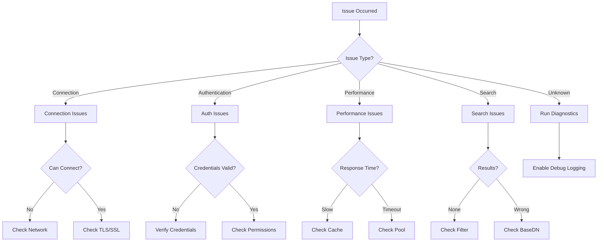

# Troubleshooting Guide

## Table of Contents

1. [Overview](#overview)
2. [Common Issues](#common-issues)
3. [Connection Problems](#connection-problems)
4. [Authentication Failures](#authentication-failures)
5. [Performance Issues](#performance-issues)
6. [Search and Query Problems](#search-and-query-problems)
7. [Diagnostic Tools](#diagnostic-tools)
8. [Debug Logging](#debug-logging)
9. [Error Messages](#error-messages)
10. [Getting Help](#getting-help)

## Overview

This guide helps diagnose and resolve common issues with simple-ldap-go. Each section provides symptoms, causes, diagnostic steps, and solutions for specific problem categories.

### Quick Diagnosis Flowchart



## Common Issues

### Issue: Library Not Connecting

**Symptoms:**
- Connection timeout errors
- "Connection refused" messages
- Unable to establish LDAP connection

**Quick Fix:**
```go
// Verify basic connectivity
client, err := ldap.Dial("tcp", "ldap.example.com:389")
if err != nil {
    log.Printf("Connection failed: %v", err)
    // Check: Network connectivity, firewall rules, LDAP server status
}
```

### Issue: Slow Operations

**Symptoms:**
- Operations taking >1 second
- Timeouts on searches
- High latency

**Quick Fix:**
```go
// Enable caching and connection pooling
config := &Config{
    EnableCache: true,
    CacheSize: 10000,
    PoolSize: 50,
    EnableOptimizations: true,
}
```

### Issue: Authentication Failures

**Symptoms:**
- Invalid credentials errors
- Account locked messages
- Permission denied

**Quick Fix:**
```go
// Verify authentication with detailed error
err := client.Authenticate(username, password)
if err != nil {
    switch {
    case errors.Is(err, ErrInvalidCredentials):
        // Wrong username/password
    case errors.Is(err, ErrAccountLocked):
        // Account locked due to failed attempts
    case errors.Is(err, ErrPasswordExpired):
        // Password needs reset
    }
}
```

## Connection Problems

### TLS/SSL Connection Issues

```go
// diagnostics/tls_check.go - TLS connection diagnostics
func DiagnoseTLSConnection(host string, port int) error {
    // Test basic TCP connectivity
    conn, err := net.DialTimeout("tcp",
        fmt.Sprintf("%s:%d", host, port),
        5*time.Second)
    if err != nil {
        return fmt.Errorf("TCP connection failed: %w", err)
    }
    conn.Close()

    // Test TLS handshake
    tlsConfig := &tls.Config{
        InsecureSkipVerify: true, // For testing only
    }

    tlsConn, err := tls.Dial("tcp",
        fmt.Sprintf("%s:%d", host, port),
        tlsConfig)
    if err != nil {
        return fmt.Errorf("TLS handshake failed: %w", err)
    }
    defer tlsConn.Close()

    // Check certificate
    state := tlsConn.ConnectionState()
    for _, cert := range state.PeerCertificates {
        fmt.Printf("Certificate Subject: %s\n", cert.Subject)
        fmt.Printf("Certificate Issuer: %s\n", cert.Issuer)
        fmt.Printf("Valid From: %s\n", cert.NotBefore)
        fmt.Printf("Valid To: %s\n", cert.NotAfter)

        // Check expiration
        if time.Now().After(cert.NotAfter) {
            return fmt.Errorf("certificate expired on %s", cert.NotAfter)
        }
    }

    return nil
}
```

### Connection Pool Exhaustion

```go
// diagnostics/pool_check.go - Pool diagnostics
func DiagnoseConnectionPool(pool *ConnectionPool) *PoolDiagnostic {
    stats := pool.Stats()

    diag := &PoolDiagnostic{
        Timestamp:       time.Now(),
        ActiveConns:     stats.ActiveConnections,
        IdleConns:       stats.IdleConnections,
        TotalConns:      stats.TotalConnections,
        WaitingRequests: stats.WaitingRequests,
        AvgWaitTime:     stats.AvgWaitTime,
    }

    // Identify issues
    if stats.ActiveConnections >= pool.MaxSize {
        diag.Issues = append(diag.Issues,
            "Pool exhausted - all connections in use")
        diag.Recommendations = append(diag.Recommendations,
            "Increase pool size or reduce connection hold time")
    }

    if stats.AvgWaitTime > 100*time.Millisecond {
        diag.Issues = append(diag.Issues,
            fmt.Sprintf("High wait time: %v", stats.AvgWaitTime))
        diag.Recommendations = append(diag.Recommendations,
            "Increase pool size or optimize query performance")
    }

    if stats.FailedConnections > 0 {
        diag.Issues = append(diag.Issues,
            fmt.Sprintf("%d failed connections", stats.FailedConnections))
        diag.Recommendations = append(diag.Recommendations,
            "Check LDAP server health and network stability")
    }

    return diag
}

// Fix pool issues
func FixPoolIssues(pool *ConnectionPool) error {
    // Reset unhealthy connections
    pool.ResetUnhealthy()

    // Increase pool size if needed
    stats := pool.Stats()
    if stats.AvgWaitTime > 100*time.Millisecond {
        newSize := pool.MaxSize * 2
        if newSize > 200 {
            newSize = 200 // Cap at reasonable limit
        }
        pool.Resize(newSize)
        log.Printf("Increased pool size to %d", newSize)
    }

    return nil
}
```

### Network Connectivity

```go
// diagnostics/network_check.go - Network diagnostics
func NetworkDiagnostics(host string) error {
    // DNS resolution
    ips, err := net.LookupIP(host)
    if err != nil {
        return fmt.Errorf("DNS resolution failed for %s: %w", host, err)
    }
    fmt.Printf("Resolved %s to: %v\n", host, ips)

    // Ping test (requires privileges)
    pinger, err := ping.NewPinger(host)
    if err == nil {
        pinger.Count = 3
        pinger.Run()
        stats := pinger.Statistics()
        fmt.Printf("Ping statistics: %d%% packet loss, avg RTT: %v\n",
            stats.PacketLoss, stats.AvgRtt)
    }

    // Traceroute for path analysis
    options := &traceroute.TracerouteOptions{}
    result, err := traceroute.Traceroute(host, options)
    if err == nil {
        fmt.Println("Traceroute path:")
        for _, hop := range result {
            fmt.Printf("  %d: %s (%v)\n", hop.TTL, hop.Address, hop.RTT)
        }
    }

    // Port scan for LDAP ports
    ports := []int{389, 636, 3268, 3269} // LDAP, LDAPS, GC, GCS
    for _, port := range ports {
        conn, err := net.DialTimeout("tcp",
            fmt.Sprintf("%s:%d", host, port),
            2*time.Second)
        if err == nil {
            conn.Close()
            fmt.Printf("Port %d: OPEN\n", port)
        } else {
            fmt.Printf("Port %d: CLOSED/FILTERED\n", port)
        }
    }

    return nil
}
```

## Authentication Failures

### Credential Verification

```go
// diagnostics/auth_check.go - Authentication diagnostics
func DiagnoseAuthentication(l *LDAP, username, password string) (*AuthDiagnostic, error) {
    diag := &AuthDiagnostic{
        Username:  username,
        Timestamp: time.Now(),
    }

    // Step 1: Find user
    user, err := l.FindUserBySAMAccountName(username)
    if err != nil {
        if errors.Is(err, ErrUserNotFound) {
            diag.Issue = "User not found in directory"
            diag.Resolution = "Verify username spelling and domain"
        } else {
            diag.Issue = fmt.Sprintf("User lookup failed: %v", err)
            diag.Resolution = "Check LDAP connectivity and permissions"
        }
        return diag, err
    }

    diag.UserDN = user.DN
    diag.UserFound = true

    // Step 2: Check account status
    if user.IsDisabled() {
        diag.Issue = "Account is disabled"
        diag.Resolution = "Contact administrator to enable account"
        return diag, ErrAccountDisabled
    }

    if user.IsLocked() {
        diag.Issue = "Account is locked"
        diag.Resolution = fmt.Sprintf("Account locked until %s", user.LockoutTime)
        return diag, ErrAccountLocked
    }

    if user.IsExpired() {
        diag.Issue = "Account has expired"
        diag.Resolution = "Contact administrator to renew account"
        return diag, ErrAccountExpired
    }

    // Step 3: Check password status
    if user.MustChangePassword() {
        diag.Issue = "Password must be changed"
        diag.Resolution = "User must change password at next logon"
    }

    if user.IsPasswordExpired() {
        diag.Issue = "Password has expired"
        diag.Resolution = "Password must be reset"
        return diag, ErrPasswordExpired
    }

    // Step 4: Attempt bind
    err = l.BindWithDN(user.DN, password)
    if err != nil {
        diag.Issue = "Authentication failed"
        diag.Resolution = "Verify password is correct"

        // Check for specific LDAP errors
        if ldapErr, ok := err.(*ldap.Error); ok {
            switch ldapErr.ResultCode {
            case 49: // Invalid credentials
                diag.Details = "Invalid username or password"
            case 50: // Insufficient access
                diag.Details = "User lacks permission to authenticate"
            case 53: // Unwilling to perform
                diag.Details = "Server unwilling to perform authentication"
            }
        }
        return diag, err
    }

    diag.Success = true
    return diag, nil
}
```

### Permission Issues

```go
// diagnostics/permission_check.go - Permission diagnostics
func DiagnosePermissions(l *LDAP, userDN string) (*PermissionDiagnostic, error) {
    diag := &PermissionDiagnostic{
        UserDN:    userDN,
        Timestamp: time.Now(),
    }

    // Test read permissions
    testCases := []struct {
        Operation string
        TestFunc  func() error
    }{
        {
            Operation: "Read User",
            TestFunc: func() error {
                _, err := l.FindUserByDN(userDN)
                return err
            },
        },
        {
            Operation: "Search Users",
            TestFunc: func() error {
                _, err := l.SearchUsers("(objectClass=user)")
                return err
            },
        },
        {
            Operation: "Read Groups",
            TestFunc: func() error {
                _, err := l.GetUserGroups(userDN)
                return err
            },
        },
        {
            Operation: "Modify User",
            TestFunc: func() error {
                // Test with harmless modification
                return l.ModifyUser(userDN, map[string][]string{
                    "description": {"Test"},
                })
            },
        },
    }

    for _, tc := range testCases {
        err := tc.TestFunc()
        result := &PermissionTestResult{
            Operation: tc.Operation,
            Allowed:   err == nil,
        }

        if err != nil {
            result.Error = err.Error()

            // Analyze error for permission issues
            if strings.Contains(err.Error(), "insufficient") ||
               strings.Contains(err.Error(), "denied") ||
               strings.Contains(err.Error(), "not authorized") {
                result.Issue = "Insufficient permissions"
            }
        }

        diag.Results = append(diag.Results, result)
    }

    return diag, nil
}
```

## Performance Issues

### Slow Query Diagnosis

```go
// diagnostics/performance_check.go - Performance diagnostics
func DiagnosePerformance(l *LDAP) (*PerformanceDiagnostic, error) {
    diag := &PerformanceDiagnostic{
        Timestamp: time.Now(),
    }

    // Test various operations
    operations := []struct {
        Name string
        Test func() (time.Duration, error)
    }{
        {
            Name: "Simple Bind",
            Test: func() (time.Duration, error) {
                start := time.Now()
                err := l.SimpleBind()
                return time.Since(start), err
            },
        },
        {
            Name: "User Lookup",
            Test: func() (time.Duration, error) {
                start := time.Now()
                _, err := l.FindUserBySAMAccountName("testuser")
                return time.Since(start), err
            },
        },
        {
            Name: "Search 100 Users",
            Test: func() (time.Duration, error) {
                start := time.Now()
                _, err := l.SearchUsersWithLimit("(objectClass=user)", 100)
                return time.Since(start), err
            },
        },
        {
            Name: "Group Membership Check",
            Test: func() (time.Duration, error) {
                start := time.Now()
                _, err := l.IsUserInGroup("testuser", "testgroup")
                return time.Since(start), err
            },
        },
    }

    for _, op := range operations {
        duration, err := op.Test()

        result := &PerformanceResult{
            Operation: op.Name,
            Duration:  duration,
            Success:   err == nil,
        }

        // Categorize performance
        switch {
        case duration < 50*time.Millisecond:
            result.Rating = "Excellent"
        case duration < 200*time.Millisecond:
            result.Rating = "Good"
        case duration < 500*time.Millisecond:
            result.Rating = "Fair"
        case duration < 1*time.Second:
            result.Rating = "Poor"
        default:
            result.Rating = "Critical"
        }

        if err != nil {
            result.Error = err.Error()
        }

        diag.Results = append(diag.Results, result)
    }

    // Check cache performance
    cacheStats := l.GetCacheStats()
    diag.CacheHitRate = cacheStats.HitRate
    diag.CacheSize = cacheStats.Size

    if cacheStats.HitRate < 50 {
        diag.Recommendations = append(diag.Recommendations,
            "Low cache hit rate - consider increasing cache size or TTL")
    }

    // Check pool performance
    poolStats := l.GetPoolStats()
    diag.PoolUtilization = poolStats.Utilization

    if poolStats.Utilization > 80 {
        diag.Recommendations = append(diag.Recommendations,
            "High pool utilization - consider increasing pool size")
    }

    return diag, nil
}
```

### Memory Usage Analysis

```go
// diagnostics/memory_check.go - Memory diagnostics
func AnalyzeMemoryUsage() *MemoryDiagnostic {
    var m runtime.MemStats
    runtime.ReadMemStats(&m)

    diag := &MemoryDiagnostic{
        Timestamp:     time.Now(),
        AllocMB:       m.Alloc / 1024 / 1024,
        TotalAllocMB:  m.TotalAlloc / 1024 / 1024,
        SysMB:         m.Sys / 1024 / 1024,
        NumGC:         m.NumGC,
        LastGC:        time.Unix(0, int64(m.LastGC)),
        PauseTotalMs:  m.PauseTotalNs / 1000000,
        HeapAllocMB:   m.HeapAlloc / 1024 / 1024,
        HeapInuseMB:   m.HeapInuse / 1024 / 1024,
        StackInuseMB:  m.StackInuse / 1024 / 1024,
    }

    // Analyze for issues
    if diag.AllocMB > 500 {
        diag.Issues = append(diag.Issues,
            fmt.Sprintf("High memory usage: %d MB", diag.AllocMB))
        diag.Recommendations = append(diag.Recommendations,
            "Consider reducing cache size or connection pool")
    }

    if diag.NumGC > 1000 {
        diag.Issues = append(diag.Issues,
            fmt.Sprintf("Excessive GC runs: %d", diag.NumGC))
        diag.Recommendations = append(diag.Recommendations,
            "Optimize object allocation patterns")
    }

    // Force GC and re-measure
    runtime.GC()
    runtime.ReadMemStats(&m)
    diag.AfterGCMB = m.Alloc / 1024 / 1024

    return diag
}

// Memory leak detection
func DetectMemoryLeaks(duration time.Duration) {
    ticker := time.NewTicker(10 * time.Second)
    defer ticker.Stop()

    var samples []uint64
    timeout := time.After(duration)

    for {
        select {
        case <-ticker.C:
            var m runtime.MemStats
            runtime.ReadMemStats(&m)
            samples = append(samples, m.Alloc)

            if len(samples) > 2 {
                // Check for consistent growth
                if isIncreasing(samples) {
                    log.Printf("WARNING: Potential memory leak detected")
                    log.Printf("Memory growth: %+v MB", samples)
                }
            }

        case <-timeout:
            return
        }
    }
}
```

## Search and Query Problems

### Filter Syntax Issues

```go
// diagnostics/filter_check.go - LDAP filter diagnostics
func DiagnoseFilter(filter string) (*FilterDiagnostic, error) {
    diag := &FilterDiagnostic{
        Filter:    filter,
        Timestamp: time.Now(),
    }

    // Validate syntax
    err := ValidateLDAPFilter(filter)
    if err != nil {
        diag.SyntaxValid = false
        diag.Issue = fmt.Sprintf("Invalid syntax: %v", err)

        // Common syntax errors
        if strings.Contains(filter, "((") {
            diag.Suggestion = "Check for duplicate opening parentheses"
        } else if strings.Count(filter, "(") != strings.Count(filter, ")") {
            diag.Suggestion = "Mismatched parentheses"
        } else if !strings.HasPrefix(filter, "(") {
            diag.Suggestion = "Filter must start with '('"
        }

        return diag, err
    }

    diag.SyntaxValid = true

    // Analyze filter complexity
    diag.Complexity = calculateFilterComplexity(filter)
    if diag.Complexity > 10 {
        diag.Warning = "Complex filter may impact performance"
        diag.Suggestion = "Consider simplifying or breaking into multiple queries"
    }

    // Check for common issues
    if strings.Contains(filter, "*") {
        diag.HasWildcards = true
        if strings.HasPrefix(filter, "(*") {
            diag.Warning = "Leading wildcard may cause slow searches"
            diag.Suggestion = "Avoid wildcards at the beginning of values"
        }
    }

    // Check for indexed attributes
    indexedAttrs := []string{"cn", "sAMAccountName", "mail", "objectGUID"}
    usesIndex := false
    for _, attr := range indexedAttrs {
        if strings.Contains(filter, attr) {
            usesIndex = true
            break
        }
    }

    if !usesIndex {
        diag.Warning = "Filter doesn't use indexed attributes"
        diag.Suggestion = "Include indexed attributes for better performance"
    }

    return diag, nil
}

// Fix common filter issues
func FixCommonFilterIssues(filter string) string {
    // Escape special characters
    fixed := ldap.EscapeFilter(filter)

    // Fix common syntax errors
    fixed = strings.ReplaceAll(fixed, "((", "(")
    fixed = strings.ReplaceAll(fixed, "))", ")")

    // Ensure proper wrapping
    if !strings.HasPrefix(fixed, "(") {
        fixed = "(" + fixed
    }
    if !strings.HasSuffix(fixed, ")") {
        fixed = fixed + ")"
    }

    return fixed
}
```

### Base DN Problems

```go
// diagnostics/basedn_check.go - Base DN diagnostics
func DiagnoseBaseDN(l *LDAP, baseDN string) (*BaseDNDiagnostic, error) {
    diag := &BaseDNDiagnostic{
        BaseDN:    baseDN,
        Timestamp: time.Now(),
    }

    // Verify base DN exists
    _, err := l.SearchOneLevel(baseDN, "(objectClass=*)")
    if err != nil {
        diag.Exists = false
        diag.Issue = "Base DN does not exist or is not accessible"

        // Try to find correct base DN
        suggestedDN := findCorrectBaseDN(l)
        if suggestedDN != "" {
            diag.Suggestion = fmt.Sprintf("Try using: %s", suggestedDN)
        }

        return diag, err
    }

    diag.Exists = true

    // Count objects in base DN
    entries, err := l.SearchWithBaseDN(baseDN, "(objectClass=*)")
    if err == nil {
        diag.ObjectCount = len(entries)

        if diag.ObjectCount == 0 {
            diag.Warning = "Base DN exists but contains no objects"
        }
    }

    // Check common OUs
    commonOUs := []string{"Users", "Computers", "Groups"}
    for _, ou := range commonOUs {
        ouDN := fmt.Sprintf("OU=%s,%s", ou, baseDN)
        exists := checkOUExists(l, ouDN)
        diag.CommonOUs[ou] = exists
    }

    return diag, nil
}
```

## Diagnostic Tools

### Health Check Script

```go
// diagnostics/health_check.go - Comprehensive health check
func RunHealthCheck(config *Config) (*HealthCheckReport, error) {
    report := &HealthCheckReport{
        Timestamp: time.Now(),
        Config:    config,
    }

    // Initialize client
    client, err := NewLDAPClient(config)
    if err != nil {
        report.ConnectionHealth = "FAILED"
        report.Errors = append(report.Errors,
            fmt.Sprintf("Connection failed: %v", err))
        return report, err
    }
    defer client.Close()

    report.ConnectionHealth = "OK"

    // Test authentication
    err = client.Authenticate(config.BindDN, config.BindPassword)
    if err != nil {
        report.AuthHealth = "FAILED"
        report.Errors = append(report.Errors,
            fmt.Sprintf("Authentication failed: %v", err))
    } else {
        report.AuthHealth = "OK"
    }

    // Test search
    users, err := client.SearchUsers("(objectClass=user)", 10)
    if err != nil {
        report.SearchHealth = "FAILED"
        report.Errors = append(report.Errors,
            fmt.Sprintf("Search failed: %v", err))
    } else {
        report.SearchHealth = "OK"
        report.SearchResults = len(users)
    }

    // Performance metrics
    report.Performance = client.GetPerformanceMetrics()

    // Cache statistics
    report.CacheStats = client.GetCacheStats()

    // Pool statistics
    report.PoolStats = client.GetPoolStats()

    // Generate recommendations
    report.Recommendations = generateRecommendations(report)

    return report, nil
}

// Generate health check CLI
func main() {
    // Parse flags
    configFile := flag.String("config", "ldap.conf", "Configuration file")
    verbose := flag.Bool("verbose", false, "Verbose output")
    fix := flag.Bool("fix", false, "Attempt to fix issues")
    flag.Parse()

    // Load configuration
    config, err := LoadConfig(*configFile)
    if err != nil {
        log.Fatalf("Failed to load config: %v", err)
    }

    // Run health check
    report, err := RunHealthCheck(config)
    if err != nil {
        log.Printf("Health check failed: %v", err)
    }

    // Display report
    DisplayHealthReport(report, *verbose)

    // Attempt fixes if requested
    if *fix && len(report.Errors) > 0 {
        FixCommonIssues(config, report)
    }
}
```

### Interactive Debugger

```go
// diagnostics/debugger.go - Interactive LDAP debugger
type InteractiveDebugger struct {
    client *LDAP
    reader *bufio.Reader
}

func (d *InteractiveDebugger) Run() {
    fmt.Println("LDAP Debugger - Type 'help' for commands")

    for {
        fmt.Print("> ")
        input, _ := d.reader.ReadString('\n')
        input = strings.TrimSpace(input)

        parts := strings.Split(input, " ")
        command := parts[0]

        switch command {
        case "help":
            d.showHelp()
        case "connect":
            d.connect(parts[1:])
        case "auth":
            d.authenticate(parts[1:])
        case "search":
            d.search(parts[1:])
        case "test":
            d.runTests()
        case "perf":
            d.showPerformance()
        case "cache":
            d.showCache()
        case "pool":
            d.showPool()
        case "debug":
            d.toggleDebug()
        case "quit", "exit":
            return
        default:
            fmt.Println("Unknown command. Type 'help' for available commands.")
        }
    }
}

func (d *InteractiveDebugger) runTests() {
    tests := []struct {
        Name string
        Test func() error
    }{
        {"Connection", d.testConnection},
        {"Authentication", d.testAuth},
        {"Search", d.testSearch},
        {"Cache", d.testCache},
        {"Pool", d.testPool},
    }

    for _, test := range tests {
        fmt.Printf("Testing %s... ", test.Name)
        err := test.Test()
        if err != nil {
            fmt.Printf("FAILED: %v\n", err)
        } else {
            fmt.Println("OK")
        }
    }
}
```

## Debug Logging

### Enable Debug Mode

```go
// logging/debug.go - Debug logging configuration
func EnableDebugLogging() {
    // Set log level to debug
    slog.SetLogLogLevel(slog.LevelDebug)

    // Add debug handler with detailed formatting
    opts := &slog.HandlerOptions{
        Level: slog.LevelDebug,
        ReplaceAttr: func(groups []string, a slog.Attr) slog.Attr {
            // Add microsecond precision to timestamps
            if a.Key == slog.TimeKey {
                t := a.Value.Time()
                a.Value = slog.StringValue(t.Format("2006-01-02T15:04:05.000000"))
            }
            return a
        },
    }

    handler := slog.NewTextHandler(os.Stdout, opts)
    logger := slog.New(handler)
    slog.SetDefault(logger)

    // Enable LDAP protocol logging
    ldap.Debug = true
}

// Conditional debug logging
func DebugLog(format string, args ...interface{}) {
    if os.Getenv("LDAP_DEBUG") == "true" {
        slog.Debug(fmt.Sprintf(format, args...))
    }
}

// Trace logging for detailed debugging
func TraceOperation(op string, fn func() error) error {
    start := time.Now()
    traceID := uuid.New().String()[:8]

    slog.Debug("operation started",
        slog.String("op", op),
        slog.String("trace_id", traceID))

    err := fn()

    slog.Debug("operation completed",
        slog.String("op", op),
        slog.String("trace_id", traceID),
        slog.Duration("duration", time.Since(start)),
        slog.Bool("success", err == nil))

    if err != nil {
        slog.Debug("operation error",
            slog.String("op", op),
            slog.String("trace_id", traceID),
            slog.String("error", err.Error()))
    }

    return err
}
```

### Trace Requests

```go
// logging/trace.go - Request tracing
type RequestTracer struct {
    enabled bool
    output  io.Writer
}

func (rt *RequestTracer) TraceRequest(req interface{}, resp interface{}, err error) {
    if !rt.enabled {
        return
    }

    trace := &RequestTrace{
        Timestamp: time.Now(),
        Request:   req,
        Response:  resp,
        Error:     err,
        Duration:  time.Since(start),
        TraceID:   generateTraceID(),
    }

    // Format and output trace
    json.NewEncoder(rt.output).Encode(trace)
}

// Enable request tracing
func EnableRequestTracing(outputFile string) {
    file, err := os.Create(outputFile)
    if err != nil {
        log.Printf("Failed to create trace file: %v", err)
        return
    }

    tracer := &RequestTracer{
        enabled: true,
        output:  file,
    }

    // Install as middleware
    ldap.SetRequestTracer(tracer.TraceRequest)
}
```

## Error Messages

### Common Error Reference

| Error | Cause | Solution |
|-------|-------|----------|
| `ldap: connection refused` | LDAP server not running or firewall blocking | Check server status, verify firewall rules |
| `ldap: invalid credentials` | Wrong username/password | Verify credentials, check for locked account |
| `ldap: timeout` | Network issues or server overload | Check network, increase timeout, optimize queries |
| `ldap: no such object` | DN doesn't exist | Verify DN spelling, check base DN |
| `ldap: insufficient access` | Permission denied | Check user permissions, verify bind DN |
| `ldap: sizelimit exceeded` | Too many results | Add pagination, refine filter |
| `ldap: invalid DN syntax` | Malformed DN | Check DN format, escape special characters |
| `ldap: filter compile error` | Invalid filter syntax | Validate filter, check parentheses |
| `TLS handshake timeout` | Certificate or TLS issues | Check certificates, verify TLS configuration |
| `connection pool exhausted` | All connections in use | Increase pool size, reduce connection hold time |

### Error Code Mapping

```go
// errors/ldap_errors.go - LDAP error code reference
var LDAPErrorMessages = map[int]string{
    1:  "Operations error",
    2:  "Protocol error",
    3:  "Time limit exceeded",
    4:  "Size limit exceeded",
    5:  "Compare false",
    6:  "Compare true",
    7:  "Authentication method not supported",
    8:  "Stronger authentication required",
    10: "Referral",
    11: "Administrative limit exceeded",
    12: "Unavailable critical extension",
    13: "Confidentiality required",
    14: "SASL bind in progress",
    16: "No such attribute",
    17: "Undefined attribute type",
    18: "Inappropriate matching",
    19: "Constraint violation",
    20: "Attribute or value exists",
    21: "Invalid attribute syntax",
    32: "No such object",
    33: "Alias problem",
    34: "Invalid DN syntax",
    36: "Alias dereferencing problem",
    48: "Inappropriate authentication",
    49: "Invalid credentials",
    50: "Insufficient access rights",
    51: "Busy",
    52: "Unavailable",
    53: "Unwilling to perform",
    54: "Loop detected",
    64: "Naming violation",
    65: "Object class violation",
    66: "Not allowed on non-leaf",
    67: "Not allowed on RDN",
    68: "Entry already exists",
    69: "Object class mods prohibited",
    71: "Affects multiple DSAs",
    80: "Other",
}

func ExplainLDAPError(code int) string {
    if msg, ok := LDAPErrorMessages[code]; ok {
        return msg
    }
    return fmt.Sprintf("Unknown LDAP error code: %d", code)
}
```

## Getting Help

### Diagnostic Information to Collect

```go
// support/diagnostic_bundle.go - Collect diagnostic information
func CreateDiagnosticBundle() (*DiagnosticBundle, error) {
    bundle := &DiagnosticBundle{
        Timestamp: time.Now(),
        Version:   Version,
    }

    // System information
    bundle.System = &SystemInfo{
        OS:           runtime.GOOS,
        Arch:         runtime.GOARCH,
        CPUs:         runtime.NumCPU(),
        GoVersion:    runtime.Version(),
        MaxProcs:     runtime.GOMAXPROCS(0),
    }

    // Configuration (sanitized)
    bundle.Config = sanitizeConfig(config)

    // Performance metrics
    bundle.Performance = getPerformanceMetrics()

    // Recent errors
    bundle.RecentErrors = getRecentErrors(100)

    // Connection stats
    bundle.ConnectionStats = getConnectionStats()

    // Cache stats
    bundle.CacheStats = getCacheStats()

    // Generate report
    report, err := bundle.GenerateReport()
    if err != nil {
        return nil, err
    }

    // Save to file
    filename := fmt.Sprintf("ldap_diagnostic_%s.json",
        time.Now().Format("20060102_150405"))

    if err := bundle.SaveToFile(filename); err != nil {
        return nil, err
    }

    fmt.Printf("Diagnostic bundle created: %s\n", filename)
    return bundle, nil
}
```

### Support Resources

1. **Documentation**: `/docs` directory
2. **Examples**: `/examples` directory
3. **Tests**: Run `go test -v ./...` for validation
4. **Debug Mode**: Set `LDAP_DEBUG=true` environment variable
5. **Issue Reporting**: Include diagnostic bundle with bug reports

### Quick Fixes Script

```bash
#!/bin/bash
# quick_fixes.sh - Common fixes for LDAP issues

echo "LDAP Quick Fixes Script"
echo "======================"

# Test connectivity
echo "Testing LDAP connectivity..."
ldapsearch -x -H ldap://localhost:389 -b "" -s base "(objectClass=*)" > /dev/null 2>&1
if [ $? -ne 0 ]; then
    echo "❌ LDAP connection failed"
    echo "   Checking if LDAP service is running..."
    systemctl status slapd
else
    echo "✅ LDAP connection OK"
fi

# Check TLS
echo "Testing TLS connection..."
echo | openssl s_client -connect localhost:636 2>/dev/null | grep "CONNECTED"
if [ $? -ne 0 ]; then
    echo "❌ TLS connection failed"
    echo "   Check certificates in /etc/ldap/certs/"
else
    echo "✅ TLS connection OK"
fi

# Clear cache
echo "Clearing application cache..."
redis-cli FLUSHDB > /dev/null 2>&1
echo "✅ Cache cleared"

# Reset connection pool
echo "Restarting application to reset connection pool..."
systemctl restart myapp
echo "✅ Connection pool reset"

echo ""
echo "Quick fixes completed. Re-test your application."
```

---

*Troubleshooting Guide v1.0.0 - simple-ldap-go Project*