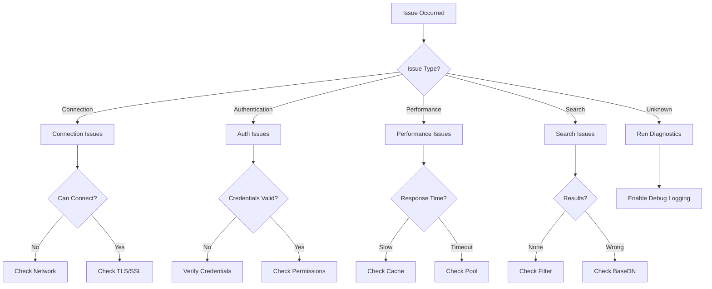

# Troubleshooting Guide

## Table of Contents

1. [Overview](#overview)
2. [Common Issues](#common-issues)
3. [Connection Problems](#connection-problems)
4. [Authentication Failures](#authentication-failures)
5. [Performance Issues](#performance-issues)
6. [Search and Query Problems](#search-and-query-problems)
7. [Diagnostic Tools](#diagnostic-tools)
8. [Debug Logging](#debug-logging)
9. [Error Messages](#error-messages)
10. [Getting Help](#getting-help)

## Overview

This guide helps diagnose and resolve common issues with simple-ldap-go. Each section provides symptoms, causes, diagnostic steps, and solutions for specific problem categories.

### Quick Diagnosis Flowchart


```mermaid
graph TD
    START[Issue Occurred] --> TYPE{Issue Type?}

    TYPE -->|Connection| CONN[Connection Issues]
    TYPE -->|Authentication| AUTH[Auth Issues]
    TYPE -->|Performance| PERF[Performance Issues]
    TYPE -->|Search| SEARCH[Search Issues]
    TYPE -->|Unknown| DIAG[Run Diagnostics]

    CONN --> CONN_CHECK{Can Connect?}
    CONN_CHECK -->|No| CHECK_NET[Check Network]
    CONN_CHECK -->|Yes| CHECK_TLS[Check TLS/SSL]

    AUTH --> AUTH_CHECK{Credentials Valid?}
    AUTH_CHECK -->|No| CHECK_CREDS[Verify Credentials]
    AUTH_CHECK -->|Yes| CHECK_PERMS[Check Permissions]

    PERF --> PERF_CHECK{Response Time?}
    PERF_CHECK -->|Slow| CHECK_CACHE[Check Cache]
    PERF_CHECK -->|Timeout| CHECK_POOL[Check Pool]

    SEARCH --> SEARCH_CHECK{Results?}
    SEARCH_CHECK -->|None| CHECK_FILTER[Check Filter]
    SEARCH_CHECK -->|Wrong| CHECK_BASE[Check BaseDN]

    DIAG --> ENABLE_DEBUG[Enable Debug Logging]
```

## Common Issues

### Issue: Library Not Connecting

**Symptoms:**
- Connection timeout errors
- "Connection refused" messages
- Unable to establish LDAP connection

**Quick Fix:**
```go
// Verify basic connectivity
client, err := ldap.Dial("tcp", "ldap.example.com:389")
if err != nil {
    log.Printf("Connection failed: %v", err)
    // Check: Network connectivity, firewall rules, LDAP server status
}
```

### Issue: Slow Operations

**Symptoms:**
- Operations taking >1 second
- Timeouts on searches
- High latency

**Quick Fix:**
```go
// Enable caching and connection pooling
config := ldap.Config{
    Server: "ldaps://ldap.example.com:636",
    BaseDN: "dc=example,dc=com",

    EnableCache: true,
    Cache: &ldap.CacheConfig{
        MaxSize: 10000,
    },
    Pool: &ldap.PoolConfig{
        MaxConnections: 50,
        MinConnections: 5,
    },
    EnableOptimizations: true,
}
```

### Issue: Authentication Failures

**Symptoms:**
- Invalid credentials errors
- Account locked messages
- Permission denied

**Quick Fix:**
```go
// Verify authentication with detailed error
_, err := client.CheckPasswordForSAMAccountName(username, password)
if err != nil {
    switch {
    case errors.Is(err, ErrInvalidCredentials):
        // Wrong username/password
    case errors.Is(err, ErrAccountLocked):
        // Account locked due to failed attempts
    case errors.Is(err, ErrPasswordExpired):
        // Password needs reset
    }
}
```

## Connection Problems

### TLS/SSL Connection Issues

```go
// diagnostics/tls_check.go - TLS connection diagnostics
func DiagnoseTLSConnection(host string, port int) error {
    // Test basic TCP connectivity
    conn, err := net.DialTimeout("tcp",
        fmt.Sprintf("%s:%d", host, port),
        5*time.Second)
    if err != nil {
        return fmt.Errorf("TCP connection failed: %w", err)
    }
    conn.Close()

    // Test TLS handshake
    tlsConfig := &tls.Config{
        InsecureSkipVerify: true, // For testing only
    }

    tlsConn, err := tls.Dial("tcp",
        fmt.Sprintf("%s:%d", host, port),
        tlsConfig)
    if err != nil {
        return fmt.Errorf("TLS handshake failed: %w", err)
    }
    defer tlsConn.Close()

    // Check certificate
    state := tlsConn.ConnectionState()
    for _, cert := range state.PeerCertificates {
        fmt.Printf("Certificate Subject: %s\n", cert.Subject)
        fmt.Printf("Certificate Issuer: %s\n", cert.Issuer)
        fmt.Printf("Valid From: %s\n", cert.NotBefore)
        fmt.Printf("Valid To: %s\n", cert.NotAfter)

        // Check expiration
        if time.Now().After(cert.NotAfter) {
            return fmt.Errorf("certificate expired on %s", cert.NotAfter)
        }
    }

    return nil
}
```

### Connection Pool Exhaustion

`ldap.PoolStats` reports counters, not wait times. What it exposes is what the
diagnosis has to be built from: how many connections exist, how often the pool
could serve a request without creating one, and what self-healing has had to do.

```go
// Read the pool counters and name what they imply.
func diagnoseConnectionPool(pool *ldap.ConnectionPool, cfg *ldap.PoolConfig) []string {
    stats := pool.Stats()
    var issues []string

    if int(stats.ActiveConnections) >= cfg.MaxConnections {
        issues = append(issues,
            "pool exhausted: every connection is checked out - raise MaxConnections "+
                "or shorten how long callers hold a connection")
    }

    // A miss means no idle connection was available and a new one was dialled.
    if total := stats.PoolHits + stats.PoolMisses; total > 0 {
        if hitRate := float64(stats.PoolHits) / float64(total); hitRate < 0.8 {
            issues = append(issues,
                fmt.Sprintf("pool hit rate %.1f%%: MinConnections is likely too low",
                    hitRate*100))
        }
    }

    if stats.HealthChecksFailed > 0 {
        issues = append(issues,
            fmt.Sprintf("%d failed health checks: check LDAP server health and network stability",
                stats.HealthChecksFailed))
    }

    // Both are produced by self-healing; a rising count means callers are not
    // returning connections with Put.
    if stats.LeakedConnections > 0 {
        issues = append(issues,
            fmt.Sprintf("%d leaked connections evicted after LeakEvictionThreshold",
                stats.LeakedConnections))
    }

    return issues
}
```

There is no `Resize`, and no way to grow the pool at runtime: `MaxConnections` is
read when the pool is built. Recovery is the pool's own job - with
`EnableSelfHealing` (the default), a connection unreturned for
`LeakDetectionThreshold` is suspected and one unreturned for
`LeakEvictionThreshold` is force-evicted, which `SelfHealingEvents` counts.

### Network Connectivity

```go
// diagnostics/network_check.go - Network diagnostics
func NetworkDiagnostics(host string) error {
    // DNS resolution
    ips, err := net.LookupIP(host)
    if err != nil {
        return fmt.Errorf("DNS resolution failed for %s: %w", host, err)
    }
    fmt.Printf("Resolved %s to: %v\n", host, ips)

    // Ping test (requires privileges)
    pinger, err := ping.NewPinger(host)
    if err == nil {
        pinger.Count = 3
        pinger.Run()
        stats := pinger.Statistics()
        fmt.Printf("Ping statistics: %d%% packet loss, avg RTT: %v\n",
            stats.PacketLoss, stats.AvgRtt)
    }

    // Traceroute for path analysis
    options := &traceroute.TracerouteOptions{}
    result, err := traceroute.Traceroute(host, options)
    if err == nil {
        fmt.Println("Traceroute path:")
        for _, hop := range result {
            fmt.Printf("  %d: %s (%v)\n", hop.TTL, hop.Address, hop.RTT)
        }
    }

    // Port scan for LDAP ports
    ports := []int{389, 636, 3268, 3269} // LDAP, LDAPS, GC, GCS
    for _, port := range ports {
        conn, err := net.DialTimeout("tcp",
            fmt.Sprintf("%s:%d", host, port),
            2*time.Second)
        if err == nil {
            conn.Close()
            fmt.Printf("Port %d: OPEN\n", port)
        } else {
            fmt.Printf("Port %d: CLOSED/FILTERED\n", port)
        }
    }

    return nil
}
```

## Authentication Failures

### Credential Verification

```go
// diagnostics/auth_check.go - Authentication diagnostics
func DiagnoseAuthentication(l *LDAP, username, password string) (*AuthDiagnostic, error) {
    diag := &AuthDiagnostic{
        Username:  username,
        Timestamp: time.Now(),
    }

    // Step 1: Find user
    user, err := l.FindUserBySAMAccountName(username)
    if err != nil {
        if errors.Is(err, ErrUserNotFound) {
            diag.Issue = "User not found in directory"
            diag.Resolution = "Verify username spelling and domain"
        } else {
            diag.Issue = fmt.Sprintf("User lookup failed: %v", err)
            diag.Resolution = "Check LDAP connectivity and permissions"
        }
        return diag, err
    }

    diag.UserDN = user.DN()
    diag.UserFound = true

    // Step 2: Check account status. There are no Is* helpers on User — the
    // state is decoded into fields when the entry is read.
    if !user.Enabled {
        diag.Issue = "Account is disabled"
        diag.Resolution = "Contact administrator to enable account"
        return diag, ErrAccountDisabled
    }

    // LockoutTime is the Unix-seconds timestamp of the most recent lockout,
    // and 0 when the account has never been locked.
    if user.LockoutTime > 0 {
        diag.Issue = "Account is locked"
        diag.Resolution = fmt.Sprintf("Locked since %s; clear it with UnlockUser",
            time.Unix(user.LockoutTime, 0).Format(time.RFC3339))
        return diag, ErrAccountLocked
    }

    // AccountExpires: 0 means no expiry recorded, -1 means never expires.
    if user.AccountExpires > 0 && time.Now().Unix() > user.AccountExpires {
        diag.Issue = "Account has expired"
        diag.Resolution = "Contact administrator to renew account"
        return diag, fmt.Errorf("account %s expired at %s", user.DN(),
            time.Unix(user.AccountExpires, 0).Format(time.RFC3339))
    }

    // Step 3: Check password status. MustChangePassword is a field, not a
    // method: it is true when AD reports pwdLastSet == 0.
    if user.MustChangePassword {
        diag.Issue = "Password must be changed"
        diag.Resolution = "User must change password at next logon"
    }

    // PasswordExpiresAt follows the same 0 / -1 / timestamp convention.
    // LDAP.PasswordExpiryFor gives a directory-independent answer.
    if user.PasswordExpiresAt > 0 && time.Now().Unix() > user.PasswordExpiresAt {
        diag.Issue = "Password has expired"
        diag.Resolution = "Password must be reset"
        return diag, ErrPasswordExpired
    }

    // Step 4: Attempt bind
    _, err = l.CheckPasswordForDN(user.DN(), password)
    if err != nil {
        diag.Issue = "Authentication failed"
        diag.Resolution = "Verify password is correct"

        // Check for specific LDAP errors
        if ldapErr, ok := err.(*ldap.Error); ok {
            switch ldapErr.ResultCode {
            case 49: // Invalid credentials
                diag.Details = "Invalid username or password"
            case 50: // Insufficient access
                diag.Details = "User lacks permission to authenticate"
            case 53: // Unwilling to perform
                diag.Details = "Server unwilling to perform authentication"
            }
        }
        return diag, err
    }

    diag.Success = true
    return diag, nil
}
```

### Permission Issues

```go
// diagnostics/permission_check.go - Permission diagnostics
func DiagnosePermissions(l *LDAP, userDN string) (*PermissionDiagnostic, error) {
    diag := &PermissionDiagnostic{
        UserDN:    userDN,
        Timestamp: time.Now(),
    }

    // Test read permissions
    testCases := []struct {
        Operation string
        TestFunc  func() error
    }{
        {
            Operation: "Read User",
            TestFunc: func() error {
                _, err := l.FindUserByDN(userDN)
                return err
            },
        },
        {
            Operation: "Search Users",
            TestFunc: func() error {
                _, err := l.FindUsers()
                return err
            },
        },
        {
            Operation: "Read Groups",
            TestFunc: func() error {
                _, err := l.FindGroups()
                return err
            },
        },
        {
            Operation: "Modify User",
            TestFunc: func() error {
                // Test with harmless modification
                return l.ModifyUser(userDN, map[string][]string{
                    "description": {"Test"},
                })
            },
        },
    }

    for _, tc := range testCases {
        err := tc.TestFunc()
        result := &PermissionTestResult{
            Operation: tc.Operation,
            Allowed:   err == nil,
        }

        if err != nil {
            result.Error = err.Error()

            // Analyze error for permission issues
            if strings.Contains(err.Error(), "insufficient") ||
               strings.Contains(err.Error(), "denied") ||
               strings.Contains(err.Error(), "not authorized") {
                result.Issue = "Insufficient permissions"
            }
        }

        diag.Results = append(diag.Results, result)
    }

    return diag, nil
}
```

## Performance Issues

### Slow Query Diagnosis

```go
// diagnostics/performance_check.go - Performance diagnostics
func DiagnosePerformance(l *LDAP) (*PerformanceDiagnostic, error) {
    diag := &PerformanceDiagnostic{
        Timestamp: time.Now(),
    }

    // Test various operations
    operations := []struct {
        Name string
        Test func() (time.Duration, error)
    }{
        {
            Name: "Connect and Bind",
            Test: func() (time.Duration, error) {
                start := time.Now()
                conn, err := l.GetConnection()
                if err == nil {
                    _ = l.ReleaseConnection(conn)
                }
                return time.Since(start), err
            },
        },
        {
            Name: "User Lookup",
            Test: func() (time.Duration, error) {
                start := time.Now()
                _, err := l.FindUserBySAMAccountName("testuser")
                return time.Since(start), err
            },
        },
        {
            Name: "Find All Users",
            Test: func() (time.Duration, error) {
                start := time.Now()
                _, err := l.FindUsers()
                return time.Since(start), err
            },
        },
        {
            Name: "Group Membership Check",
            Test: func() (time.Duration, error) {
                start := time.Now()
                // Membership is carried on the user: User.Groups holds the DNs
                // of every group the entry belongs to.
                user, err := l.FindUserBySAMAccountName("testuser")
                if err == nil {
                    for _, groupDN := range user.Groups {
                        if groupDN == "cn=testgroup,ou=groups,dc=example,dc=com" {
                            break
                        }
                    }
                }
                return time.Since(start), err
            },
        },
    }

    for _, op := range operations {
        duration, err := op.Test()

        result := &PerformanceResult{
            Operation: op.Name,
            Duration:  duration,
            Success:   err == nil,
        }

        // Categorize performance
        switch {
        case duration < 50*time.Millisecond:
            result.Rating = "Excellent"
        case duration < 200*time.Millisecond:
            result.Rating = "Good"
        case duration < 500*time.Millisecond:
            result.Rating = "Fair"
        case duration < 1*time.Second:
            result.Rating = "Poor"
        default:
            result.Rating = "Critical"
        }

        if err != nil {
            result.Error = err.Error()
        }

        diag.Results = append(diag.Results, result)
    }

    // Check cache performance
    cacheStats := l.GetCacheStats()
    diag.CacheHitRate = cacheStats.HitRate
    diag.CacheSize = cacheStats.Size

    if cacheStats.HitRate < 50 {
        diag.Recommendations = append(diag.Recommendations,
            "Low cache hit rate - consider increasing cache size or TTL")
    }

    // Check pool performance
    poolStats := l.GetPoolStats()
    diag.PoolUtilization = poolStats.Utilization

    if poolStats.Utilization > 80 {
        diag.Recommendations = append(diag.Recommendations,
            "High pool utilization - consider increasing pool size")
    }

    return diag, nil
}
```

### Memory Usage Analysis

```go
// diagnostics/memory_check.go - Memory diagnostics
func AnalyzeMemoryUsage() *MemoryDiagnostic {
    var m runtime.MemStats
    runtime.ReadMemStats(&m)

    diag := &MemoryDiagnostic{
        Timestamp:     time.Now(),
        AllocMB:       m.Alloc / 1024 / 1024,
        TotalAllocMB:  m.TotalAlloc / 1024 / 1024,
        SysMB:         m.Sys / 1024 / 1024,
        NumGC:         m.NumGC,
        LastGC:        time.Unix(0, int64(m.LastGC)),
        PauseTotalMs:  m.PauseTotalNs / 1000000,
        HeapAllocMB:   m.HeapAlloc / 1024 / 1024,
        HeapInuseMB:   m.HeapInuse / 1024 / 1024,
        StackInuseMB:  m.StackInuse / 1024 / 1024,
    }

    // Analyze for issues
    if diag.AllocMB > 500 {
        diag.Issues = append(diag.Issues,
            fmt.Sprintf("High memory usage: %d MB", diag.AllocMB))
        diag.Recommendations = append(diag.Recommendations,
            "Consider reducing cache size or connection pool")
    }

    if diag.NumGC > 1000 {
        diag.Issues = append(diag.Issues,
            fmt.Sprintf("Excessive GC runs: %d", diag.NumGC))
        diag.Recommendations = append(diag.Recommendations,
            "Optimize object allocation patterns")
    }

    // Force GC and re-measure
    runtime.GC()
    runtime.ReadMemStats(&m)
    diag.AfterGCMB = m.Alloc / 1024 / 1024

    return diag
}

// Memory leak detection
func DetectMemoryLeaks(duration time.Duration) {
    ticker := time.NewTicker(10 * time.Second)
    defer ticker.Stop()

    var samples []uint64
    timeout := time.After(duration)

    for {
        select {
        case <-ticker.C:
            var m runtime.MemStats
            runtime.ReadMemStats(&m)
            samples = append(samples, m.Alloc)

            if len(samples) > 2 {
                // Check for consistent growth
                if isIncreasing(samples) {
                    log.Printf("WARNING: Potential memory leak detected")
                    log.Printf("Memory growth: %+v MB", samples)
                }
            }

        case <-timeout:
            return
        }
    }
}
```

## Search and Query Problems

### Filter Syntax Issues

```go
// diagnostics/filter_check.go - LDAP filter diagnostics
func DiagnoseFilter(filter string) (*FilterDiagnostic, error) {
    diag := &FilterDiagnostic{
        Filter:    filter,
        Timestamp: time.Now(),
    }

    // Validate syntax
    err := ValidateLDAPFilter(filter)
    if err != nil {
        diag.SyntaxValid = false
        diag.Issue = fmt.Sprintf("Invalid syntax: %v", err)

        // Common syntax errors
        if strings.Contains(filter, "((") {
            diag.Suggestion = "Check for duplicate opening parentheses"
        } else if strings.Count(filter, "(") != strings.Count(filter, ")") {
            diag.Suggestion = "Mismatched parentheses"
        } else if !strings.HasPrefix(filter, "(") {
            diag.Suggestion = "Filter must start with '('"
        }

        return diag, err
    }

    diag.SyntaxValid = true

    // Analyze filter complexity
    diag.Complexity = calculateFilterComplexity(filter)
    if diag.Complexity > 10 {
        diag.Warning = "Complex filter may impact performance"
        diag.Suggestion = "Consider simplifying or breaking into multiple queries"
    }

    // Check for common issues
    if strings.Contains(filter, "*") {
        diag.HasWildcards = true
        if strings.HasPrefix(filter, "(*") {
            diag.Warning = "Leading wildcard may cause slow searches"
            diag.Suggestion = "Avoid wildcards at the beginning of values"
        }
    }

    // Check for indexed attributes
    indexedAttrs := []string{"cn", "sAMAccountName", "mail", "objectGUID"}
    usesIndex := false
    for _, attr := range indexedAttrs {
        if strings.Contains(filter, attr) {
            usesIndex = true
            break
        }
    }

    if !usesIndex {
        diag.Warning = "Filter doesn't use indexed attributes"
        diag.Suggestion = "Include indexed attributes for better performance"
    }

    return diag, nil
}

// Fix common filter issues
func FixCommonFilterIssues(filter string) string {
    // Escape special characters
    fixed := ldap.EscapeFilter(filter)

    // Fix common syntax errors
    fixed = strings.ReplaceAll(fixed, "((", "(")
    fixed = strings.ReplaceAll(fixed, "))", ")")

    // Ensure proper wrapping
    if !strings.HasPrefix(fixed, "(") {
        fixed = "(" + fixed
    }
    if !strings.HasSuffix(fixed, ")") {
        fixed = fixed + ")"
    }

    return fixed
}
```

### Base DN Problems

```go
// diagnostics/basedn_check.go - Base DN diagnostics
func DiagnoseBaseDN(l *LDAP, baseDN string) (*BaseDNDiagnostic, error) {
    diag := &BaseDNDiagnostic{
        BaseDN:    baseDN,
        Timestamp: time.Now(),
    }

    // Verify the base DN exists. There is no SearchOneLevel helper: build a
    // *ldap.SearchRequest with the scope you want and stream it through
    // SearchIter, which yields entries one at a time.
    req := ldap.NewSearchRequest(
        baseDN, ldap.ScopeSingleLevel, ldap.NeverDerefAliases, 1, 0, false,
        "(objectClass=*)", []string{"dn"}, nil,
    )
    var err error
    for _, iterErr := range l.SearchIter(context.Background(), req) {
        if iterErr != nil {
            err = iterErr
        }
        break // one entry is enough to prove the base DN resolves
    }
    if err != nil {
        diag.Exists = false
        diag.Issue = "Base DN does not exist or is not accessible"

        // Try to find correct base DN
        suggestedDN := findCorrectBaseDN(l)
        if suggestedDN != "" {
            diag.Suggestion = fmt.Sprintf("Try using: %s", suggestedDN)
        }

        return diag, err
    }

    diag.Exists = true

    // Count objects under the base DN. SearchPagedIter pages server-side, so
    // a large subtree does not have to be held in memory to be counted.
    countReq := ldap.NewSearchRequest(
        baseDN, ldap.ScopeWholeSubtree, ldap.NeverDerefAliases, 0, 0, false,
        "(objectClass=*)", []string{"dn"}, nil,
    )
    count := 0
    var iterErr error
    for _, err := range l.SearchPagedIter(context.Background(), countReq, 500) {
        if err != nil {
            iterErr = err
            break
        }
        count++
    }
    if iterErr == nil {
        diag.ObjectCount = count

        if diag.ObjectCount == 0 {
            diag.Warning = "Base DN exists but contains no objects"
        }
    }

    // Check common OUs
    commonOUs := []string{"Users", "Computers", "Groups"}
    for _, ou := range commonOUs {
        ouDN := fmt.Sprintf("OU=%s,%s", ou, baseDN)
        exists := checkOUExists(l, ouDN)
        diag.CommonOUs[ou] = exists
    }

    return diag, nil
}
```

## Diagnostic Tools

### Health Check Script

```go
// diagnostics/health_check.go - Comprehensive health check
func RunHealthCheck(config ldap.Config, bindDN, bindPassword string) (*HealthCheckReport, error) {
    report := &HealthCheckReport{
        Timestamp: time.Now(),
        Config:    config,
    }

    // Initialize client
    client, err := ldap.New(config, bindDN, bindPassword)
    if err != nil {
        report.ConnectionHealth = "FAILED"
        report.Errors = append(report.Errors,
            fmt.Sprintf("Connection failed: %v", err))
        return report, err
    }
    defer client.Close()

    report.ConnectionHealth = "OK"

    // Test authentication
    _, err = client.CheckPasswordForDN(bindDN, bindPassword)
    if err != nil {
        report.AuthHealth = "FAILED"
        report.Errors = append(report.Errors,
            fmt.Sprintf("Authentication failed: %v", err))
    } else {
        report.AuthHealth = "OK"
    }

    // Test search
    users, err := client.FindUsers()
    if err != nil {
        report.SearchHealth = "FAILED"
        report.Errors = append(report.Errors,
            fmt.Sprintf("Search failed: %v", err))
    } else {
        report.SearchHealth = "OK"
        report.SearchResults = len(users)
    }

    // Performance metrics
    report.Performance = client.GetPerformanceStats()

    // Cache statistics
    report.CacheStats = client.GetCacheStats()

    // Pool statistics
    report.PoolStats = client.GetPoolStats()

    // Generate recommendations
    report.Recommendations = generateRecommendations(report)

    return report, nil
}

// Generate health check CLI
func main() {
    // Parse flags
    configFile := flag.String("config", "ldap.conf", "Configuration file")
    verbose := flag.Bool("verbose", false, "Verbose output")
    fix := flag.Bool("fix", false, "Attempt to fix issues")
    flag.Parse()

    // Load configuration
    config, err := LoadConfig(*configFile)
    if err != nil {
        log.Fatalf("Failed to load config: %v", err)
    }

    // Run health check
    report, err := RunHealthCheck(config)
    if err != nil {
        log.Printf("Health check failed: %v", err)
    }

    // Display report
    DisplayHealthReport(report, *verbose)

    // Attempt fixes if requested
    if *fix && len(report.Errors) > 0 {
        FixCommonIssues(config, report)
    }
}
```

### Interactive Debugger

```go
// diagnostics/debugger.go - Interactive LDAP debugger
type InteractiveDebugger struct {
    client *LDAP
    reader *bufio.Reader
}

func (d *InteractiveDebugger) Run() {
    fmt.Println("LDAP Debugger - Type 'help' for commands")

    for {
        fmt.Print("> ")
        input, _ := d.reader.ReadString('\n')
        input = strings.TrimSpace(input)

        parts := strings.Split(input, " ")
        command := parts[0]

        switch command {
        case "help":
            d.showHelp()
        case "connect":
            d.connect(parts[1:])
        case "auth":
            d.authenticate(parts[1:])
        case "search":
            d.search(parts[1:])
        case "test":
            d.runTests()
        case "perf":
            d.showPerformance()
        case "cache":
            d.showCache()
        case "pool":
            d.showPool()
        case "debug":
            d.toggleDebug()
        case "quit", "exit":
            return
        default:
            fmt.Println("Unknown command. Type 'help' for available commands.")
        }
    }
}

func (d *InteractiveDebugger) runTests() {
    tests := []struct {
        Name string
        Test func() error
    }{
        {"Connection", d.testConnection},
        {"Authentication", d.testAuth},
        {"Search", d.testSearch},
        {"Cache", d.testCache},
        {"Pool", d.testPool},
    }

    for _, test := range tests {
        fmt.Printf("Testing %s... ", test.Name)
        err := test.Test()
        if err != nil {
            fmt.Printf("FAILED: %v\n", err)
        } else {
            fmt.Println("OK")
        }
    }
}
```

## Debug Logging

### Enable Debug Mode

```go
// logging/debug.go - Debug logging configuration
func EnableDebugLogging() {
    // Set log level to debug
    slog.SetLogLogLevel(slog.LevelDebug)

    // Add debug handler with detailed formatting
    opts := &slog.HandlerOptions{
        Level: slog.LevelDebug,
        ReplaceAttr: func(groups []string, a slog.Attr) slog.Attr {
            // Add microsecond precision to timestamps
            if a.Key == slog.TimeKey {
                t := a.Value.Time()
                a.Value = slog.StringValue(t.Format("2006-01-02T15:04:05.000000"))
            }
            return a
        },
    }

    handler := slog.NewTextHandler(os.Stdout, opts)
    logger := slog.New(handler)
    slog.SetDefault(logger)

    // Enable LDAP protocol logging
    ldap.Debug = true
}

// Conditional debug logging
func DebugLog(format string, args ...interface{}) {
    if os.Getenv("LDAP_DEBUG") == "true" {
        slog.Debug(fmt.Sprintf(format, args...))
    }
}

// Trace logging for detailed debugging
func TraceOperation(op string, fn func() error) error {
    start := time.Now()
    traceID := uuid.New().String()[:8]

    slog.Debug("operation started",
        slog.String("op", op),
        slog.String("trace_id", traceID))

    err := fn()

    slog.Debug("operation completed",
        slog.String("op", op),
        slog.String("trace_id", traceID),
        slog.Duration("duration", time.Since(start)),
        slog.Bool("success", err == nil))

    if err != nil {
        slog.Debug("operation error",
            slog.String("op", op),
            slog.String("trace_id", traceID),
            slog.String("error", err.Error()))
    }

    return err
}
```

### Trace Requests

There is no tracing hook to install: the library has no middleware interface.
What it has is its own structured log, so a trace is a debug-level handler
writing to a file of your choosing.

```go
func enableRequestTracing(outputFile string) (*slog.Logger, func() error, error) {
    file, err := os.Create(outputFile)
    if err != nil {
        return nil, nil, fmt.Errorf("creating trace file: %w", err)
    }

    logger := slog.New(slog.NewJSONHandler(file, &slog.HandlerOptions{
        Level: slog.LevelDebug,
    }))

    return logger, file.Close, nil
}

logger, closeTrace, err := enableRequestTracing("ldap-trace.jsonl")
if err != nil {
    return err
}
defer closeTrace()

client, err := ldap.New(config, bindDN, password, ldap.WithLogger(logger))
```

Every operation logs its own duration, so the trace carries the timings without
a wrapper. [Structured Logging](STRUCTURED_LOGGING.md) lists what is emitted.

## Error Messages

### Common Error Reference

| Error | Cause | Solution |
|-------|-------|----------|
| `ldap: connection refused` | LDAP server not running or firewall blocking | Check server status, verify firewall rules |
| `ldap: invalid credentials` | Wrong username/password | Verify credentials, check for locked account |
| `ldap: timeout` | Network issues or server overload | Check network, increase timeout, optimize queries |
| `ldap: no such object` | DN doesn't exist | Verify DN spelling, check base DN |
| `ldap: insufficient access` | Permission denied | Check user permissions, verify bind DN |
| `ldap: sizelimit exceeded` | Too many results | Add pagination, refine filter |
| `ldap: invalid DN syntax` | Malformed DN | Check DN format, escape special characters |
| `ldap: filter compile error` | Invalid filter syntax | Validate filter, check parentheses |
| `TLS handshake timeout` | Certificate or TLS issues | Check certificates, verify TLS configuration |
| `connection pool exhausted` | All connections in use | Increase pool size, reduce connection hold time |

### Error Code Mapping

```go
// errors/ldap_errors.go - LDAP error code reference
var LDAPErrorMessages = map[int]string{
    1:  "Operations error",
    2:  "Protocol error",
    3:  "Time limit exceeded",
    4:  "Size limit exceeded",
    5:  "Compare false",
    6:  "Compare true",
    7:  "Authentication method not supported",
    8:  "Stronger authentication required",
    10: "Referral",
    11: "Administrative limit exceeded",
    12: "Unavailable critical extension",
    13: "Confidentiality required",
    14: "SASL bind in progress",
    16: "No such attribute",
    17: "Undefined attribute type",
    18: "Inappropriate matching",
    19: "Constraint violation",
    20: "Attribute or value exists",
    21: "Invalid attribute syntax",
    32: "No such object",
    33: "Alias problem",
    34: "Invalid DN syntax",
    36: "Alias dereferencing problem",
    48: "Inappropriate authentication",
    49: "Invalid credentials",
    50: "Insufficient access rights",
    51: "Busy",
    52: "Unavailable",
    53: "Unwilling to perform",
    54: "Loop detected",
    64: "Naming violation",
    65: "Object class violation",
    66: "Not allowed on non-leaf",
    67: "Not allowed on RDN",
    68: "Entry already exists",
    69: "Object class mods prohibited",
    71: "Affects multiple DSAs",
    80: "Other",
}

func ExplainLDAPError(code int) string {
    if msg, ok := LDAPErrorMessages[code]; ok {
        return msg
    }
    return fmt.Sprintf("Unknown LDAP error code: %d", code)
}
```

## Getting Help

### Diagnostic Information to Collect

```go
// support/diagnostic_bundle.go - Collect diagnostic information
func CreateDiagnosticBundle() (*DiagnosticBundle, error) {
    bundle := &DiagnosticBundle{
        Timestamp: time.Now(),
        Version:   Version,
    }

    // System information
    bundle.System = &SystemInfo{
        OS:           runtime.GOOS,
        Arch:         runtime.GOARCH,
        CPUs:         runtime.NumCPU(),
        GoVersion:    runtime.Version(),
        MaxProcs:     runtime.GOMAXPROCS(0),
    }

    // Configuration (sanitized)
    bundle.Config = sanitizeConfig(config)

    // Performance metrics
    bundle.Performance = getPerformanceMetrics()

    // Recent errors
    bundle.RecentErrors = getRecentErrors(100)

    // Connection stats
    bundle.ConnectionStats = getConnectionStats()

    // Cache stats
    bundle.CacheStats = getCacheStats()

    // Generate report
    report, err := bundle.GenerateReport()
    if err != nil {
        return nil, err
    }

    // Save to file
    filename := fmt.Sprintf("ldap_diagnostic_%s.json",
        time.Now().Format("20060102_150405"))

    if err := bundle.SaveToFile(filename); err != nil {
        return nil, err
    }

    fmt.Printf("Diagnostic bundle created: %s\n", filename)
    return bundle, nil
}
```

### Support Resources

1. **Documentation**: `/docs` directory
2. **Examples**: `/examples` directory
3. **Tests**: Run `go test -v ./...` for validation
4. **Debug Mode**: Set `LDAP_DEBUG=true` environment variable
5. **Issue Reporting**: Include diagnostic bundle with bug reports

### Quick Fixes Script

```bash
#!/bin/bash
# quick_fixes.sh - Common fixes for LDAP issues

echo "LDAP Quick Fixes Script"
echo "======================"

# Test connectivity
echo "Testing LDAP connectivity..."
ldapsearch -x -H ldap://localhost:389 -b "" -s base "(objectClass=*)" > /dev/null 2>&1
if [ $? -ne 0 ]; then
    echo "❌ LDAP connection failed"
    echo "   Checking if LDAP service is running..."
    systemctl status slapd
else
    echo "✅ LDAP connection OK"
fi

# Check TLS
echo "Testing TLS connection..."
echo | openssl s_client -connect localhost:636 2>/dev/null | grep "CONNECTED"
if [ $? -ne 0 ]; then
    echo "❌ TLS connection failed"
    echo "   Check certificates in /etc/ldap/certs/"
else
    echo "✅ TLS connection OK"
fi

# Clear cache
echo "Clearing application cache..."
redis-cli FLUSHDB > /dev/null 2>&1
echo "✅ Cache cleared"

# Reset connection pool
echo "Restarting application to reset connection pool..."
systemctl restart myapp
echo "✅ Connection pool reset"

echo ""
echo "Quick fixes completed. Re-test your application."
```

---

*Troubleshooting Guide - Last Updated: 2026-09-17*